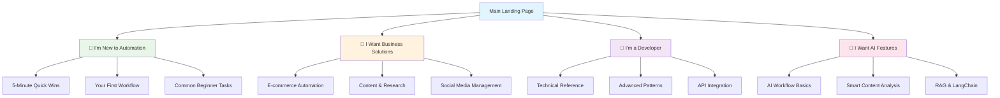
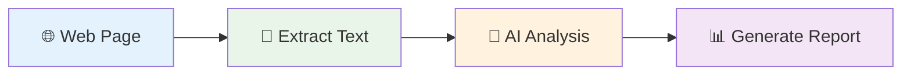

# Design Document

## Overview

This design document outlines the content-focused approach to simplifying, cleaning, and enhancing the Agentic Workflow Studio documentation. The design leverages the existing Astro.js/Starlight infrastructure while focusing on content transformation, new page creation, and improved learning experiences for non-developer users.

## Architecture

### Content Reorganization Strategy

The documentation content will be restructured around user goals and practical outcomes:



**User-Type Entry Points:**
- **🌱 New to Automation**: Clear guidance for users without technical background
- **💼 Business Solutions**: Task-focused paths for specific business needs
- **🔧 Developer**: Technical documentation and advanced integration guides
- **🤖 AI Features**: Specialized content for AI-powered workflow creation

### Content Structure Framework

**Primary Content Types:**
1. **Quick Win Tutorials** (5-15 minutes) - Immediate value demonstrations
2. **Complete Project Guides** (30-60 minutes) - End-to-end workflow creation
3. **How-To Pages** - Specific task-focused instructions
4. **Reference Documentation** - Comprehensive node and feature details
5. **Troubleshooting Guides** - Problem-solving resources

**Content Organization Principles:**
- Lead with practical value and real-world applications
- Use progressive disclosure (simple → detailed)
- Include visual elements for every major concept
- Provide multiple learning paths for different user types
- Use clear skill-level indicators (🌱 Beginner, 🚀 Intermediate, 🎯 Advanced)
- Include specialized learning tracks with clear outcomes

## Components and Interfaces

### 1. Content Templates and Patterns

**Tutorial Page Template**
```markdown
# [Task Name]: [Outcome Description]

## What You'll Build
- Clear outcome description with visual preview
- Time estimate and difficulty level
- Prerequisites checklist

## Why This Matters
- Real-world application examples
- Business value explanation
- Common use cases

## Step-by-Step Guide
1. [Action] with screenshot
2. [Configuration] with explanation
3. [Result] with validation

## What's Next?
- 2-3 related tutorials
- Advanced variations
- Community examples
```

**Node Documentation Template**
```markdown
# [Node Name]

## What It Does
- Plain language description
- 3-5 practical use cases
- Visual diagram of data flow

## Real-World Examples
- E-commerce: [specific example]
- Research: [specific example]  
- Content: [specific example]

## How to Use It
- Step-by-step configuration
- Common settings explained
- Troubleshooting tips

## Try It Yourself
- Copy-paste ready example
- Expected results
- Variations to explore
```

### 2. Visual Content Standards

**Mermaid Diagram Conventions**


**Color Coding System:**
- 🔵 Blue (#e3f2fd): Input/Source nodes
- 🟢 Green (#e8f5e8): Processing/Transformation nodes  
- 🟡 Yellow (#fff3e0): AI/Intelligence nodes
- 🟣 Purple (#f3e5f5): Output/Result nodes

**Screenshot Standards:**
- Consistent browser/extension interface
- Clear callouts with numbered annotations
- Highlighted UI elements with colored borders
- Before/after comparisons where applicable

**Content Formatting Guidelines:**
- Use emoji icons for visual hierarchy (🌱 🚀 🎯)
- Consistent heading structure (H1 → H2 → H3)
- Bullet points for scannable lists
- Callout boxes for important information
- Progress indicators for multi-step processes
- Clear feedback mechanisms for content improvement
- "What's Next?" sections with logical follow-up tutorials

### 3. Language Simplification Framework

**Writing Style Guidelines:**
- Maximum 8th-grade reading level (Flesch-Kincaid)
- Active voice over passive voice
- Short sentences (average 15-20 words)
- Conversational tone without being casual
- Technical terms explained immediately in context

**Progressive Disclosure Pattern:**
```markdown
## Basic Explanation
Simple description that anyone can understand

<details>
<summary>🔍 Technical Details</summary>

Detailed technical information for advanced users
- API specifications
- Advanced configuration options
- Integration patterns

</details>
```

**Terminology Consistency:**
- "Workflow" not "automation" or "process"
- "Node" not "component" or "block"  
- "Browser extension" not "plugin" or "add-on"
- "Extract" not "scrape" or "capture"
- "AI analysis" not "machine learning processing"

### 4. New Content Pages Structure

**Quick Wins Section** (`/use-cases/quick-wins/`)
- 5-minute automation examples
- Copy-paste ready workflows
- Immediate value demonstrations
- No prerequisites required

**Industry Solutions** (`/use-cases/solutions/`)
- `/use-cases/solutions/ecommerce/` - Price monitoring, product research, inventory tracking
- `/use-cases/solutions/content/` - Article research, social media automation, SEO analysis  
- `/use-cases/solutions/research/` - Data collection, academic research, market analysis
- `/use-cases/solutions/social-media/` - Content scheduling, engagement tracking, competitor analysis

**How-To Guides** (`/use-cases/how-to/`)
- Task-specific instructions
- "How to extract data from any website"
- "How to automate form filling"
- "How to create AI-powered content analysis"
- "How to build a price monitoring system"

**Troubleshooting** (`/usage/troubleshooting/`)
- Common issues with screenshots
- Browser compatibility problems
- Permission and security issues
- Performance optimization tips

### 5. Content Enhancement Patterns

**Example-First Approach:**
Every concept starts with a practical example before explaining theory:

```markdown
## Extract Product Prices from E-commerce Sites

### See It in Action
[Screenshot of workflow extracting prices from Amazon]

### What This Does
This workflow automatically collects product prices from shopping websites...

### How It Works
The workflow uses these nodes:
1. Get All Text - finds price information
2. Edit Fields - cleans and formats prices  
3. Save to File - stores results for analysis
```

**Multi-Modal Learning:**
- Visual learners: Diagrams and screenshots
- Reading learners: Step-by-step text guides
- Hands-on learners: Copy-paste examples
- Video learners: Embedded tutorials with transcripts

**Validation and Feedback:**
- "✅ You should see..." checkpoints with expected outcomes
- "❌ If this doesn't work..." troubleshooting with common solutions
- "💡 Pro tip:" advanced techniques and optimizations
- "⚠️ Important:" critical warnings and prerequisites
- Clear validation steps for practical exercises
- "Step X of Y" progress indicators throughout tutorials

## Data Models

### Content Metadata Structure

**Frontmatter Standards:**
```yaml
---
title: "Clear, Action-Oriented Title"
description: "One-sentence description of what users will accomplish"
difficulty: "🌱 beginner" | "🚀 intermediate" | "🎯 advanced"  
time: "5 min" | "15 min" | "30 min" | "1 hour"
tags: ["ecommerce", "data-extraction", "automation"]
industry: ["retail", "research", "marketing"]
nodes: ["GetSelectedText", "EditFields", "DownloadAsFile"]
use_cases: ["price-monitoring", "research-automation", "content-creation"]
---
```

**Content Categories:**
- `quick-win`: 5-15 minute tutorials with immediate value
- `project`: Complete workflow building guides (30+ minutes)
- `how-to`: Task-specific instructions
- `reference`: Node and feature documentation
- `troubleshooting`: Problem-solving guides

### Content Quality Guidelines

**Readability Standards:**
- Use plain language (8th-grade reading level)
- Keep sentences short and clear (15-20 words average)
- Use active voice when possible
- Define technical terms immediately when first used

**Visual Content Requirements:**
- Include visual elements regularly throughout content
- Add clear annotations to all screenshots
- Create workflow diagrams for multi-step processes
- Show before/after comparisons where helpful

## Error Handling

### Content Accessibility Standards

**Image and Media Accessibility:**
- Descriptive alt text for all images and diagrams
- Captions for video content
- Transcripts for audio content
- High contrast ratios (minimum 4.5:1)

**Content Structure Accessibility:**
- Proper heading hierarchy (H1 → H2 → H3)
- Semantic markup for lists and tables
- Skip links for long content sections
- Keyboard navigation support

### Content Review Framework

**Pre-Publication Checklist:**
- [ ] Content uses plain language and clear explanations
- [ ] Screenshots are current and clearly annotated
- [ ] Workflow examples work as described
- [ ] Links are functional and relevant
- [ ] Content follows accessibility guidelines
- [ ] Terminology is consistent throughout

**Quality Review Process:**
1. Content review for clarity and accuracy
2. Visual elements check (screenshots, diagrams)
3. Accessibility review for inclusive design
4. Cross-reference validation for consistency

## Implementation Approach

### Phase 1: Content Audit and Planning (Weeks 1-2)
**Foundation Work**
- Audit existing content for simplification opportunities
- Identify content gaps and new page requirements
- Create content templates and style guidelines
- Establish visual design standards

### Phase 2: Core Content Transformation (Weeks 3-8)
**High-Priority Content Rewrite**
- Simplify main landing pages and getting started guides
- Rewrite top 20 most-visited tutorial pages
- Create new "Quick Wins" section with 5-minute tutorials
- Develop industry-specific solution pages

### Phase 3: Visual Enhancement and New Content (Weeks 9-12)
**Visual and Structural Improvements**
- Add Mermaid diagrams to all workflow tutorials
- Create annotated screenshots for step-by-step guides
- Build "How-To" section with task-specific pages
- Develop template library with downloadable workflows

### Phase 4: Quality Assurance and Launch (Weeks 13-16)
**Testing and Refinement**
- Conduct usability testing with non-technical users
- Perform accessibility audits and corrections

## Content Migration Strategy

### Existing Content Assessment

**Content Categorization:**
1. **Keep As-Is** (10%): Already user-friendly content
   - Some beginner tutorials in `/learning/text-courses/beginner/`
   - Basic getting started guides

2. **Simplify Language** (40%): Good structure, complex language
   - Most node documentation in `/integrations/`
   - Advanced AI guides in `/advanced-ai/`
   - Technical reference materials

3. **Restructure** (30%): Good content, poor organization
   - Main index pages that are feature-focused rather than use-case focused
   - Learning paths that don't clearly indicate outcomes

4. **Complete Rewrite** (15%): Needs fundamental changes
   - Highly technical content without practical examples
   - Abstract concepts without real-world applications

5. **New Content Needed** (5%): Missing essential pages
   - Industry-specific guides
   - Quick win tutorials
   - Troubleshooting resources

### Content Transformation Process

**Language Simplification Workflow:**
1. Identify technical jargon and complex sentences
2. Rewrite using plain language principles
3. Add inline definitions for necessary technical terms
4. Include practical examples for abstract concepts
5. Review content for clarity and readability

**Visual Enhancement Process:**
1. Add Mermaid diagrams for workflow concepts
2. Create annotated screenshots for UI interactions
3. Design comparison tables for feature differences
4. Develop decision trees for complex choices

## Accessibility and Inclusion Design

### Content Accessibility Standards

**Language Accessibility:**
- Plain language principles (8th-grade reading level)
- Consistent terminology throughout documentation
- Immediate definitions for technical terms
- Multiple explanation levels (simple and detailed)
- Cultural neutrality in examples and scenarios

**Visual Accessibility:**
- High contrast ratios for all text and backgrounds
- Descriptive alt text for all images and diagrams
- Color-blind friendly color schemes
- Scalable text and interface elements
- Clear visual hierarchy with proper heading structure

**Cognitive Accessibility:**
- Logical information flow and organization
- Clear progress indicators for multi-step processes
- Consistent navigation and layout patterns
- Reduced cognitive load through chunked information
- Multiple ways to access the same information

### Inclusive Content Strategy

**Diverse Examples and Scenarios:**
- Global business examples, not just US-centric
- Various industry applications beyond tech
- Different skill levels and backgrounds represented
- Gender-neutral language and examples
- Accessibility considerations in workflow design