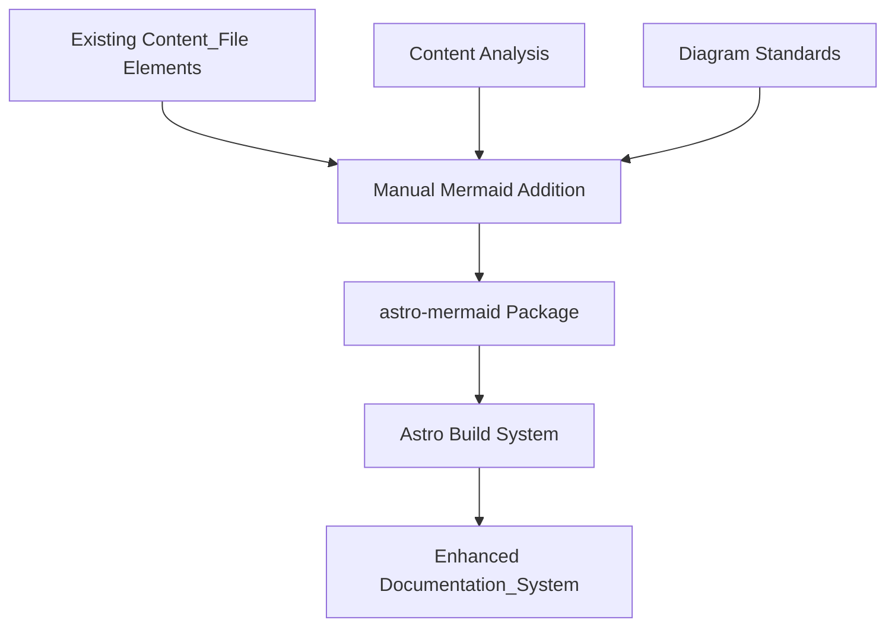

# Design Document

## Overview

The Visual Documentation Enhancement feature will systematically add Mermaid diagrams to existing markdown files in the `Agentic WorkFlow` documentation. This design leverages the already-installed astro-mermaid package to render diagrams directly from standard Mermaid markdown syntax within Content_File elements.

The solution focuses on two key areas: identifying where Visual_Enhancement elements would improve comprehension, and directly adding Mermaid_Diagram elements using standard markdown syntax to explain concepts, workflows, and node relationships.

## Architecture

### System Components



The architecture consists of:

1. **Content Layer**: Existing Content_File elements in `src/content/docs/`
2. **Enhancement Layer**: Direct addition of Mermaid_Diagram syntax to markdown files
3. **Processing Layer**: astro-mermaid package handles rendering during build
4. **Presentation Layer**: Enhanced Documentation_System with Visual_Enhancement elements

### Integration Points

- **astro-mermaid Package**: Already installed package handles Mermaid_Diagram rendering
- **Standard Markdown Syntax**: Use ```mermaid code blocks directly in Content_File elements
- **Existing Build Process**: No changes needed to Astro build pipeline
- **Content Structure**: Preserve existing frontmatter and markdown structure

## Components and Interfaces

### Mermaid Diagram Standards

**Purpose**: Consistent Visual_Enhancement patterns for different content types

**Diagram Types**:
- **Flowcharts**: For workflow processes and decision trees
- **Sequence Diagrams**: For AI agent interactions and data flow
- **Graph Diagrams**: For node relationships and connections
- **Timeline Diagrams**: For multi-step procedures

**Implementation**:
- Direct markdown syntax: ```mermaid [diagram content] ```
- Consistent placement within Content_File elements
- Descriptive text accompanying each Mermaid_Diagram

### Content Enhancement Process

**Purpose**: Manual process for systematically adding Visual_Enhancement elements to existing Content_File elements

**Process**:
1. **Content Review**: Identify sections that would benefit from Visual_Enhancement elements
2. **Diagram Creation**: Create appropriate Mermaid_Diagram elements using standard markdown syntax
3. **Integration**: Add Mermaid_Diagram elements directly to Content_File elements while preserving structure
4. **Validation**: Ensure Mermaid_Diagram elements render correctly and enhance understanding

## Data Models

### Mermaid Diagram Structure

**Standard Markdown Syntax**:
```markdown
```mermaid
[diagram type] [diagram definition]
```
```

**Diagram Categories**:
- **Node Documentation**: Data flow and connection diagrams
- **Workflow Patterns**: Process flowcharts and decision trees
- **AI Concepts**: Sequence diagrams for agent interactions
- **Technical Processes**: Timeline and step-by-step diagrams

### Content Enhancement Tracking

**Manual Documentation**:
- Track enhanced Content_File elements in implementation notes
- Document diagram placement decisions and rationale
- Maintain consistency across similar content types

## Error Handling

### Mermaid Syntax Validation

- **Manual validation**: Test Mermaid_Diagram syntax before committing changes
- **Build-time validation**: astro-mermaid package handles syntax validation during build
- **Fallback rendering**: Invalid diagrams display error messages automatically
- **Recovery mechanisms**: Fix syntax errors manually in Content_File elements

### Content Preservation

- **Version control**: Use git for tracking changes to Content_File elements
- **Incremental enhancement**: Add Visual_Enhancement elements gradually to minimize risk
- **Structure preservation**: Maintain existing frontmatter and markdown structure
- **Review process**: Validate that Mermaid_Diagram elements enhance rather than replace content

## Testing Strategy

### Build Validation

- **Astro build process**: Verify enhanced Content_File elements build successfully

## Implementation Phases

### Phase 1: Validation and Standards
- Verify astro-mermaid package integration works correctly
- Establish Mermaid_Diagram standards and guidelines
- Test diagram rendering in development environment

### Phase 2: High-Priority Content Enhancement
- Add Visual_Enhancement elements to AI agent Node_Documentation
- Enhance Workflow_Pattern documentation with flowcharts
- Create diagrams for core node data flow concepts

### Phase 3: Comprehensive Content Coverage
- Systematically review and enhance all Content_File elements
- Add Visual_Enhancement elements where they improve comprehension
- Ensure consistent diagram styling across the Documentation_System

### Phase 4: Quality Assurance and Documentation
- Validate all Mermaid_Diagram elements render correctly
- Create guidelines for future Visual_Enhancement additions
- Document enhancement decisions and patterns for maintainers