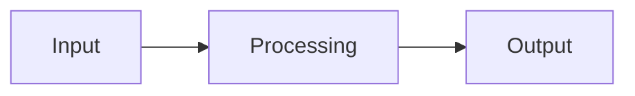
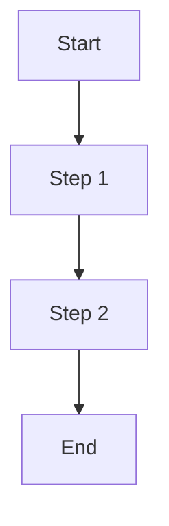
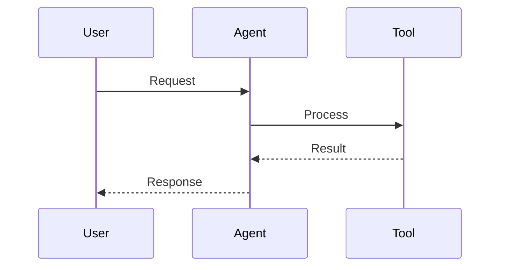

# Visual Enhancement Guidelines

## Overview

This document provides guidelines for determining when and where to add Visual_Enhancement elements (Mermaid diagrams) to Content_File elements in the Agentic Workflow Studio documentation. The goal is to strategically enhance comprehension without overwhelming users or duplicating information.

## When to Add Visual Enhancements

### 1. Complex Processes
**Add diagrams when:**
- Describing multi-step workflows with 3+ sequential steps
- Explaining decision-making processes with multiple branches
- Showing data transformation through multiple stages
- Illustrating parallel or concurrent operations

**Examples:**
- AI agent processing pipelines
- Multi-node workflow execution
- Data validation and transformation flows
- Error handling and recovery processes

### 2. Relationships and Connections
**Add diagrams when:**
- Showing how different nodes connect to each other
- Explaining parent-child or hierarchical relationships
- Illustrating data flow between system components
- Demonstrating integration patterns

**Examples:**
- Node connection patterns in workflows
- AI agent and tool relationships
- Memory and data persistence flows
- API integration architectures

### 3. Abstract Concepts
**Add diagrams when:**
- Explaining concepts that benefit from visual representation
- Breaking down complex technical processes
- Showing temporal sequences or timelines
- Illustrating cause-and-effect relationships

**Examples:**
- AI reasoning processes
- Workflow execution order
- Memory management concepts
- Performance optimization strategies

### 4. Learning and Tutorial Content
**Add diagrams when:**
- Introducing new concepts to beginners
- Showing step-by-step procedures
- Providing visual examples of abstract ideas
- Creating decision trees for troubleshooting

**Examples:**
- Getting started tutorials
- Workflow pattern explanations
- Troubleshooting guides
- Best practice illustrations

## When NOT to Add Visual Enhancements

### 1. Simple Concepts
**Avoid diagrams for:**
- Single-step processes or simple actions
- Basic parameter descriptions
- Straightforward configuration options
- Linear lists without relationships

### 2. Redundant Information
**Avoid diagrams when:**
- The text already clearly explains the concept
- A simple bullet list would be more effective
- The diagram would just repeat textual information
- The visual would not add meaningful insight

### 3. Overly Complex Diagrams
**Avoid diagrams that:**
- Require extensive explanation to understand
- Contain too many elements (>10-12 nodes)
- Are more confusing than the text description
- Cannot be easily read on mobile devices

### 4. Frequently Changing Content
**Avoid diagrams for:**
- Content that changes frequently (specific version numbers, URLs)
- Temporary or experimental features
- Content that requires frequent updates
- Information that becomes outdated quickly

## Where to Place Visual Enhancements

### 1. Content File Locations

#### High Priority Locations
- **Node documentation** (`integration/builtin/*/`)
  - Add data flow diagrams showing input → processing → output
  - Include connection examples with other nodes
  - Show parameter relationships and dependencies

- **Workflow patterns** (`learning/workflow-patterns/`)
  - Create process flowcharts for common patterns
  - Add decision trees for pattern selection
  - Show before/after examples of optimizations

- **AI concepts** (`advanced-ai/`)
  - Sequence diagrams for agent interactions
  - Memory flow diagrams for data persistence
  - Tool selection and execution processes

#### Medium Priority Locations
- **Getting started guides** (`usage/getting-started/`)
  - Step-by-step workflow creation diagrams
  - Learning path progression charts
  - Decision trees for choosing approaches

- **Key concepts** (`usage/key-concepts/`)
  - Data structure visualizations
  - Flow control illustrations
  - Component relationship diagrams

- **Examples and tutorials** (`learning/examples/`, `advanced-ai/examples/`)
  - Workflow execution sequences
  - Real-world implementation patterns
  - Problem-solution illustrations

#### Lower Priority Locations
- **Reference documentation** (API docs, configuration)
- **Release notes and changelogs**
- **Legal and policy pages**
- **Simple how-to guides with linear steps**

### 2. Placement Within Files

#### Optimal Positions
1. **After concept introduction**: Place diagrams immediately after introducing a new concept
2. **Before detailed explanation**: Use diagrams to provide context before diving into specifics
3. **Section transitions**: Use diagrams to bridge between related sections
4. **Summary positions**: Include overview diagrams that summarize complex sections

#### Placement Structure
```markdown
## Section Title

Brief introduction to the concept (1-2 sentences).

### Visual Overview

The following diagram illustrates [specific aspect]:

```mermaid
[diagram content]
```

### Detailed Explanation

Now that you can see the overall process, let's examine each step:

1. [Step details...]
2. [Step details...]
```

## Content-Specific Guidelines

### 1. Node Documentation Structure
```markdown
# Node Name

Brief description of the node's purpose.

## How It Works

### Data Processing Flow



## Parameters
[Parameter details...]

## Examples
[Usage examples...]

## Related Nodes
[Connection information...]
```

### 2. Workflow Pattern Structure
```markdown
# Pattern Name

## Overview
Brief description of when to use this pattern.

## Implementation Flow



## Step-by-Step Guide
[Detailed instructions...]

## Variations
[Alternative approaches...]
```

### 3. AI Concept Structure
```markdown
# AI Concept

## Understanding [Concept]

### Interaction Pattern



## Implementation Details
[Technical information...]
```

## Quality Guidelines

### 1. Enhancement Value Assessment
Before adding a diagram, ask:
- Does this diagram make the concept clearer than text alone?
- Will users understand the process better with this visual?
- Does the diagram reveal relationships not obvious in text?
- Is this the simplest effective way to show this information?

### 2. Consistency Requirements
- Use consistent diagram types for similar concepts
- Maintain uniform styling and terminology
- Follow established placement patterns
- Ensure diagrams complement existing content structure

### 3. Accessibility Considerations
- Provide descriptive text before and after diagrams
- Ensure content is understandable without the visual
- Use clear, descriptive labels in diagrams
- Maintain logical reading flow from text to diagram to text

## Implementation Checklist

### Before Adding a Diagram
- [ ] Concept benefits from visual representation
- [ ] Diagram adds value beyond text description
- [ ] Content fits high or medium priority categories
- [ ] Placement follows established guidelines
- [ ] Diagram type matches content purpose

### After Adding a Diagram
- [ ] Diagram renders correctly in development
- [ ] Labels use consistent terminology
- [ ] Descriptive context is provided
- [ ] Content flows logically around diagram
- [ ] Mobile display is readable and functional

### Review and Validation
- [ ] Diagram enhances rather than replaces content
- [ ] Visual follows established styling standards
- [ ] Content maintains accessibility requirements
- [ ] Implementation supports learning objectives
- [ ] Enhancement aligns with user needs and goals