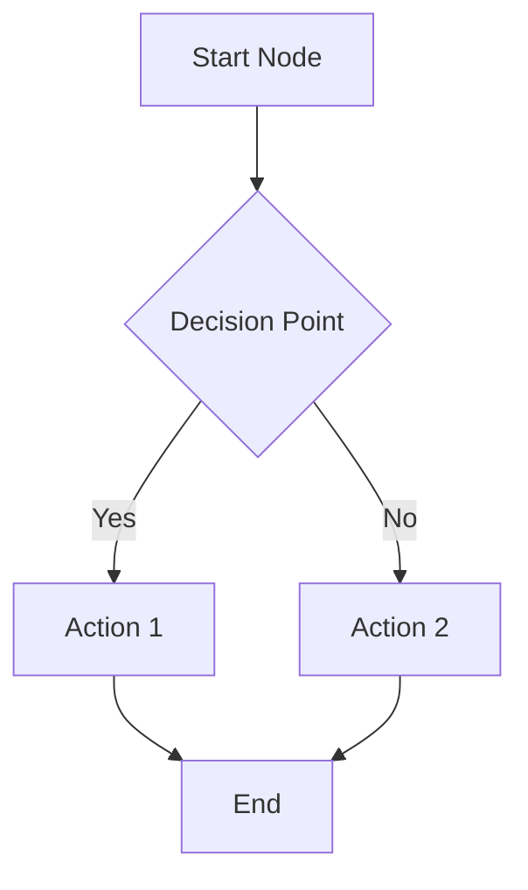
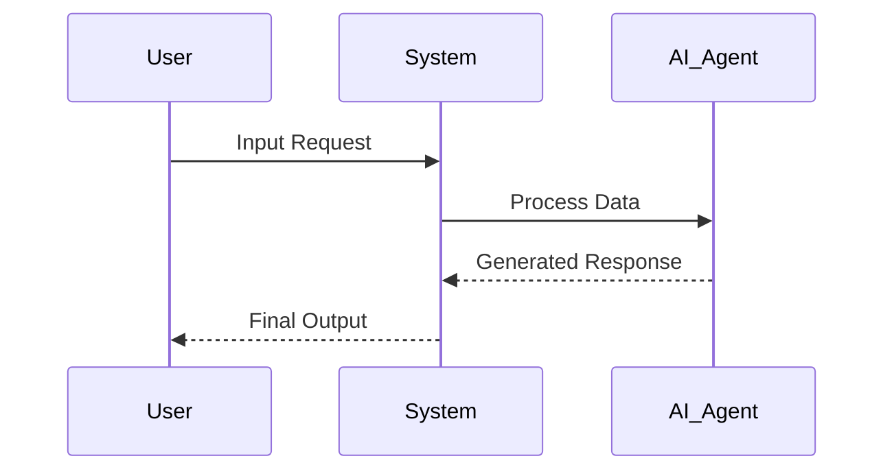
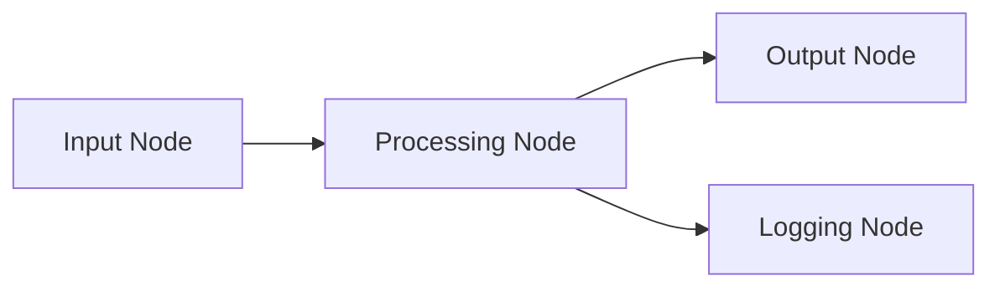
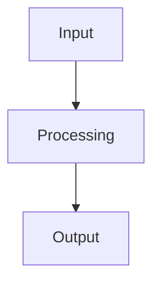
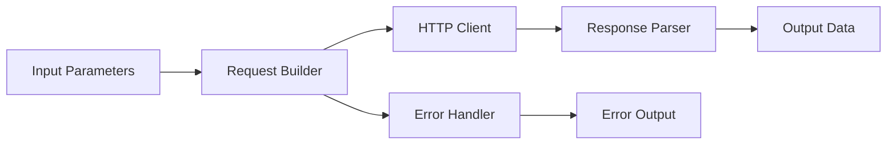
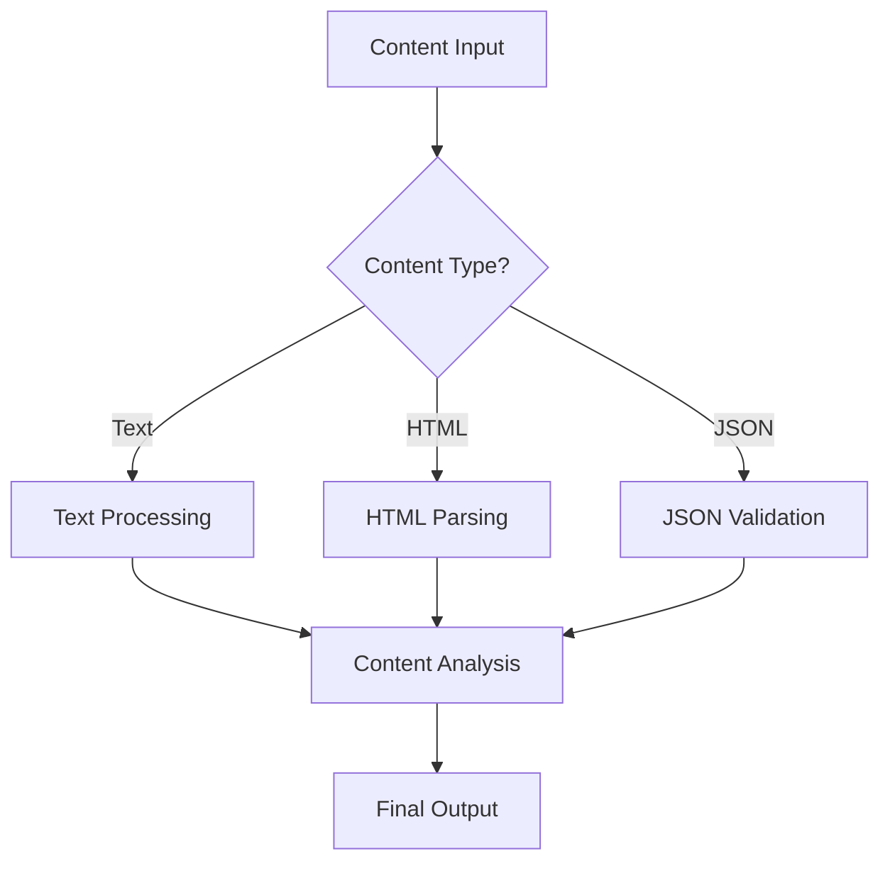

# Mermaid Diagram Standards and Guidelines

## Overview

This document establishes standards for consistent Mermaid diagram placement, styling, and usage across the Agentic Workflow Studio documentation. These guidelines ensure Visual_Enhancement elements improve comprehension while maintaining consistency and accessibility.

## Diagram Types and Usage

### 1. Flowcharts (`flowchart` or `graph`)
**When to use:**
- Workflow processes and decision trees
- Node connection patterns
- Multi-step procedures
- Data transformation flows

**Standard syntax:**


### 2. Sequence Diagrams (`sequenceDiagram`)
**When to use:**
- AI agent interactions
- API communication flows
- Time-based processes
- Request-response patterns

**Standard syntax:**


### 3. Graph Diagrams (`graph`)
**When to use:**
- Node relationships and connections
- System architecture overviews
- Component interactions
- Data flow between nodes

**Standard syntax:**


## Placement Guidelines

### 1. Diagram Positioning
- **After concept introduction**: Place diagrams immediately after introducing a concept
- **Before detailed explanation**: Use diagrams to provide visual context before diving into details
- **Section breaks**: Use diagrams to break up long text sections and improve readability

### 2. Context Requirements
- **Descriptive heading**: Always precede diagrams with a descriptive heading (### or ####)
- **Introductory text**: Include 1-2 sentences explaining what the diagram shows
- **Follow-up explanation**: Provide textual explanation after the diagram when needed

**Example structure:**
```markdown
### Data Flow Process

The following diagram shows how data moves through the AI processing pipeline:



This process ensures that all data is validated and transformed according to the specified rules.
```

## Styling Standards

### 1. Node Naming Conventions
- **Descriptive labels**: Use clear, descriptive labels for all nodes
- **Consistent terminology**: Use the same terms as in the surrounding documentation
- **Proper capitalization**: Use title case for node labels (e.g., "AI Agent", "Data Processing")

### 2. Node Types and Shapes
- **Rectangles `[Text]`**: For processes, actions, and standard nodes
- **Diamonds `{Text}`**: For decision points and conditional logic
- **Circles `((Text))`**: For start/end points and triggers
- **Rounded rectangles `(Text)`**: For external systems or services

### 3. Connection Styles
- **Solid arrows `-->`**: For standard data flow
- **Dotted arrows `-.->` **: For optional or conditional flows
- **Thick arrows `==>`**: For primary or emphasized flows
- **Labeled connections `-->|Label|`**: For decision outcomes or specific data types

### 4. Color and Theme
- Use the default "forest" theme configured in astro.config.mjs
- Avoid custom colors unless necessary for clarity
- Maintain consistency with the Starlight documentation theme

## Content-Specific Guidelines

### 1. Node Documentation
- **Data flow diagrams**: Show input → processing → output patterns
- **Connection diagrams**: Illustrate how nodes connect to each other
- **Parameter flow**: Visualize how parameters affect node behavior

### 2. Workflow Patterns
- **Step-by-step processes**: Use flowcharts with numbered or sequential steps
- **Decision trees**: Use diamond shapes for decision points
- **Parallel processes**: Show concurrent operations with parallel branches

### 3. AI Concepts
- **Agent interactions**: Use sequence diagrams for multi-agent scenarios
- **Memory flows**: Show how data persists and retrieves from memory
- **Tool usage**: Illustrate how agents select and use tools

### 4. Learning Content
- **Progressive complexity**: Start with simple diagrams, build to complex ones
- **Visual examples**: Use diagrams to illustrate abstract concepts
- **Troubleshooting flows**: Create decision trees for problem resolution

## Accessibility Guidelines

### 1. Descriptive Content
- **Alt text equivalent**: Provide textual description of diagram content
- **Context explanation**: Explain the purpose and key insights of each diagram
- **Standalone comprehension**: Ensure content is understandable without the diagram

### 2. Screen Reader Compatibility
- **Descriptive headings**: Use clear headings that describe diagram content
- **Text alternatives**: Include textual explanations of visual relationships
- **Logical flow**: Ensure text follows the same logical flow as the diagram

## Quality Assurance

### 1. Validation Checklist
- [ ] Diagram syntax is valid and renders correctly
- [ ] Labels are clear and use consistent terminology
- [ ] Diagram enhances rather than replaces textual content
- [ ] Proper heading and context are provided
- [ ] Diagram follows established styling conventions

### 2. Review Process
- Test diagram rendering in development environment
- Verify mobile responsiveness and readability
- Ensure diagram adds value to the content
- Check for consistency with similar diagrams in other sections

## Implementation Notes

### 1. Technical Requirements
- Use standard Mermaid markdown syntax: ````mermaid [content] ````
- No additional configuration needed beyond existing astro-mermaid setup
- Diagrams are processed automatically during build

### 2. Maintenance
- Update diagrams when related content changes
- Maintain consistency across similar content types
- Document any new diagram patterns for future reference

## Examples by Content Type

### Node Documentation Example
```markdown
### HTTP Request Data Flow

The HTTP Request node processes data through the following pipeline:



This flow ensures proper error handling and data validation at each step.
```

### Workflow Pattern Example
```markdown
### Multi-Step Content Processing

Complex content processing workflows follow this pattern:



Each content type requires specific processing before the unified analysis step.
```