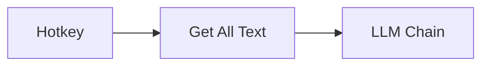

# Contributing to Agentic Workflow

We are thrilled that you are considering contributing to **Agentic Workflow**! Your help is vital in building the next generation of browser-native automation. While the core extension code is proprietary and closed-source, we highly value community contributions to our documentation, bug reports, and feature suggestions.

## 🤝 Code of Conduct

Please note that all contributors are expected to adhere to our [Code of Conduct](./CODE_OF_CONDUCT.md). By participating, you are expected to uphold this code.

## 🐛 Reporting Bugs

If you find a bug in the extension, please help us by submitting an issue to our designated issue tracker (link to be provided).

1.  **Check Existing Issues**: Before submitting, please check if the bug has already been reported.
2.  **Provide Details**: When creating a new issue, please include:
    *   A clear and descriptive title.
    *   The steps to reproduce the issue.
    *   The expected behavior and the actual behavior.
    *   Your browser version (e.g., Chrome 120, Firefox 118).
    *   The version of the Agentic Workflow extension you are using.
    *   Screenshots or screen recordings are highly encouraged.

## ✨ Suggesting Enhancements

We welcome ideas for new features, especially new **Nodes** that leverage the browser's unique capabilities (e.g., new local LLM integrations, advanced DOM manipulation).

1.  **Check Existing Feature Requests**: Search the issue tracker to see if your idea has already been discussed.
2.  **Open a Feature Request**: Open an issue and use the "Feature Request" template. Clearly describe the problem your suggestion solves and how the new feature (or Node) would work.

## 📝 Contributing to Documentation

The most direct way to contribute is by improving our documentation, tutorials, and example workflows. High-quality documentation is crucial for our users.

1.  **Find the Documentation Repository**: [agentic-com/Agentic-Flow-Doc](https://github.com/agentic-com/Agentic-Flow-Doc). Every page has an **Edit** link at the bottom that opens the file on GitHub.
2.  **Identify Areas for Improvement**: Look for typos, unclear explanations, missing examples, or outdated information.
3.  **Submit a Pull Request (PR)**:
    *   Fork the documentation repository.
    *   Create a new branch for your changes (e.g., `docs/fix-typo-in-node-guide`).
    *   Make your changes to the Markdown files.
    *   Open a Pull Request against the `Dev` branch of the documentation repository.
    *   Provide a clear description of your changes.

### Run the docs locally

```bash
bun install
bun run dev     # http://localhost:4321
bun run build   # must pass before you open a PR
```

The build needs `DOCS_SITE_URL`, `PUBLIC_SITE_URL`, `PUBLIC_CHROME_EXTENSION_URL` and `PUBLIC_FIREFOX_EXTENSION_URL` (a `.env` file works). `VITE_CONTENT_SET_ID` feeds the "Was this page useful?" widget. `starlight-links-validator` checks every internal link and `#anchor` during the build.

## ✍️ Docs style guide

Write for a capable non-coder who wants a result. Short sentences, second person, outcome first. Name things the way the app shows them (**Open Focused**, not `active`).

### Page frontmatter

Besides `title` and `description` (always set both; the description appears under the title and in search results), pages can declare:

| Field | Use it for |
| --- | --- |
| `kind` | `node`, `lesson`, `recipe`, `concept`, `guide`, `connection`, `release`, `hub`. `kind: node` turns the title into a node header. |
| `section` | `get-started`, `app`, `recipes`, `nodes`, `concepts`, `releases`. Sets the tab and banner colour when the folder alone doesn't. |
| `worksIn` | `[extension]`, `[web]` or both. Shown as badges on node pages. |
| `node` | `{ id, family, agentTool, deprecated, since }`. `id` matches the node's `docLink` slug. |
| `lesson` / `recipe` | Learning-path and recipe metadata (see `src/content.config.ts`). |

### Built-in Starlight components

Import them from `@astrojs/starlight/components`.

- **`<Steps>`**: every tutorial or how-to with more than two actions. Wrap a plain ordered list. Don't number "Step 1 / Step 2" in headings by hand.
- **`<Tabs>` / `<TabItem>`**: alternatives the reader picks one of (Extension vs Web app, macOS vs Windows). Use `syncKey` when several tab groups share the same choice. Not for sequential content.
- **`<Badge>`** (Starlight's): inline status in prose or in the sidebar (`sidebar: { badge: New }`). Variants: `note`, `tip`, `success`, `caution`, `danger`.
- **`<LinkCard>`**: "Related nodes" and "Next steps" at the end of a page. Prefer 2–4 cards in a `<CardGrid>`.
- **`<Card>` / `<CardGrid>`**: overview pages only.
- **`<FileTree>`**: folder or export layouts (e.g. what an `.awf` export contains).
- **Asides** (`:::note`, `:::tip`, `:::caution`, `:::danger`): one per idea, never stacked. They render as tinted boxes.
- **Code blocks**: always give a language and a `title=`, e.g. ` ```json title="my-flow.awf" ` or ` ```js title="Expression" `.
- **Heading badges** (starlight-heading-badges): `## Search messages :badge[New]{variant=tip}`.
- **Keyboard shortcuts that differ per OS** (starlight-kbd): `import { Kbd } from 'starlight-kbd/components'` then `<Kbd mac="Cmd+K" windows="Ctrl+K" />`.
- **Images** zoom on click (starlight-image-zoom); no extra markup needed.

### Mermaid diagrams

Use a diagram only when it explains something the prose can't. Don't hard-code colours with `style X fill:…` or `classDef`: they break dark mode. Use the theme-aware classes instead, which work in both themes without a `classDef`:



Available: `awf-trigger`, `awf-ai`, `awf-data`, `awf-flow`, `awf-io`, `awf-ok`, `awf-warn`, `awf-err`.

### AWFlow components

Import from `@components/awflow`, e.g. `import { Callout, ParamTable } from '@components/awflow';`. Styles load on every page; you don't import CSS.

| Component | When to use it | Props |
| --- | --- | --- |
| `<Badge>` | Status next to a title or in a list. | `variant`: `new` · `deprecated` · `admin` · `on-device` · `no-setup` · `connections` · `agent-tool` · `extension` · `web` · `beta` · `neutral`; `text` (overrides the label, e.g. "New in 0.8"); `count` (for `connections`). |
| `<WorksIn>` | Where a node or feature runs. Node pages get it automatically from `worksIn`. | `envs={['extension']}` or the flags `extension` / `web`; `showMissing` (default `true`); `label` (shows "Works in"). |
| `<Callout>` | A single, actionable note: a tip, a required connection, something to be careful about. Use instead of an aside when you need an action link. | `type`: `tip` · `info` · `credential` · `careful` · `danger` · `new`; `title`; `href` + `linkLabel`. Body is the children. |
| `<ParamTable>` | Settings of a node or a dialog. | `rows`: `{ name, type?, required?, default?, description? }[]`; `caption`. |
| `<OutputPorts>` | A node's output ports. | `ports`: `{ name, type?, description? }[]`; `label`. |
| `<StepCard>` | A tutorial step with a verifiable result. Every step should say how the reader knows it worked. | `n`, `title`, `check` (renders "Check: …"), `level` (heading level, default 3). Body is the children. |
| `<Screenshot>` | App captures, ideally a light and a dark pair, with numbered hotspots explained in a legend. | `src`, `srcDark`, `alt` (required), `caption`, `hotspots`: `{ x, y, label }[]` (x/y in %), `width`, `height`. |
| `<PageActions>` | Copy as Markdown / Ask Aria / Edit buttons. Node headers already include it. Interactive: add `client:visible`. | `markdownUrl` (defaults to the page's `.md` twin), `editUrl`, `askAriaHref`, `askAriaLabel`, `compact`. |
| `<RecipeCard>` | Linking to a recipe from a node, concept or hub page. | `title`, `href`, `goal`, `level` (`beginner` · `intermediate` · `advanced`), `minutes`, `apps`, `setup` (`none` · `connection` · `on-device`). |
| `<Kbd>` | A fixed key or combination. For shortcuts that differ per OS, use starlight-kbd's `<Kbd>` instead. | `keys`: `"Ctrl+Shift+K"` or `['⌘', 'K']`. |

Example:

```mdx
import { Callout, StepCard } from '@components/awflow';

<Callout type="credential" title="Needs a Slack connection" href="/usage/using-the-app/credentials/" linkLabel="Connect Slack">
  A bot token from a small Slack app (about 3 minutes).
</Callout>

<StepCard n={1} title="Add the Slack node" check="the node appears on the canvas with a red dot until it's connected.">
  Open the node picker and type **Slack**.
</StepCard>
```

### The `starlight-awflow` plugin

The site chrome (section tabs, banners, node headers, the "at a glance" card, the Ask Aria pill, brand tokens and motion) lives in the in-repo plugin `plugins/starlight-awflow/`. Its options are typed in `plugins/starlight-awflow/types.ts`; the header tabs come from its `sections` option in `astro.config.mjs`. Motion respects "reduce motion".

## 📸 Screenshots

App screenshots are generated, never taken by hand, so they can be refreshed for each release. The pipeline lives in `scripts/capture/` and writes to `src/assets/screenshots/`:

- `<shot>.light.webp` and `<shot>.dark.webp`: 1440×900 viewport at 2× scale, downscaled to 2000 px wide, WebP quality 85.
- `manifest.json`: one entry per shot with `shot`, `route`, `page` (the docs page it is meant for), `alt` (true, descriptive alt text), `status` (`ok`, `skipped` or `failed`, with a `reason`), `files`, `hotspots`, `appCommit`, `appVersion` and `capturedAt`.

### Refresh the screenshots

You need the app repo checked out next to this one (`../agentic-flow`, or pass `--app <dir>`) with its dependencies installed. Playwright is loaded from the app repo; if Chromium is missing, run `bunx playwright install chromium` there.

```bash
bun run docs:capture --build                 # build the app (build:prod:web), then capture every shot in both themes
bun run docs:capture --only canvas,memory    # some shots only (the manifest keeps the others)
bun run docs:capture --theme dark            # one theme only: light, dark or both (default)
```

- It captures the app's **production web build**, served on `127.0.0.1`. Never point it at the app's dev server: `dev:web` rewrites the app's translation files.
- The browser starts as a fresh anonymous local workspace with first-run tours dismissed, in light or dark mode (the app's `mode-watcher-mode` key). Calls to a local Ollama are blocked so the machine's own models never show up.
- Data is created through the app's own UI: example workflows from `scripts/capture/fixtures/*.awf` are imported with the Add Workflow wizard, runs are started from the workflow list, and the Memory and chat shots import a generated `.awmem` file (`scripts/capture/lib/awmem.ts`) with Memory › Import. No model runs during capture.
- `local-models` and `marketplace-browse` need the network (Hugging Face list, `api.awflow.io`). The API does not allow a `127.0.0.1` origin, so the script adds CORS headers to those responses; the data is the live API's. Offline, these two are recorded as `skipped` and their old images are removed.
- A shot that fails keeps its previous images and manifest entry, the run exits with code 1, and a screenshot plus an accessibility snapshot of the failing page are saved in your temp folder (`awflow-docs-capture-debug/`).
- Afterwards, open the changed images and check there is no toast, dialog or half-loaded state, then commit the images and `manifest.json` together.

### Add a shot

1. Add an entry to `SHOTS` in `scripts/capture/shots.ts` (the array order is the manifest order): `name`, `page`, `route`, `alt`, 2–4 `hotspots` and a `prepare(session)` that brings the app to the state to capture.
2. Use visible roles and text for locators (`p.getByRole('button', { name: 'Add Workflow' })`) and wait for what you capture. Reuse the `Session` helpers (`workflow`, `editor`, `testRun`, `savedRuns`, `importMemory`, `knowledgeBase`, `assistant`) instead of seeding storage.
3. Set `needsNetwork: true` only when the shot cannot work offline, and `viewport` for a non-desktop size (the `side-panel` shot uses 400×860).
4. Write `alt` as what the image really shows. If a state can't be produced reliably (it needs an account or a model), leave the shot out or let it be `skipped`; never fake it.
5. Run `bun run docs:capture --only <name>`, open both images, then commit.

### Use a shot in a page

```mdx
import { Screenshot } from '@components/awflow';
import canvasLight from '@assets/screenshots/canvas.light.webp';
import canvasDark from '@assets/screenshots/canvas.dark.webp';

<Screenshot src={canvasLight} srcDark={canvasDark} alt="…alt from manifest.json…" hotspots={[{ x: 19.8, y: 9.6, label: 'Add a step (node)' }]} />
```

Take `alt` and the hotspots' `x`, `y` and `label` from the shot's `manifest.json` entry. Each hotspot also has a `box` (the element's bounds, in % of the image) if you need to place a marker elsewhere.

## 🌍 Languages

The docs are **English only** for now. This was decided in awflow/Agentic-Flow#1332, while the docs are being restructured (epic #1308): translating pages that are still moving and being rewritten would waste the effort and leave stale copies behind.

- The app itself ships French, German and Chinese. The docs will follow once the information architecture (#1334) and the templates are stable.
- **When we add a language:** enable a Starlight locale in `astro.config.mjs` (`locales`), then translate in this order: getting started → recipes → privacy & data. Pages that aren't translated fall back to English automatically.
- The dead `fr` config and the empty `i18n` collection have been removed. Don't add UI-string translations until a locale is enabled.

## ⚖️ Legal

By contributing to our documentation, you agree to license your contribution under the project's [License](./LICENSE.md). You also confirm that you have the right to submit your work under that license.

Thank you for helping us build a better, more private, and more powerful automation tool!
