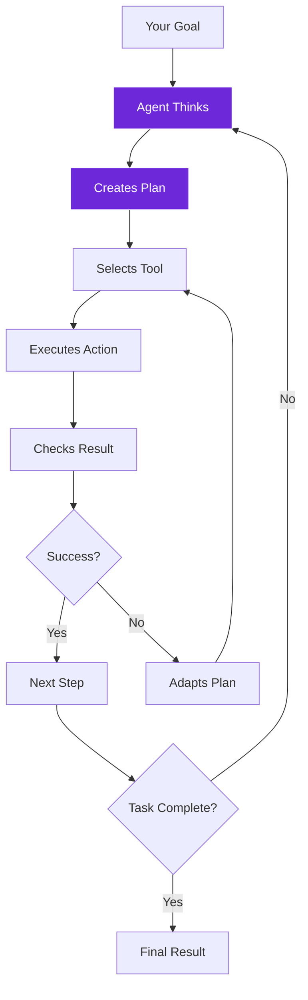

import { Steps, Aside, Tabs, TabItem } from "@astrojs/starlight/components";
import { Image } from "astro:assets";
import Social from "@images/social.webp";

AI agents are like having smart assistants that can think through problems, make plans, and use different tools to get things done. Unlike simple automation that follows fixed steps, agents can adapt their approach based on what they encounter.

Think of an agent as a problem-solver that can figure out the best way to accomplish your goals, even when things don't go as expected.

<Image src={Social} alt="AI agent thinking and selecting tools to complete tasks" />

## How agents think

Agents follow a reasoning process similar to how humans approach complex tasks:

## Types of agents

<Tabs>
  <TabItem label="Tools Agent">
    **Best for:** Complex tasks requiring multiple tools
    
    The Tools Agent can use any combination of available tools to accomplish goals. It's like having a Swiss Army knife - it picks the right tool for each part of the job.
    
    **Example:** "Research competitor pricing and create a comparison report"
    - Uses web scraping tools to visit competitor sites
    - Uses AI analysis to extract pricing information  
    - Uses data tools to organize findings into a report
  </TabItem>
  
  <TabItem label="Q&A Agent">
    **Best for:** Answering questions about specific content
    
    The Q&A Agent specializes in reading through content and answering specific questions about what it finds.
    
    **Example:** "What are the main benefits mentioned in these product reviews?"
    - Reads through all the review content
    - Identifies benefit-related information
    - Summarizes the key advantages customers mention
  </TabItem>
  
  <TabItem label="RAG Agent">
    **Best for:** Knowledge-based tasks with large document collections
    
    The RAG Agent searches through your document database first, then uses that information to provide accurate, source-backed answers.
    
    **Example:** "How do we handle customer refunds according to our policies?"
    - Searches company policy documents
    - Finds relevant refund procedures
    - Provides accurate answer with policy citations
  </TabItem>
</Tabs>

## Agent vs traditional automation

| Traditional Automation | AI Agents |
|------------------------|-----------|
| Follows fixed sequence | Adapts plan based on results |
| Breaks when things change | Tries alternative approaches |
| Requires manual updates | Learns from new situations |
| One-size-fits-all approach | Customizes approach per task |

## Real-world agent examples

### Research assistant
**Goal:** "Find contact information for tech startups in San Francisco"

**Agent approach:**
1. Plans to search startup directories and company websites
2. Uses web scraping to gather company lists
3. Visits individual company sites to find contact details
4. Adapts when some sites have different layouts
5. Compiles results into organized contact list

### Content monitor
**Goal:** "Track mentions of our company across news sites"

**Agent approach:**
1. Plans to check multiple news sources regularly
2. Uses web scraping to gather recent articles
3. Uses AI analysis to identify company mentions
4. Adapts search terms based on what it finds
5. Summarizes findings and sentiment analysis

### Customer support
**Goal:** "Help customers find answers in our documentation"

**Agent approach:**
1. Understands the customer's question
2. Searches through knowledge base for relevant information
3. Finds multiple related documents
4. Synthesizes information into helpful answer
5. Provides source links for further reading

<Aside type="tip" title="Start with clear goals">
  Agents work best when you give them specific, measurable goals rather than vague instructions. Instead of "help with research," try "find pricing information for 5 competitors in the SaaS space."
</Aside>

## Building effective agents

<Steps>

1. **Define clear objectives**: What specific outcome do you want?

2. **Choose appropriate tools**: Give agents access to tools they'll need for the task

3. **Set reasonable limits**: Prevent infinite loops with maximum step counts

4. **Test with simple tasks**: Start small and gradually increase complexity

5. **Monitor and refine**: Watch how agents work and adjust their instructions

</Steps>

## Common agent patterns

### Information gathering
- Web scraping + AI analysis + data organization
- Perfect for market research, lead generation, competitive analysis

### Content processing  
- Document reading + question answering + summarization
- Great for analyzing reports, reviews, research papers

### Decision making
- Data analysis + rule evaluation + action selection
- Useful for content moderation, quality control, routing decisions

### Workflow orchestration
- Task planning + tool coordination + progress monitoring
- Ideal for complex multi-step business processes

Agents represent the next evolution of automation - from rigid scripts to intelligent assistants that can think, adapt, and solve problems creatively.