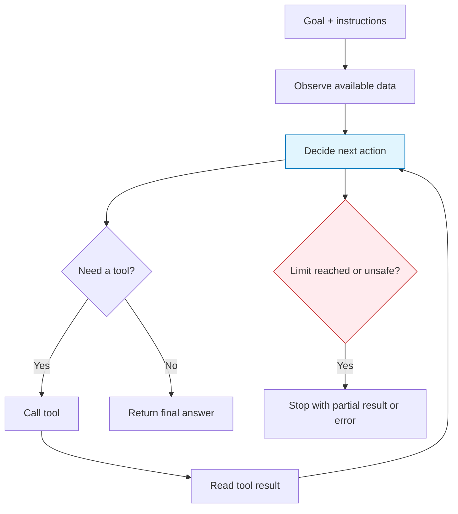
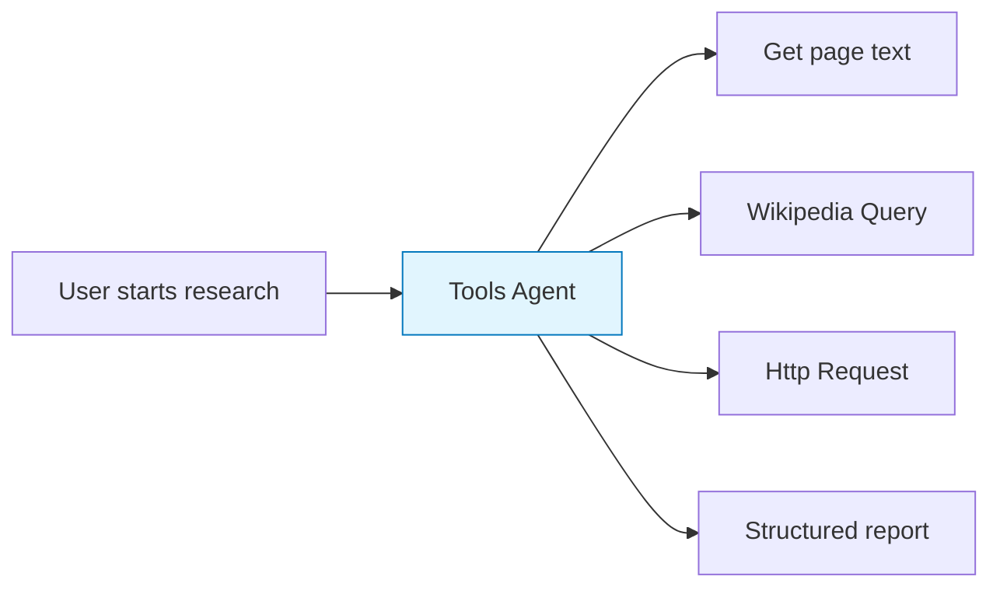

import { Aside, Tabs, TabItem } from "@astrojs/starlight/components";

An AI agent is a workflow step that can reason about a goal, choose tools, inspect results, and decide what to do next. It is useful when the path to the answer is not always the same.

Do not use an agent just because a workflow uses AI. Use an agent when the workflow needs **decision-making**. For predictable transformations, a direct LLM chain is usually simpler and easier to test.

## Agent loop

Most agents follow the same loop:

The loop is powerful, but it must be bounded. Give agents clear goals, tool access, stopping conditions, and output expectations.

## Agent types in Agentic WorkFlow

<Tabs>
  <TabItem label="Basic LLM Chain">
    Use this when the model should transform known input into known output: summarize text, classify content, draft a message, or rewrite a field.

    It is not really an agent loop. It is the best default for predictable AI steps.
  </TabItem>

  <TabItem label="Q&A Agent">
    Use this when the user asks a question about provided context. The quality depends on whether the workflow passes the right context into the node.

    It is a good fit for page Q&A, document Q&A, and support-style answers.
  </TabItem>

  <TabItem label="RAG Agent">
    Use this when the answer should be grounded in a vector store or local knowledge source.

    It is the right choice when the model should search before answering.
  </TabItem>

  <TabItem label="Tools Agent">
    Use this when the model must choose between tools, such as searching, extracting page content, querying Wikipedia, or calling a service.

    It is the most flexible pattern, and also the one that needs the clearest limits.
  </TabItem>
</Tabs>

## When to use an agent

Use an agent when:

- The workflow does not know in advance which tool is needed.
- The task needs multiple steps and intermediate decisions.
- The model should inspect results before continuing.
- The workflow can tolerate some variability.

Avoid an agent when:

- The workflow is a fixed transformation.
- The output must follow a strict schema and no tool choice is needed.
- A wrong action would be expensive or destructive.
- The task can be solved with a direct node chain.

## Agent design checklist

| Design question | Why it matters |
| --- | --- |
| What is the exact goal? | Vague goals produce wandering tool calls |
| What data can the agent see? | Missing context leads to guesses |
| Which tools can it use? | Too many tools increase wrong choices |
| When should it stop? | Prevents loops and runaway execution |
| What should the output look like? | Makes downstream nodes reliable |
| How will you evaluate it? | Catches regressions and hallucinations |

## Example: research workflow

The agent should not be told “research this.” A stronger instruction is:

> Find three source-backed facts about this company. Use page text first, then Wikipedia if the page lacks enough context. Return a short report with source URLs.

That instruction gives the agent a goal, tool preference, stopping condition, and output shape.

<Aside type="tip" title="Keep agents narrow">
  A narrow agent with two or three relevant tools is usually more reliable than a broad agent with every tool available.
</Aside>

## Related topics

- [Tool selection](/advanced-ai/concepts/tool-selection/)
- [Prompting and structured outputs](/advanced-ai/concepts/prompting-and-outputs/)
- [RAG](/advanced-ai/concepts/rag/)
- [Evaluation and testing](/advanced-ai/concepts/evaluation-testing/)
