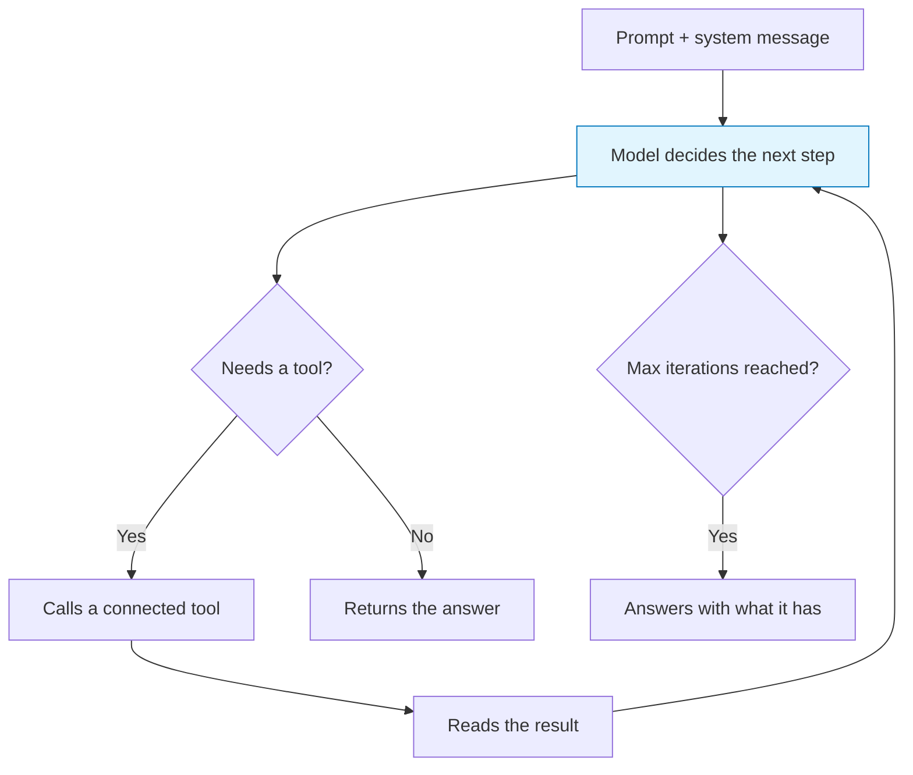
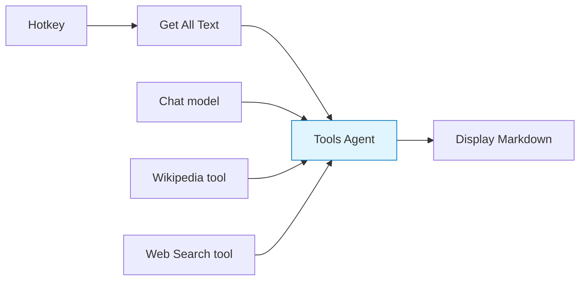

import { Aside, Tabs, TabItem } from "@astrojs/starlight/components";

An **agent** is an AI node that can decide what to do next: search your documents, call a tool, read the result, and try again until it has an answer. A **chain** does one thing: it sends your input to the model once and returns the answer.

Use an agent only when the step needs **decisions**. For a fixed task, such as summarizing or classifying, a chain is simpler, faster and easier to test.

<Aside type="note" title="Agents in workflows and agents in the chat">
This page is about agent **nodes** in workflows. To chat with Aria or with agents you create yourself, see [Agents](/usage/using-the-app/chat-and-agents/agents/). To hand a task from a workflow to one of those agents, use the **Run agent** node.
</Aside>

## How an agent works

```mermaid
flowchart TD
  Goal["Prompt + system message"] --> Decide["Model decides the next step"]
  Decide --> Tool{"Needs a tool?"}
  Tool -->|Yes| Call["Calls a connected tool"]
  Call --> Result["Reads the result"]
  Result --> Decide
  Tool -->|No| Answer["Returns the answer"]
  Decide --> Stop{"Max iterations reached?"}
  Stop -->|Yes| Partial["Answers with what it has"]

  style Decide fill:#e1f5fe,stroke:#0277bd
```

The agent can only use what you connect to it. It never gets a tool you didn't add.

## Which AI node to use

<Tabs>
  <TabItem label="Basic LLM Chain">
    [Basic LLM Chain](/nodes/builtin/ai/aiagents/basicllmchainnode/) sends your prompt to the model once and returns its answer. Use it to rewrite, draft, translate or answer from text you pass in. No tools, no search.

    For common tasks there are ready-made chains: [Summarization](/nodes/builtin/ai/aiagents/summarizationchainnode/), [Text Classifier](/nodes/builtin/ai/aiagents/textclassifiernode/), [Sentiment Analysis](/nodes/builtin/ai/aiagents/sentimentanalysisnode/) and [Information Extractor](/nodes/builtin/ai/aiagents/informationextractornode/).
  </TabItem>

  <TabItem label="Q&A Agent">
    [Q&A Agent](/nodes/builtin/ai/aiagents/qanode/) answers a question from a connected knowledge base. It retrieves the most relevant passages (4 by default) and answers from them. It also works with on-device question-answering models.
  </TabItem>

  <TabItem label="RAG Agent">
    [RAG Agent](/nodes/builtin/ai/aiagents/ragnode/) searches a connected [Local Knowledge](/nodes/builtin/ai/aidependencies/vectorstore/localknowledge/) base before answering, so its answers come from your documents. It can also use a [Chat Memory](/nodes/builtin/ai/aidependencies/chatmemories/chatmemory/) and an output parser. See [RAG](/advanced-ai/concepts/rag/).
  </TabItem>

  <TabItem label="Tools Agent">
    [Tools Agent](/nodes/builtin/ai/aiagents/toolsagentnode/) chooses between the tools you connect: [Web Search](/nodes/builtin/ai/aidependencies/tools/web-search/), [Wikipedia](/nodes/builtin/ai/aidependencies/tools/wikipedia-query/), [Calculator](/nodes/builtin/ai/aidependencies/tools/calculator/), [Browser](/nodes/builtin/ai/aidependencies/tools/browser/), [HTTP Request](/nodes/builtin/ai/aidependencies/tools/http-request/), [MCP Client](/nodes/builtin/ai/aidependencies/tools/mcp-client/), another workflow through the [Workflow Tool](/nodes/builtin/ai/aidependencies/tools/workflow-tool/), and more.

    It needs a chat model that supports tool calling. **Max iterations** (10 by default) limits how many tool calls it may make before it must answer.
  </TabItem>
</Tabs>

## What you can connect

| Port | Basic LLM Chain | Q&A Agent | RAG Agent | Tools Agent |
| --- | --- | --- | --- | --- |
| Model (required) | Yes | Yes | Yes | Yes, with tool calling |
| Knowledge | — | Yes | Yes | Yes |
| Memory | — | — | Yes | Yes |
| Tools | — | — | — | Yes |
| Output parser | Yes | Yes | Yes | Yes |

Check each node's page for the exact options.

## When to use an agent

Use an agent when:

- you can't know in advance which tool the step needs;
- the step needs several actions, each depending on the last result;
- some variation in the answer is acceptable.

Use a chain, or regular nodes, when:

- the task is the same every time;
- a wrong action would be costly. If you still need an agent, rely on [action approval](/advanced-ai/concepts/action-approval/);
- the task can be done with a few regular nodes in a row.

## Keep agents focused

| Question | Why it matters |
| --- | --- |
| What exactly should it achieve? | A vague goal leads to wandering tool calls. |
| What data does it get? | Missing input leads to guesses. |
| Which tools does it need? | Fewer tools mean fewer wrong choices. See [Tool selection](/advanced-ai/concepts/tool-selection/). |
| When should it stop? | **Max iterations** is a safety net, not a plan. Say in the prompt when the task is done. |
| What should the answer look like? | Connect an [output parser](/advanced-ai/concepts/prompting-and-outputs/) when a later step uses it. |

## Example: research a company

```mermaid
flowchart LR
  Trigger["Hotkey"] --> Text["Get All Text"]
  Text --> Agent["Tools Agent"]
  Model["Chat model"] --> Agent
  Wiki["Wikipedia tool"] --> Agent
  Search["Web Search tool"] --> Agent
  Agent --> Note["Display Markdown"]

  style Agent fill:#e1f5fe,stroke:#0277bd
```

"Research this company" is too vague. A stronger prompt is:

> Find three facts about this company and give the source of each. Use the page text first. Search Wikipedia only if the page doesn't say enough. Return a short list with links.

It gives the agent a goal, an order for its tools, a point to stop, and the shape of the answer.

<Aside type="tip" title="Two or three tools are enough">
An agent with two or three relevant tools is usually more reliable than one with every tool connected.
</Aside>

## Related

- [Tool selection](/advanced-ai/concepts/tool-selection/)
- [Action approval](/advanced-ai/concepts/action-approval/)
- [Prompting and outputs](/advanced-ai/concepts/prompting-and-outputs/)
- [RAG](/advanced-ai/concepts/rag/)
- [Testing AI workflows](/advanced-ai/concepts/evaluation-testing/)
