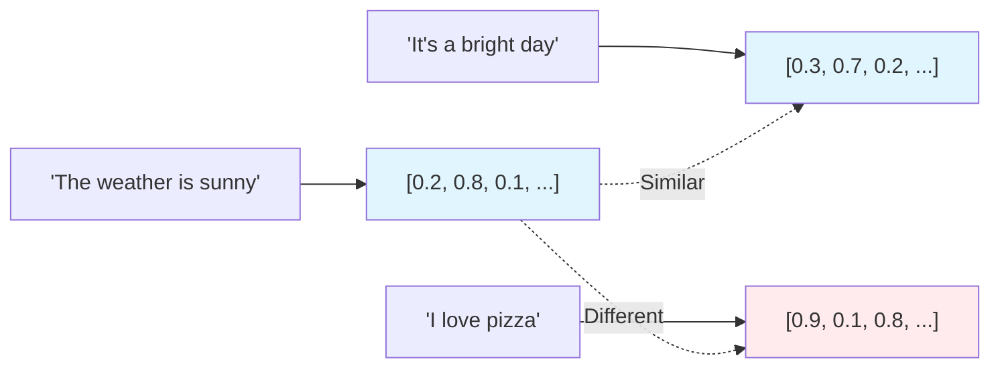
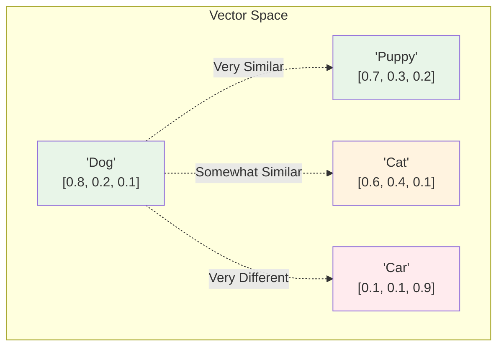

import { Steps, Aside, Tabs, TabItem } from "@astrojs/starlight/components";
import { Image } from "astro:assets";
import Social from "@images/social.webp";

Embeddings are like creating a "fingerprint" for text that captures its meaning in numbers. Instead of searching for exact word matches, you can find content that means the same thing, even if it uses completely different words.

This is the secret behind smart search systems that understand what you're really looking for.

<Image src={Social} alt="Text being transformed into numerical vectors that represent meaning" />

## What are embeddings?

Imagine you could represent the meaning of any text as a point in space. Similar meanings would be close together, while different meanings would be far apart. That's exactly what embeddings do - they convert text into lists of numbers (vectors) that capture semantic meaning.

## Why embeddings matter

Traditional search looks for exact word matches. Embedding-based search understands meaning:

<Tabs>
  <TabItem label="Traditional Search">
    **Search:** "How to fix a broken website"
    
    **Finds:** Documents containing exactly "fix", "broken", "website"
    
    **Misses:** 
    - "Troubleshooting site issues"
    - "Repairing web application problems"  
    - "Website debugging guide"
  </TabItem>
  
  <TabItem label="Embedding Search">
    **Search:** "How to fix a broken website"
    
    **Finds:** All documents about website problems, including:
    - "Troubleshooting site issues"
    - "Repairing web application problems"
    - "Website debugging guide"
    - "Solving webpage errors"
    
    **Why:** Understands these all relate to the same concept
  </TabItem>
</Tabs>

## How embeddings work

<Steps>

1. **Text Input**: You provide any text - a sentence, paragraph, or document

2. **AI Processing**: An embedding model (like those in Ollama) analyzes the text

3. **Vector Creation**: The model outputs a list of numbers representing the meaning

4. **Storage**: These vectors can be stored and compared with other vectors

5. **Similarity Search**: Find content with similar vector patterns

</Steps>

## Vector similarity

Vectors that are "close" in mathematical space represent similar meanings:

## Practical applications

### Smart document search
Instead of keyword matching, find documents by meaning:
- Search "customer complaints" → finds "user feedback", "service issues", "client concerns"
- Search "pricing information" → finds "cost details", "fee structure", "payment plans"

### Content recommendation
Find related articles or products:
- User reads about "solar panels" → recommend "renewable energy", "green technology", "sustainable power"

### Question answering
Match questions to relevant answers:
- Question: "How do I reset my password?" 
- Matches: "Password recovery", "Account access issues", "Login troubleshooting"

### Duplicate detection
Find similar content even with different wording:
- "The product is excellent" ≈ "This item is outstanding" ≈ "Great quality product"

## Embedding models

Different models create different types of vectors:

| Model Type | Best For | Example |
|------------|----------|---------|
| **General Purpose** | Most text content | nomic-embed-text |
| **Multilingual** | Multiple languages | multilingual-e5 |
| **Code-Specific** | Programming content | code-embeddings |
| **Domain-Specific** | Specialized fields | biomedical-embeddings |

<Aside type="tip" title="Start with general purpose">
  For most use cases, general-purpose models like nomic-embed-text work excellently. Only use specialized models if you have specific domain requirements.
</Aside>

## Building with embeddings

### Creating a knowledge base
1. Convert all your documents into embeddings
2. Store embeddings with original text
3. When users search, convert their query to embeddings
4. Find documents with similar embeddings
5. Return the most relevant original text

### Improving search results
- **Similarity threshold**: Only return results above a certain similarity score
- **Result ranking**: Order results by how similar they are to the query
- **Metadata filtering**: Combine embedding search with traditional filters

## Common challenges

### Vector dimensions
- More dimensions = more detailed meaning representation
- But also = more storage space and slower search
- Most models use 384-1536 dimensions

### Storage requirements
- Each document becomes a vector of hundreds of numbers
- Large document collections need significant storage
- Local storage has browser limits

### Search quality
- Quality depends on the embedding model used
- Some models better for specific types of content
- May need fine-tuning for specialized domains

Embeddings transform how we search and understand text, making it possible to build truly intelligent document systems that understand meaning, not just words.