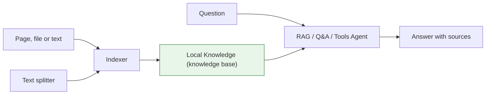

import { Aside } from "@astrojs/starlight/components";

An **embedding** is a list of numbers (a **vector**) that captures what a piece of text means. Texts with similar meanings get similar vectors, even when they use different words. "How do I cancel my plan?" and "stop my subscription" end up close together.

This is how a [knowledge base](/usage/using-the-app/knowledge-bases/overview/) finds the right passages for a question: it turns the question into a vector and returns the passages whose vectors are closest.

## Where embeddings are used in AWFlow

```mermaid
flowchart LR
  Source["Page, file or text"] --> Indexer["Indexer"]
  Splitter["Text splitter"] --> Indexer
  Indexer --> KB["Local Knowledge (knowledge base)"]
  Question["Question"] --> Agent["RAG / Q&A / Tools Agent"]
  KB --> Agent
  Agent --> Answer["Answer with sources"]

  style KB fill:#e8f5e9,stroke:#2e7d32
```

1. The [Indexer](/nodes/builtin/ai/aiagents/indexernode/) splits text into chunks (with a [text splitter](/nodes/builtin/ai/aidependencies/textsplitter/recursivecharactertextsplitter/)) and saves each chunk with its vector in a knowledge base.
2. [Local Knowledge](/nodes/builtin/ai/aidependencies/vectorstore/localknowledge/) connects that knowledge base to an agent.
3. The [RAG Agent](/nodes/builtin/ai/aiagents/ragnode/), [Q&A Agent](/nodes/builtin/ai/aiagents/qanode/) or [Tools Agent](/nodes/builtin/ai/aiagents/toolsagentnode/) searches it before answering.

You can also fill a knowledge base without a workflow: on its page, click **Add sources** to add files, web pages, open tabs or pasted text, or [save from anywhere](/usage/using-the-app/knowledge-bases/save-from-anywhere/).

## Embedding models

The embedding model turns text into vectors. Every knowledge base **remembers the model it was built with** and always uses it, because vectors from different models can't be compared.

| Model | Where it runs | Node |
| --- | --- | --- |
| all-MiniLM-L6-v2 (default) | In your browser, free, private | [Local Embeddings](/nodes/builtin/ai/aidependencies/embeddings/localembeddings/) |
| Ollama models | On your computer | [Ollama Embeddings](/nodes/builtin/ai/aidependencies/embeddings/ollamaembeddings/) |
| OpenAI | Cloud, needs your API key | [OpenAI Embeddings](/nodes/builtin/ai/aidependencies/embeddings/openai/) |
| Google (Gemini) | Cloud, needs your API key | [Google Embeddings](/nodes/builtin/ai/aidependencies/embeddings/google/) |
| Cohere | Cloud, needs your API key | [Cohere Embeddings](/nodes/builtin/ai/aidependencies/embeddings/cohere/) |
| Voyage AI | Cloud, needs your API key | [Voyage Embeddings](/nodes/builtin/ai/aidependencies/embeddings/voyage/) |
| Hugging Face | Cloud, needs your API key | [Hugging Face Embeddings](/nodes/builtin/ai/aidependencies/embeddings/huggingface/) |

A new knowledge base uses the on-device model unless you connect another embeddings node on its first run. To move a knowledge base to another model later, use **Re-embed with…** (see [Change the search engine](/usage/using-the-app/knowledge-bases/overview/#change-the-search-engine-re-embed)).

<Aside type="caution" title="Cloud embeddings send your text">
A cloud embedding model receives the text of every chunk you index, and every question you search with. For private documents, use the on-device model.
</Aside>

## Meaning and keywords

Pure vector search is good at meaning but can miss exact words, names and codes, such as an invoice number. The agents' **Match by** option controls this:

- **Keywords and meaning** (default) also finds exact words.
- **Meaning only** uses vector similarity alone.

Other search options (**Search type**, **Minimum relevance**, **Metadata filter**) are described in [Knowledge base options](/nodes/builtin/ai/aiagents/ragnode/#knowledge-base-options).

## Getting good results

- **Chunk size matters.** Small chunks find precise facts; large chunks keep more context. Start with the splitter's defaults and adjust if answers miss details or lack context.
- **Index clean text.** Navigation menus, cookie banners and footers add noise. Extract the main content first, for example with [Get All Text](/nodes/extension/getalltext/) on the right part of the page.
- **Name your sources.** Set **Source name** and **Source link** on the Indexer so answers can cite them, and so re-indexing replaces the old version instead of adding a copy.
- **Retrieve a few passages, not many.** The agents use 4 by default. More passages give the model more to read, but also more to get confused by.

## Related

- [RAG](/advanced-ai/concepts/rag/)
- [Knowledge bases](/usage/using-the-app/knowledge-bases/overview/)
- [Models and dependencies](/advanced-ai/concepts/model-dependencies/)
- [Local AI](/usage/using-the-app/local-models/)
