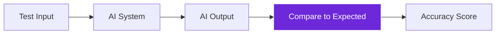
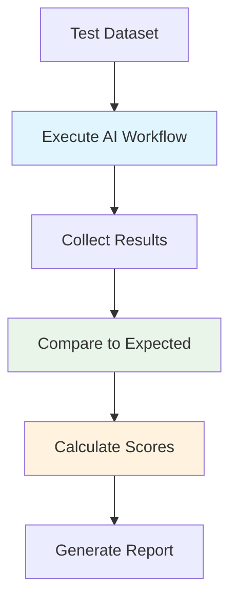
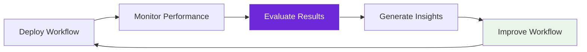

import { Steps, Aside, Tabs, TabItem } from "@astrojs/starlight/components";
import { Image } from "astro:assets";
import Social from "@images/social.webp";

AI workflow evaluation is like quality control for intelligent automation. Unlike traditional workflows where you can predict exact outputs, AI systems need testing to ensure they behave correctly across different scenarios and edge cases.

Think of it as the difference between testing a calculator (predictable results) and testing a human assistant (need to verify judgment and reasoning).

<Image src={Social} alt="Testing and evaluating AI workflow performance across different scenarios" />

## Why evaluation matters

AI workflows can behave differently with different inputs, making systematic testing crucial:

<Tabs>
  <TabItem label="Traditional Testing">
    **Input:** User clicks button
    **Expected:** Form submits
    **Test:** Click button, verify form submission
    **Result:** Pass/Fail (predictable)
  </TabItem>
  
  <TabItem label="AI Testing">
    **Input:** "Find competitor pricing"
    **Expected:** Accurate pricing data
    **Test:** Multiple competitor sites, various layouts
    **Result:** Accuracy score, edge case handling (variable)
    
    **Additional considerations:**
    - Does it handle different website layouts?
    - Can it recognize pricing in various formats?
    - How does it behave with missing information?
  </TabItem>
</Tabs>

## Types of AI evaluation

### Accuracy testing
Measuring how often the AI gets the right answer:

**Example:** Content extraction workflow
- Test on 100 different product pages
- Measure how often it correctly extracts price, title, description
- Calculate accuracy percentage for each field

### Robustness testing
How well the AI handles unexpected or challenging inputs:

**Test scenarios:**
- Broken or malformed web pages
- Content in different languages
- Missing or incomplete information
- Unusual formatting or layouts

### Performance testing
Measuring speed, resource usage, and scalability:

**Metrics to track:**
- Processing time per task
- Memory usage during execution
- Success rate under load
- Error recovery time

## Evaluation strategies

<Steps>

1. **Create test datasets**: Collect representative examples of inputs and expected outputs

2. **Define success criteria**: What constitutes "good enough" performance for your use case

3. **Build evaluation workflows**: Automate the testing process using Agentic WorkFlow

4. **Monitor continuously**: Set up ongoing evaluation as your workflows run in production

5. **Iterate and improve**: Use evaluation results to refine and optimize your workflows

</Steps>

## Building evaluation workflows

### Automated testing pipeline
Create workflows that test your AI workflows:

### A/B testing for AI
Compare different approaches to see which works better:

**Example:** Content summarization
- **Version A:** Basic LLM Chain with simple prompt
- **Version B:** Q&A Node with structured questions
- **Test:** Same 50 articles through both versions
- **Measure:** Summary quality, accuracy, user satisfaction

### Human evaluation integration
Some aspects need human judgment:

**Automated metrics:**
- Accuracy (correct/incorrect)
- Speed (processing time)
- Coverage (percentage of tasks completed)

**Human evaluation:**
- Content quality and readability
- Appropriateness of responses
- User experience and satisfaction

## Real-world evaluation examples

### E-commerce data extraction
**Goal:** Extract product information from various shopping sites

**Test approach:**
1. **Dataset:** 200 product pages from 10 different sites
2. **Metrics:** Accuracy of price, title, description, image extraction
3. **Edge cases:** Sale prices, out-of-stock items, different currencies
4. **Success criteria:** 95% accuracy on price, 90% on other fields

### Customer support automation
**Goal:** Automatically categorize and route support tickets

**Test approach:**
1. **Dataset:** 1000 historical support tickets with known categories
2. **Metrics:** Classification accuracy, response appropriateness
3. **Edge cases:** Ambiguous requests, multiple issues in one ticket
4. **Success criteria:** 85% correct classification, 90% user satisfaction

### Content quality assessment
**Goal:** Automatically evaluate article quality for publication

**Test approach:**
1. **Dataset:** 500 articles with human quality ratings
2. **Metrics:** Correlation with human ratings, consistency
3. **Edge cases:** Different content types, various writing styles
4. **Success criteria:** 80% agreement with human evaluators

## Evaluation metrics

### Quantitative metrics
Numbers you can measure directly:

| Metric | Meaning | Best For |
|--------|---------|----------|
| **Accuracy** | Did it get the right answer? | Categorizing items, extracting data |
| **Relevance** | Was the answer helpful even if not perfect? | Search, recommendations |
| **Completeness** | Did it find *all* the relevant items? | Research, data collection |

### Qualitative metrics
Aspects that require human judgment:

| Metric | Purpose | Evaluation Method |
|--------|---------|-------------------|
| **Relevance** | How well results match user intent | Human rating scales |
| **Coherence** | Logical flow and consistency | Expert evaluation |
| **Usefulness** | Practical value to users | User feedback surveys |
| **Safety** | Avoiding harmful outputs | Content review processes |

<Aside type="tip" title="Start with simple metrics">
  Begin with basic accuracy measurements and gradually add more sophisticated evaluation criteria as you understand your workflow's behavior better.
</Aside>

## Continuous evaluation

### Production monitoring
Keep evaluating workflows as they run in real environments:

**Monitoring approaches:**
- Sample a percentage of production runs for evaluation
- Track user feedback and satisfaction scores
- Monitor error rates and failure patterns
- Compare performance over time

### Feedback loops
Use evaluation results to improve workflows:

## Common evaluation challenges

### Defining "correct" answers
- AI outputs can be subjective or have multiple valid answers
- Need clear criteria for what constitutes success
- Consider using ranges or confidence scores instead of binary pass/fail

### Representative test data
- Test data must reflect real-world usage patterns
- Include edge cases and unusual scenarios
- Keep test data updated as your use cases evolve

### Evaluation bias
- Human evaluators may have unconscious biases
- Test data might not represent all user groups
- Consider multiple evaluation perspectives and methods

### Scalability of evaluation
- Manual evaluation doesn't scale to large datasets
- Need automated evaluation methods for continuous monitoring
- Balance between evaluation thoroughness and resource costs

Systematic evaluation ensures your AI workflows perform reliably and improve over time, building confidence in automated intelligent systems.