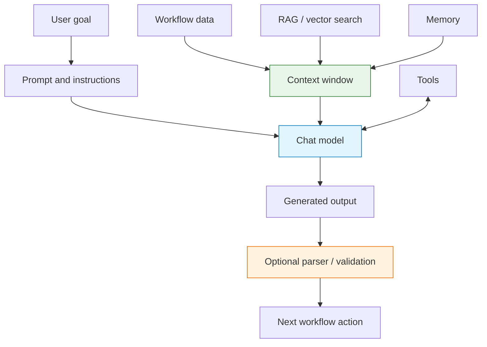

import { Card, CardGrid } from '@astrojs/starlight/components';

AI workflows are not magic boxes. They are systems made from several smaller parts: a model, a prompt, data context, optional memory, optional tools, and a way to check whether the result is good enough.

This section explains those parts so you can design AI workflows deliberately instead of debugging vague model behavior after the fact.

## The AI workflow stack

Use this stack as a checklist. If an AI step behaves poorly, identify which layer is weak: unclear prompt, missing context, wrong model, noisy retrieval, no parser, or missing evaluation.

## Core concepts

<CardGrid>
  <Card title="AI Agents" icon="star">
    Agents coordinate reasoning, tool use, and multi-step decisions.

    [Learn about AI agents →](./ai-agents)
  </Card>

  <Card title="Models & Dependencies" icon="laptop">
    Chat models, embeddings, vector stores, memory, tools, parsers, and splitters are dependency nodes.

    [Understand dependencies →](./model-dependencies)
  </Card>

  <Card title="Prompting & Outputs" icon="document">
    Prompts define the task. Parsers and schemas make outputs usable by later workflow nodes.

    [Design prompts and outputs →](./prompting-and-outputs)
  </Card>

  <Card title="Embeddings & Vectors" icon="puzzle">
    Embeddings convert meaning into vectors so documents can be searched semantically.

    [Explore embeddings →](./embeddings-vectors)
  </Card>

  <Card title="RAG" icon="document">
    Retrieval-Augmented Generation gives the model source material before it answers.

    [Understand RAG →](./rag)
  </Card>

  <Card title="Memory & Context" icon="laptop">
    Memory preserves useful conversation state. Context is what the model can see right now.

    [Learn memory and context →](./memory-context)
  </Card>

  <Card title="Tool Selection" icon="setting">
    Tool selection explains when an agent should search, extract, transform, call APIs, or stop.

    [Master tool selection →](./tool-selection)
  </Card>

  <Card title="Workflow Intelligence" icon="rocket">
    Intelligent workflows combine branching, retrieval, AI reasoning, and feedback loops.

    [Build workflow intelligence →](./workflow-intelligence)
  </Card>

  <Card title="Evaluation & Testing" icon="approve-check">
    Evaluation checks whether AI outputs are correct, useful, grounded, and stable.

    [Learn evaluation →](./evaluation-testing)
  </Card>
</CardGrid>

## Common design paths

| Goal | Start with | Add next |
| --- | --- | --- |
| Summarize page text | Basic LLM Chain | Prompting and output structure |
| Answer questions from docs | RAG Agent | Embeddings, vector store, evaluation |
| Research across websites | Tools Agent | Browser context, tool selection, rate limits |
| Keep conversation context | Q&A Agent | Local Memory, context boundaries |
| Produce rows or JSON | Structured Output Parser | Validation and fallback handling |

## Rule of thumb

If the answer must be based on source material, use retrieval. If the answer must trigger downstream automation, structure the output. If the task requires choosing between actions, use an agent. If the workflow must be reliable, evaluate it with realistic examples.
