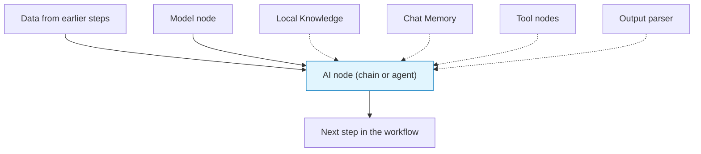

import { Card, CardGrid } from '@astrojs/starlight/components';

An AI step is made of a few parts: an **AI node** that does the task, a **model** connected to it, the **input** you map from earlier steps, and optionally **knowledge**, **memory**, **tools** and an **output parser**. When an AI step behaves badly, one of these parts is usually the cause.

## How the parts fit together

```mermaid
flowchart TB
  Data["Data from earlier steps"] --> Node["AI node (chain or agent)"]
  Model["Model node"] --> Node
  Knowledge["Local Knowledge"] -.-> Node
  Memory["Chat Memory"] -.-> Node
  Tools["Tool nodes"] -.-> Node
  Parser["Output parser"] -.-> Node
  Node --> Next["Next step in the workflow"]

  style Node fill:#e1f5fe,stroke:#0277bd
```

Dotted lines are optional. Each part is a node you connect to the AI node's ports on the canvas.

| Part | What it does | Nodes |
| --- | --- | --- |
| AI node | Does the task | [Basic LLM Chain](/nodes/builtin/ai/aiagents/basicllmchainnode/), [Summarization](/nodes/builtin/ai/aiagents/summarizationchainnode/), [Text Classifier](/nodes/builtin/ai/aiagents/textclassifiernode/), [Information Extractor](/nodes/builtin/ai/aiagents/informationextractornode/), [RAG Agent](/nodes/builtin/ai/aiagents/ragnode/), [Tools Agent](/nodes/builtin/ai/aiagents/toolsagentnode/) |
| Model | Reads and writes text | [Chat OpenAI](/nodes/builtin/ai/aidependencies/llm/openai/), [Chat Anthropic](/nodes/builtin/ai/aidependencies/llm/anthropic/), [Ollama](/nodes/builtin/ai/aidependencies/llm/ollama/), [Web LLM](/nodes/builtin/ai/aidependencies/llm/wbellm/) and [others](/nodes/builtin/ai/) |
| Knowledge | Your documents, searched by meaning | [Local Knowledge](/nodes/builtin/ai/aidependencies/vectorstore/localknowledge/), [Indexer](/nodes/builtin/ai/aiagents/indexernode/) |
| Memory | The conversation so far | [Chat Memory](/nodes/builtin/ai/aidependencies/chatmemories/chatmemory/) |
| Tools | Actions an agent can choose | [Web Search](/nodes/builtin/ai/aidependencies/tools/web-search/), [Browser](/nodes/builtin/ai/aidependencies/tools/browser/), [HTTP Request](/nodes/builtin/ai/aidependencies/tools/http-request/), [Workflow Tool](/nodes/builtin/ai/aidependencies/tools/workflow-tool/) |
| Output parser | Turns the answer into data | [Structured Output Parser](/nodes/builtin/ai/aidependencies/outputparser/structuredoutputparser/), [Item List Output Parser](/nodes/builtin/ai/aidependencies/outputparser/itemlistoutputparser/) |

## Concepts

<CardGrid>
  <Card title="Models and dependencies" icon="laptop">
    What you connect to an AI node, and how to choose a model.

    [Models and dependencies →](/advanced-ai/concepts/model-dependencies/)
  </Card>
  <Card title="Prompting and outputs" icon="document">
    Instructions that work, and outputs later steps can use.

    [Prompting and outputs →](/advanced-ai/concepts/prompting-and-outputs/)
  </Card>
  <Card title="AI agents" icon="star">
    When to use an agent instead of a simple AI step.

    [AI agents →](/advanced-ai/concepts/ai-agents/)
  </Card>
  <Card title="Tool selection" icon="setting">
    Which tools to give an agent, and how it picks them.

    [Tool selection →](/advanced-ai/concepts/tool-selection/)
  </Card>
  <Card title="Action approval" icon="approve-check">
    Why you approve each action an agent takes on a page or a service.

    [Action approval →](/advanced-ai/concepts/action-approval/)
  </Card>
  <Card title="Embeddings and vectors" icon="puzzle">
    How knowledge bases find passages by meaning.

    [Embeddings and vectors →](/advanced-ai/concepts/embeddings-vectors/)
  </Card>
  <Card title="RAG" icon="document">
    Answers grounded in your own documents.

    [RAG →](/advanced-ai/concepts/rag/)
  </Card>
  <Card title="Memory and context" icon="laptop">
    Conversations that continue across runs.

    [Memory and context →](/advanced-ai/concepts/memory-context/)
  </Card>
  <Card title="Branching on AI results" icon="rocket">
    Route items with classifiers, guardrails and human review.

    [Branching on AI results →](/advanced-ai/concepts/workflow-intelligence/)
  </Card>
  <Card title="Testing AI workflows" icon="approve-check">
    Check AI results before you rely on them.

    [Testing AI workflows →](/advanced-ai/concepts/evaluation-testing/)
  </Card>
</CardGrid>

## Common starting points

| Goal | Start with | Add next |
| --- | --- | --- |
| Summarize page text | [Get All Text](/nodes/extension/getalltext/) → [Summarization](/nodes/builtin/ai/aiagents/summarizationchainnode/) | A shorter input, a **Max words** limit |
| Answer questions from your documents | [RAG Agent](/nodes/builtin/ai/aiagents/ragnode/) + [Local Knowledge](/nodes/builtin/ai/aidependencies/vectorstore/localknowledge/) | A "not found" answer, testing |
| Research across websites | [Tools Agent](/nodes/builtin/ai/aiagents/toolsagentnode/) + [Web Search](/nodes/builtin/ai/aidependencies/tools/web-search/) | A small set of tools, a **Max iterations** limit |
| Let an agent act on a page | [Tools Agent](/nodes/builtin/ai/aiagents/toolsagentnode/) + [Browser](/nodes/builtin/ai/aidependencies/tools/browser/) | [Action approval](/advanced-ai/concepts/action-approval/) |
| Run a chatbot that remembers | [Chat Trigger](/nodes/builtin/trigger/chat/) + agent + [Chat Memory](/nodes/builtin/ai/aidependencies/chatmemories/chatmemory/) | [Memory and context](/advanced-ai/concepts/memory-context/) |
| Produce rows or JSON | [Information Extractor](/nodes/builtin/ai/aiagents/informationextractornode/) + [Structured Output Parser](/nodes/builtin/ai/aidependencies/outputparser/structuredoutputparser/) | [Auto-fixing Output Parser](/nodes/builtin/ai/aidependencies/outputparser/autofixingoutputparser/) |

## Rule of thumb

If the answer must come from your documents, use a knowledge base. If a later step uses the answer, give it a structure. If the model must choose between actions, use an agent. Before you rely on a workflow, try it with realistic inputs.
