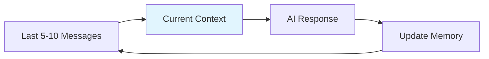
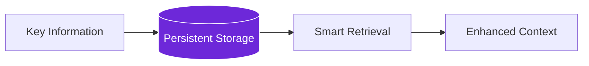

import { Steps, Aside, Tabs, TabItem } from "@astrojs/starlight/components";
import { Image } from "astro:assets";
import Social from "@images/social.webp";

Memory in AI workflows is like giving your automation a notebook to remember important information from previous interactions. This allows AI to provide more relevant responses, maintain conversation context, and build upon past knowledge.

Without memory, every interaction starts from scratch. With memory, AI can learn, adapt, and provide increasingly better assistance.

<Image src={Social} alt="AI system maintaining memory and context across interactions" />

## Why memory matters

Imagine talking to someone who forgets everything you said 5 minutes ago. That's how AI works without memory - every interaction is completely isolated.

```mermaid
graph TD
    subgraph "Without Memory"
        A1[User: "What's the weather?"] --> B1[AI: "It's sunny"]
        C1[User: "What about tomorrow?"] --> D1[AI: "What location?"]
    end
    
    subgraph "With Memory"
        A2[User: "What's the weather?"] --> B2[AI: "It's sunny"]
        B2 --> Memory[(Remembers: Location, Context)]
        C2[User: "What about tomorrow?"] --> Memory
        Memory --> D2[AI: "Tomorrow will be cloudy"]
    end
    
    style Memory fill:#6d28d9,stroke:#fff,color:#fff
```

## Types of memory

<Tabs>
  <TabItem label="Conversation Memory">
    **Purpose:** Remember what was said in a conversation
    
    **Best for:**
    - Chatbots and AI assistants
    - Customer support systems
    - Interactive workflows
    
    **Example:**
    ```
    User: "I'm having trouble with my order"
    AI: "I can help! What's your order number?"
    User: "It's #12345"
    AI: "I see order #12345 was placed yesterday. What specific issue are you having?"
    ```
    
    The AI remembers the order number without asking again.
  </TabItem>
  
  <TabItem label="Task Memory">
    **Purpose:** Remember progress on multi-step tasks
    
    **Best for:**
    - Complex workflows
    - Research projects
    - Data collection tasks
    
    **Example:**
    ```
    Step 1: Collected pricing from 3 competitors ✓
    Step 2: Analyzed feature comparisons ✓  
    Step 3: Currently gathering customer reviews...
    ```
    
    The workflow knows what's been completed and what's next.
  </TabItem>
  
  <TabItem label="Knowledge Memory">
    **Purpose:** Build up knowledge over time
    
    **Best for:**
    - Learning systems
    - Personalization
    - Adaptive workflows
    
    **Example:**
    ```
    Learned: User prefers detailed technical explanations
    Learned: User works in healthcare industry
    Learned: User typically asks about compliance topics
    ```
    
    Future interactions become more relevant and personalized.
  </TabItem>
</Tabs>

## Memory strategies

### Short-term memory
Remembers recent interactions within a single session:



**Good for:**
- Maintaining conversation flow
- Avoiding repetitive questions
- Understanding immediate context

### Long-term memory
Stores important information across multiple sessions:



**Good for:**
- User preferences and history
- Learned patterns and insights
- Building knowledge over time

## Implementing memory

<Steps>

1. **Choose Memory Type**: Decide what information needs to be remembered

2. **Set Storage Limits**: Determine how much history to keep (memory has costs)

3. **Design Retrieval**: Plan how to find relevant memories when needed

4. **Handle Updates**: Decide when to update, modify, or delete memories

5. **Manage Privacy**: Ensure sensitive information is handled appropriately

</Steps>

## Memory patterns

### Conversation buffer
Keeps a rolling window of recent messages:

```
Memory: [Message 1, Message 2, Message 3, Message 4, Message 5]
New message arrives → Remove Message 1, Add Message 6
```

**Pros:** Simple, predictable memory usage
**Cons:** May lose important early context

### Summary memory
Summarizes old conversations to save space:

```
Detailed Memory: Last 10 messages
Summary Memory: "User is researching competitors for SaaS pricing"
```

**Pros:** Retains key information, uses less storage
**Cons:** May lose nuanced details

### Selective memory
Only remembers important information:

```
All Messages: 50 messages
Stored Memory: 8 key facts and decisions
```

**Pros:** Highly efficient, focuses on what matters
**Cons:** Requires smart filtering to avoid losing context

## Real-world examples

### Customer support bot
```
Memory stores:
- Customer name and account details
- Previous issues and resolutions  
- Preferred communication style
- Current conversation context

Result: Personalized, efficient support
```

### Research assistant
```
Memory stores:
- Research topics and findings
- Sources already checked
- Key insights discovered
- User's research preferences

Result: Builds comprehensive knowledge over time
```

### Content moderator
```
Memory stores:
- Previous moderation decisions
- User behavior patterns
- Content policy updates
- Appeal outcomes

Result: Consistent, learning-based moderation
```

<Aside type="caution" title="Privacy considerations">
  Memory systems store user data. Always consider privacy implications, data retention policies, and user consent when implementing memory features.
</Aside>

## Memory challenges

### Storage limits
- Browser storage has size limits
- Large memories slow down processing
- Need strategies for memory cleanup

### Relevance filtering
- Not all information is worth remembering
- Need to identify what's important
- Balance between too much and too little memory

### Context retrieval
- Finding the right memories at the right time
- Avoiding information overload
- Maintaining conversation flow

### Memory conflicts
- What to do when memories contradict
- Handling outdated information
- Updating vs. replacing memories

Memory transforms AI from reactive tools into proactive assistants that learn, adapt, and provide increasingly valuable interactions over time.