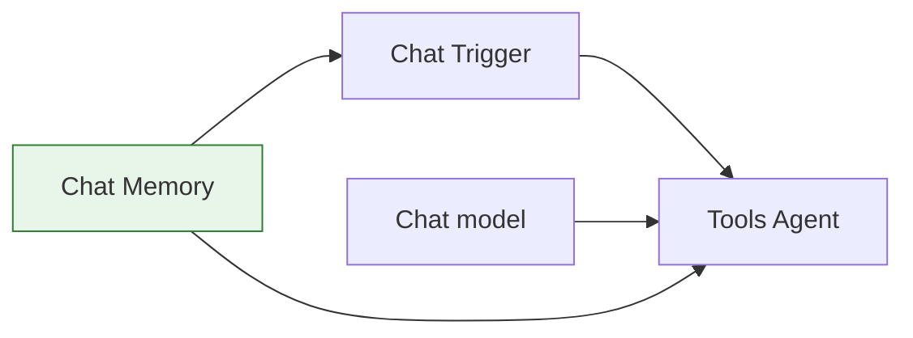

import { Aside } from "@astrojs/starlight/components";

A model has no memory of its own. Each time an AI node runs, the model sees only what the node sends it: the **context**. Memory is a way to add the earlier conversation to that context, so the next answer can build on the last one.

This page is about designing memory into **workflows**. For everything AWFlow remembers (chats, workflow conversations and facts) and how to view, export or clear it, see the [Memory page](/usage/using-the-app/memory/overview/).

## What the model sees

On each run, an agent's context is built from:

| Part | Where it comes from |
| --- | --- |
| Instructions | The node's **System message** |
| The request | The prompt you map from earlier steps, for example `{{ $json.chatInput }}` |
| Earlier messages | A connected [Chat Memory](/nodes/builtin/ai/aidependencies/chatmemories/chatmemory/) |
| Passages from your documents | A connected [Local Knowledge](/nodes/builtin/ai/aidependencies/vectorstore/localknowledge/) base |
| Tool results | Tools the agent called during this run |

Everything must fit in the model's **context window**. Small and on-device models have small windows, so give them less.

## Chat Memory

Connect a [Chat Memory](/nodes/builtin/ai/aidependencies/chatmemories/chatmemory/) node to the memory port of a [RAG Agent](/nodes/builtin/ai/aiagents/ragnode/) or [Tools Agent](/nodes/builtin/ai/aiagents/toolsagentnode/). Before calling the model, the agent reads the earlier messages; after answering, it saves the new message and its reply.

Pick a **Storage** for the conversation:

| Storage | Use it when |
| --- | --- |
| **Conversation** (default) | One ongoing conversation, such as a single chatbot or an agent that runs on a schedule and should remember earlier runs. |
| **Key** | One conversation per user, ticket or page. Set the key with an expression, for example `{{ $json.userId }}`. |
| **This run only** | The agent only needs to remember within one run, for example across several tool calls. Nothing is saved. |

When the conversation gets long, **History sent to the model** decides how much is sent: **As much as fits** (default) or the **Last N messages**. With **Summarise older messages** on, what no longer fits is summarized instead of dropped.

### A chatbot that remembers

```mermaid
flowchart LR
  Chat["Chat Trigger"] --> Agent["Tools Agent"]
  Model["Chat model"] --> Agent
  Memory["Chat Memory"] --> Agent
  Memory --> Chat

  style Memory fill:#e8f5e9,stroke:#2e7d32
```

Connect the **same** Chat Memory to the [Chat Trigger](/nodes/builtin/trigger/chat/) and to the agent, and set the agent's prompt to `{{ $json.chatInput }}`. The chat window then shows the conversation the agent saves.

## Memory or knowledge base?

| You need the AI to… | Use |
| --- | --- |
| Continue a conversation | [Chat Memory](/nodes/builtin/ai/aidependencies/chatmemories/chatmemory/) |
| Answer from documents, pages or notes | A [knowledge base](/usage/using-the-app/knowledge-bases/overview/) with [Local Knowledge](/nodes/builtin/ai/aidependencies/vectorstore/localknowledge/). See [RAG](/advanced-ai/concepts/rag/) |
| Keep a single value between runs, such as a counter or the last item seen | The [Data Store](/nodes/builtin/core/datastore/) node |

Memory is not a good place for reference material: it grows with every message, and old messages get summarized. Put documents in a knowledge base.

## Good practice

- **Keep the context small.** Map only the fields the model needs, not a whole page.
- **Use a key per person or thread.** Without one, everyone who uses the workflow shares one conversation.
- **Use "This run only" for one-off tasks.** A long-lived conversation for a one-off task only adds noise.
- **Check what was saved.** Open the conversation on the [Memory page](/usage/using-the-app/memory/overview/) to see exactly what the agent will read next time.

<Aside type="note" title="Stored on your device">
Workflow conversations are stored in your browser, on this device. Replaced memory nodes (Local Memory, Persistent Chat Memory, Window Buffer Memory) keep working and are upgraded to Chat Memory when you save.
</Aside>

## Related

- [Memory page](/usage/using-the-app/memory/overview/): everything AWFlow remembers
- [Assistant memory](/usage/using-the-app/chat-and-agents/memory/): facts Aria and your agents learn about you
- [Chat Memory node](/nodes/builtin/ai/aidependencies/chatmemories/chatmemory/)
- [RAG](/advanced-ai/concepts/rag/)
