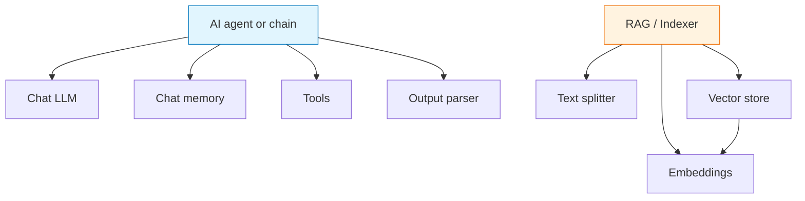
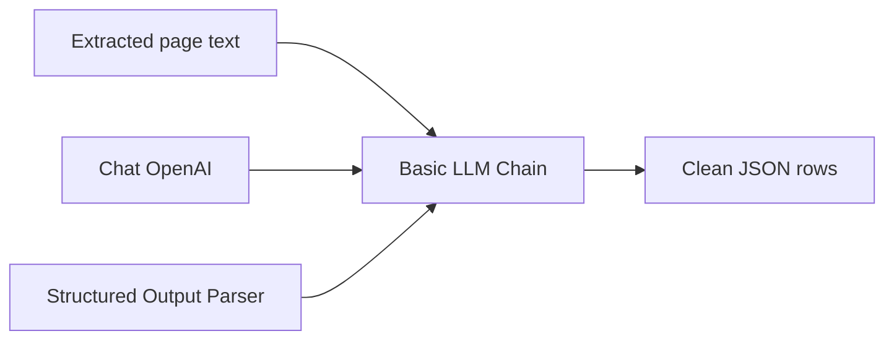

AI workflows in Agentic WorkFlow are built by connecting agent nodes to dependency nodes. Dependency nodes do not usually perform the final task alone. They provide capabilities that an agent or chain uses.

## Dependency map

## Dependency types

| Dependency | What it provides | Example nodes |
| --- | --- | --- |
| Chat LLM | Text reasoning and generation | Chat OpenAI, Chat Anthropic, Chat Google, Ollama, Web LLM, Chrome AI |
| Embeddings | Converts text to vectors | OpenAI Embeddings, Ollama Embeddings |
| Vector store | Stores and searches embedded content | Local Knowledge |
| Text splitter | Breaks large text into chunks | Character Text Splitter, Recursive Character Text Splitter |
| Chat memory | Keeps conversation state | Local Memory |
| Output parser | Makes model output structured | Structured Output Parser |
| Tool | Gives an agent an action it can call | Wikipedia Query |

## Choosing a model

Choose the model based on the job, not only on raw capability.

| Need | Prefer |
| --- | --- |
| Fast local experimentation | Web LLM, Chrome AI, Ollama |
| Strong general reasoning | Chat OpenAI, Chat Anthropic, Chat Google |
| Private local workflows | Ollama or browser-local models |
| Source-grounded search | Embeddings + vector store + RAG |
| Reliable downstream automation | Chat model + structured output parser |

## Connection design

Keep dependencies close to the agent that uses them. A workflow is easier to debug when each AI step has an explicit model, explicit memory, explicit tools, and explicit parser.

## Practical rules

- Use one primary chat model per AI step unless you have a clear reason to compare models.
- Add memory only when previous conversation turns should affect later answers.
- Add tools only when the agent must choose actions.
- Add a parser when another node will consume the model output.
- Keep local/browser models for privacy-sensitive or offline-friendly workflows, but test quality on your actual tasks.

## Related nodes

- [Chat OpenAI](/nodes/builtin/ai/aidependencies/llm/openai/)
- [Chat Anthropic](/nodes/builtin/ai/aidependencies/llm/anthropic/)
- [Ollama](/nodes/builtin/ai/aidependencies/llm/ollama/)
- [OpenAI Embeddings](/nodes/builtin/ai/aidependencies/embeddings/openai/)
- [Local Knowledge](/nodes/builtin/ai/aidependencies/vectorstore/localknowledge/)
- [Structured Output Parser](/nodes/builtin/ai/aidependencies/outputparser/structuredoutputparser/)
