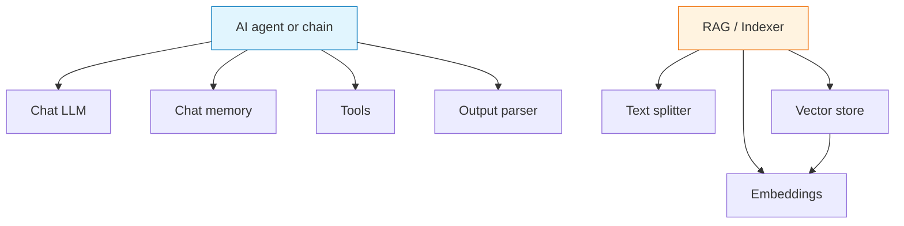
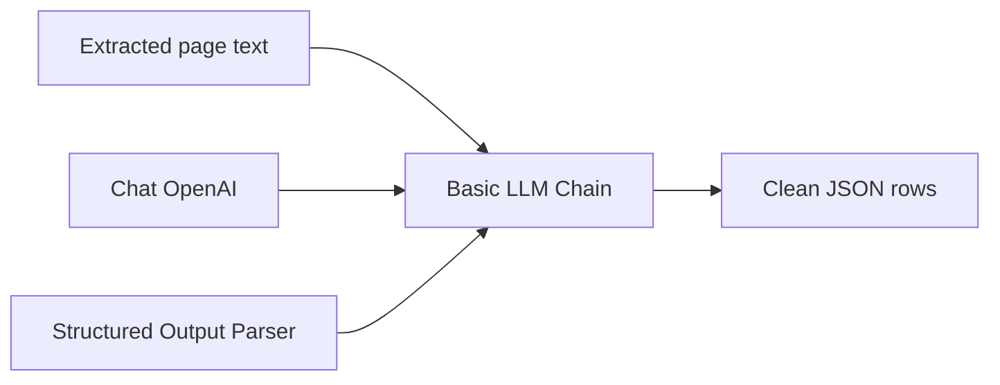

AI workflows in AWFlow are built by connecting agent nodes to dependency nodes. Dependency nodes do not usually perform the final task alone. They provide capabilities that an agent or chain uses.

## Dependency map

```mermaid
flowchart TD
  Agent["AI agent or chain"] --> LLM["Chat LLM"]
  Agent --> Memory["Chat memory"]
  Agent --> Tools["Tools"]
  Agent --> Parser["Output parser"]
  RAG["RAG / Indexer"] --> Splitter["Text splitter"]
  RAG --> Embeddings["Embeddings"]
  RAG --> Store["Vector store"]
  Store --> Embeddings

  style Agent fill:#e1f5fe,stroke:#0277bd
  style RAG fill:#fff3e0,stroke:#ef6c00
```

## Dependency types

| Dependency | What it provides | Example nodes |
| --- | --- | --- |
| Chat model | Text reasoning and generation | Cloud: [Chat OpenAI](/nodes/builtin/ai/aidependencies/llm/openai/), [Chat Anthropic](/nodes/builtin/ai/aidependencies/llm/anthropic/), [Chat Google](/nodes/builtin/ai/aidependencies/llm/google/), [Chat Mistral](/nodes/builtin/ai/aidependencies/llm/mistral/), [Chat Groq](/nodes/builtin/ai/aidependencies/llm/groq/), [Chat DeepSeek](/nodes/builtin/ai/aidependencies/llm/deepseek/), [Chat xAI](/nodes/builtin/ai/aidependencies/llm/xai/), [Chat OpenRouter](/nodes/builtin/ai/aidependencies/llm/openrouter/), [Chat Azure OpenAI](/nodes/builtin/ai/aidependencies/llm/azure-openai/). On your computer: [Ollama](/nodes/builtin/ai/aidependencies/llm/ollama/). In your browser: [Web LLM](/nodes/builtin/ai/aidependencies/llm/wbellm/), [Transformers Chat](/nodes/builtin/ai/aidependencies/llm/transformerschat/), [Chrome AI](/nodes/builtin/ai/aidependencies/llm/chrome-ai/) |
| Embeddings | Converts text to vectors | [Local Embeddings](/nodes/builtin/ai/aidependencies/embeddings/localembeddings/), [OpenAI Embeddings](/nodes/builtin/ai/aidependencies/embeddings/openai/), [Ollama Embeddings](/nodes/builtin/ai/aidependencies/embeddings/ollamaembeddings/) and [others](/advanced-ai/concepts/embeddings-vectors/#embedding-models) |
| Knowledge (vector store) | Stores and searches your documents | [Local Knowledge](/nodes/builtin/ai/aidependencies/vectorstore/localknowledge/) |
| Text splitter | Breaks large text into chunks | [Character Text Splitter](/nodes/builtin/ai/aidependencies/textsplitter/charactertextsplitter/), [Recursive Character Text Splitter](/nodes/builtin/ai/aidependencies/textsplitter/recursivecharactertextsplitter/) |
| Memory | Keeps the conversation | [Chat Memory](/nodes/builtin/ai/aidependencies/chatmemories/chatmemory/) |
| Output parser | Makes model output structured | [Structured Output Parser](/nodes/builtin/ai/aidependencies/outputparser/structuredoutputparser/), [Item List Output Parser](/nodes/builtin/ai/aidependencies/outputparser/itemlistoutputparser/), [Auto-fixing Output Parser](/nodes/builtin/ai/aidependencies/outputparser/autofixingoutputparser/) |
| Tool | Gives an agent an action it can call | [Web Search](/nodes/builtin/ai/aidependencies/tools/web-search/), [Wikipedia](/nodes/builtin/ai/aidependencies/tools/wikipedia-query/), [Browser](/nodes/builtin/ai/aidependencies/tools/browser/) and [others](/advanced-ai/concepts/tool-selection/#available-tools) |

The on-device chat models run in your browser through [Local AI](/usage/using-the-app/local-models/): free and private, but smaller and slower than cloud models. Cloud models use your own API key, added in **Settings › Providers**.

## Choosing a model

Choose the model based on the job, not only on raw capability.

| Need | Prefer |
| --- | --- |
| Fast local experimentation | Web LLM, Chrome AI, Ollama |
| Strong general reasoning and tool use | Chat OpenAI, Chat Anthropic, Chat Google |
| Private workflows, nothing leaves your device | Ollama or the in-browser models |
| Source-grounded search | Embeddings + vector store + RAG |
| Reliable downstream automation | Chat model + structured output parser |

## Connection design

Keep dependencies close to the agent that uses them. A workflow is easier to debug when each AI step has an explicit model, explicit memory, explicit tools, and explicit parser.

```mermaid
flowchart LR
  Text["Extracted page text"] --> Chain["Basic LLM Chain"]
  Model["Chat OpenAI"] --> Chain
  Parser["Structured Output Parser"] --> Chain
  Chain --> Rows["Clean JSON rows"]
```

## Practical rules

- Use one primary chat model per AI step unless you have a clear reason to compare models.
- Add memory only when previous conversation turns should affect later answers.
- Add tools only when the agent must choose actions.
- Add a parser when another node will consume the model output.
- Keep local/browser models for privacy-sensitive or offline-friendly workflows, but test quality on your actual tasks.

## Related nodes

- [Chat OpenAI](/nodes/builtin/ai/aidependencies/llm/openai/)
- [Chat Anthropic](/nodes/builtin/ai/aidependencies/llm/anthropic/)
- [Ollama](/nodes/builtin/ai/aidependencies/llm/ollama/)
- [OpenAI Embeddings](/nodes/builtin/ai/aidependencies/embeddings/openai/)
- [Local Knowledge](/nodes/builtin/ai/aidependencies/vectorstore/localknowledge/)
- [Structured Output Parser](/nodes/builtin/ai/aidependencies/outputparser/structuredoutputparser/)
