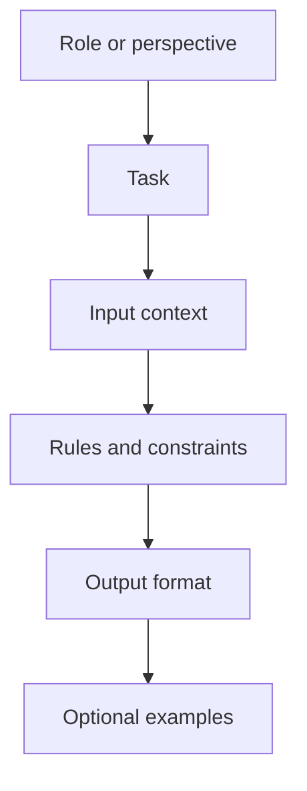
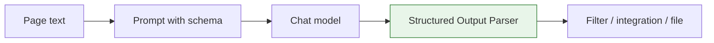

Prompting is not just writing instructions for a model. In a workflow, a prompt is also an interface between unstructured language and structured automation.

If the next node expects a field, list, label, or JSON object, design the prompt and output parser together.

## Prompt anatomy



A good workflow prompt usually includes:

- The task to perform.
- The input fields the model should use.
- What not to do.
- The required output format.
- A fallback when the answer is not available.

## Weak vs strong prompts

| Weak prompt | Stronger workflow prompt |
| --- | --- |
| “Summarize this.” | “Summarize `pageText` in 5 bullet points for a sales researcher. Do not include claims not present in the text.” |
| “Extract products.” | “Return JSON with `name`, `price`, `currency`, and `sourceUrl`. If a price is missing, set `price` to null.” |
| “Is this relevant?” | “Classify as `relevant` or `not_relevant`, then provide one sentence explaining the decision from the source text.” |

## Structured output pattern

Use structured output when another node must consume the AI result.



Plain prose is fine for humans. JSON-like output is better for workflows.

## Design the schema first

Before writing the prompt, decide what the next node needs.

```json
{
  "companyName": "string",
  "pricingMentioned": "boolean",
  "price": "number or null",
  "currency": "string or null",
  "sourceQuote": "string"
}
```

Then write the prompt around that structure:

> Extract pricing information from `pageText`. Return only the fields in the schema. If the page does not mention pricing, set `pricingMentioned` to false and `price` to null. Use a short source quote from the page when available.

## Fallbacks are part of the output

Do not make the model guess silently. Give it a valid output for missing information.

| Situation | Better fallback |
| --- | --- |
| Source does not mention a value | `null` plus a reason |
| Classification is uncertain | `unknown` with confidence |
| Retrieved context is insufficient | “Not enough source information” |
| Tool call fails | Structured error field |

## Test prompts with edge cases

Test with:

- Empty input.
- Very long input.
- Missing fields.
- Conflicting source text.
- Pages with navigation text mixed into content.
- Non-English or unusually formatted content.

## Related topics

- [Models and dependencies](/advanced-ai/concepts/model-dependencies/)
- [RAG](/advanced-ai/concepts/rag/)
- [Evaluation and testing](/advanced-ai/concepts/evaluation-testing/)
- [Structured Output Parser](/nodes/builtin/ai/aidependencies/outputparser/structuredoutputparser/)
