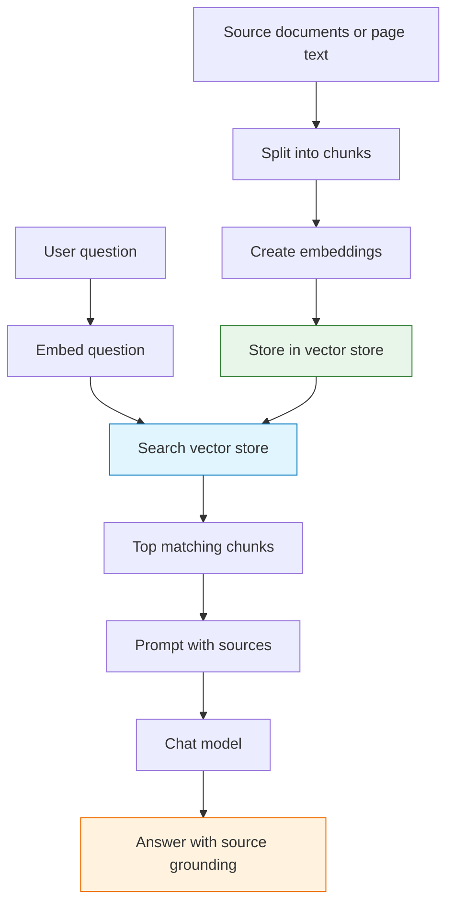
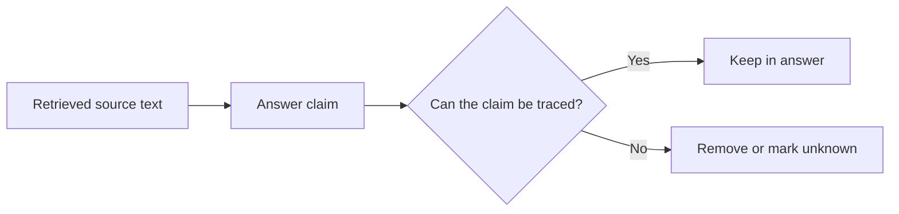

import { Aside } from "@astrojs/starlight/components";

RAG means **Retrieval-Augmented Generation**. It is a pattern where the workflow searches trusted content first, then gives the matching content to the model before asking it to answer.

Use RAG when an answer must be grounded in specific documents, page content, policies, product data, or knowledge that may not be in the model.

## Why RAG exists

A chat model answers from the context it can see and from patterns learned during training. If your workflow asks about private, recent, or highly specific information without providing that information, the model may guess.

RAG changes the question from:

> “What do you know about this?”

to:

> “Using these retrieved sources, answer this question.”

## The RAG pipeline

There are two phases: indexing and answering. Indexing prepares the knowledge. Answering searches that knowledge and asks the model to respond from the retrieved context.

## Indexing decisions

| Decision | Tradeoff |
| --- | --- |
| Chunk size | Smaller chunks improve precision; larger chunks preserve context |
| Chunk overlap | Helps avoid cutting important meaning at boundaries |
| Metadata | Lets you filter by source, date, page, category, or customer |
| Embedding model | Affects search quality and cost |
| Re-index schedule | Keeps answers current when source content changes |

Bad indexing leads to bad retrieval. If the correct source never appears in search results, the model cannot reliably answer from it.

## Answering decisions

| Decision | Tradeoff |
| --- | --- |
| Number of results | Too few misses context; too many adds noise |
| Similarity threshold | Higher thresholds reduce weak matches but may return nothing |
| Prompt wording | Should tell the model to answer only from provided sources |
| Citation format | Helps users verify the answer |
| Fallback behavior | Defines what to do when retrieval finds nothing useful |

## What “grounded” means

A grounded answer should be traceable to retrieved context. It should not add unsupported facts just because they sound plausible.

## Common failure modes

| Symptom | Likely cause | Fix |
| --- | --- | --- |
| Answer is generic | No relevant context was retrieved | Improve chunking, metadata, or query |
| Answer mixes sources incorrectly | Too many unrelated chunks | Lower result count or add filters |
| Answer invents details | Prompt allows guessing | Require “not found in sources” fallback |
| Correct source is missing | Index is stale or incomplete | Re-index source content |
| Answer ignores source | Prompt is too broad | Put source-grounding rules near the task |

## Agentic WorkFlow pattern

For a browser-based RAG workflow:

1. Extract content with [Get All Text](/nodes/extension/getalltext/) or URL content nodes.
2. Split text with a text splitter dependency.
3. Create embeddings with an embeddings dependency.
4. Store content in [Local Knowledge](/nodes/builtin/ai/aidependencies/vectorstore/localknowledge/).
5. Ask with [RAG Agent](/nodes/builtin/ai/aiagents/ragnode/) or a Tools Agent connected to retrieval.

<Aside type="tip" title="Design the fallback first">
  Decide what the workflow should say when it cannot find enough source material. A clear fallback is one of the simplest ways to reduce hallucinations.
</Aside>

## Related topics

- [Embeddings and vectors](/advanced-ai/concepts/embeddings-vectors/)
- [Prompting and structured outputs](/advanced-ai/concepts/prompting-and-outputs/)
- [Memory and context](/advanced-ai/concepts/memory-context/)
- [Evaluation and testing](/advanced-ai/concepts/evaluation-testing/)
