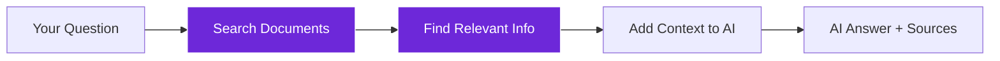
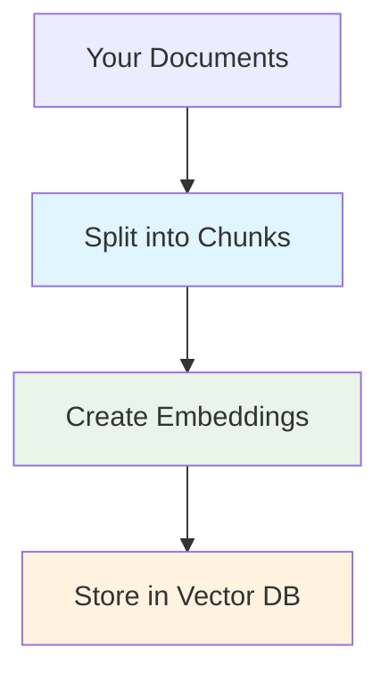
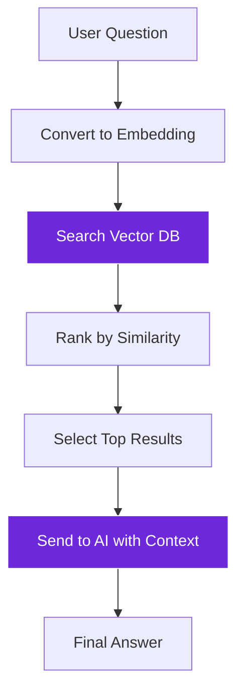

import { Steps, Aside, Tabs, TabItem } from "@astrojs/starlight/components";
import { Image } from "astro:assets";
import Social from "@images/social.webp";

RAG (Retrieval-Augmented Generation) is like giving AI a research library. Instead of relying on what it learned during training, RAG first searches through your documents to find relevant information, then uses that information to provide accurate, source-backed answers.

This eliminates AI "hallucinations" by grounding responses in your actual documents and data.

<Image src={Social} alt="AI searching through documents to provide accurate, source-backed answers" />

## Why RAG matters

Regular AI can make up facts or provide outdated information. RAG ensures AI only uses information from your documents:

<Tabs>
  <TabItem label="Regular AI">
    **User:** "What's our vacation policy?"
    
    **AI Response:** "Most companies offer 2-3 weeks vacation..." *(generic, possibly wrong)*
    
    **Problems:**
    - May not match your actual policy
    - Could be outdated information
    - No source to verify accuracy
  </TabItem>
  
  <TabItem label="RAG AI">
    **User:** "What's our vacation policy?"
    
    **AI Response:** "According to the Employee Handbook (Section 4.2), full-time employees receive 15 days vacation in their first year, increasing to 20 days after 2 years of service."
    
    **Benefits:**
    - Uses your actual policy document
    - Provides specific, accurate details
    - Includes source citation for verification
  </TabItem>
</Tabs>

## How RAG works

RAG follows a simple process: search first, then answer:

## Building a RAG system

<Steps>

1. **Prepare your documents**: Convert documents into searchable format using embeddings

2. **Store in vector database**: Use Local Knowledge or similar vector store

3. **Set up search**: Configure how many documents to search and similarity thresholds

4. **Connect to AI**: Use RAG Node or Tools Agent with vector store access

5. **Test and refine**: Adjust search parameters based on answer quality

</Steps>

## RAG workflow patterns

### Document preparation
Transform your documents into searchable format:

**Key decisions:**
- **Chunk size**: Smaller chunks (200-500 words) for precise answers, larger chunks (500-1000 words) for more context
- **Overlap**: 10-20% overlap between chunks to maintain context
- **Metadata**: Add document titles, dates, categories for better filtering

### Query processing
How RAG handles user questions:

## RAG implementation options

<Tabs>
  <TabItem label="RAG Node">
    **Best for:** Simple question-answering workflows
    
    **Setup:**
    - Connect to Local Knowledge vector store
    - Set search parameters (top K, similarity threshold)
    - Ask questions in natural language
    
    **Example use:** Company FAQ system, document Q&A
  </TabItem>
  
  <TabItem label="Tools Agent + Vector Store">
    **Best for:** Complex workflows requiring multiple tools
    
    **Setup:**
    - Add vector store as a tool for Tools Agent
    - Agent decides when to search documents
    - Can combine document search with other actions
    
    **Example use:** Research assistant, customer support bot
  </TabItem>
  
  <TabItem label="Custom Workflow">
    **Best for:** Specialized RAG implementations
    
    **Setup:**
    - Use Local Knowledge node directly
    - Combine with Q&A Node or Basic LLM Chain
    - Custom logic for search and response generation
    
    **Example use:** Content analysis, specialized domain applications
  </TabItem>
</Tabs>

## Real-world RAG examples

### Company knowledge base
**Documents:** Employee handbook, policies, procedures
**Use case:** HR chatbot that answers employee questions
**Benefits:** Always current information, reduces HR workload

### Technical documentation
**Documents:** API docs, troubleshooting guides, FAQs  
**Use case:** Developer support system
**Benefits:** Faster problem resolution, consistent answers

### Research assistant
**Documents:** Research papers, reports, industry analysis
**Use case:** Automated research and insight generation
**Benefits:** Comprehensive analysis, source tracking

### Customer support
**Documents:** Product manuals, support tickets, knowledge articles
**Use case:** Automated customer service
**Benefits:** 24/7 availability, consistent quality

## Optimizing RAG performance

### Search quality
- **Similarity threshold**: 0.7 for general use, 0.8+ for precise matches
- **Result count**: Start with 3-5 documents. Too few might miss answers; too many can confuse the AI.
- **Metadata filtering**: Combine semantic search with traditional filters

### Answer quality
- **Context window**: Balance between enough context and token limits
- **Source citation**: Always include document sources in responses
- **Confidence scoring**: Indicate how confident the AI is in its answer

### Performance tuning
- **Embedding model**: Choose based on your content type and accuracy needs
- **Chunk strategy**: Optimize for your specific document types
- **Caching**: Store frequently accessed embeddings for faster search

<Aside type="tip" title="Start simple, then optimize">
  Begin with default settings and basic document preparation. Monitor answer quality and gradually refine search parameters, chunk sizes, and embedding models based on real usage.
</Aside>

## Common RAG challenges

### Document quality
- **Problem**: Poor quality documents lead to poor answers
- **Solution**: Clean and structure documents before indexing

### Search relevance
- **Problem**: RAG finds irrelevant documents for queries
- **Solution**: Adjust similarity thresholds, improve document metadata

### Context limits
- **Problem**: Reading too many documents at once can overwhelm the AI.
- **Solution**: Search for fewer, more relevant documents or summarize them first.

### Outdated information
- **Problem**: Documents become stale over time
- **Solution**: Regular document updates, version tracking

RAG transforms AI from a general knowledge system into a specialized expert on your specific documents and data, providing accurate, verifiable, and up-to-date information.
