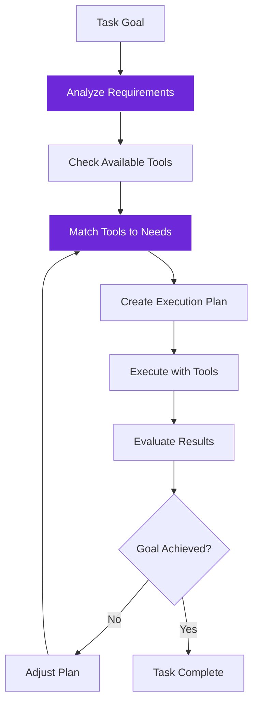
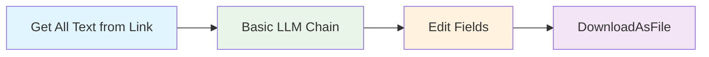
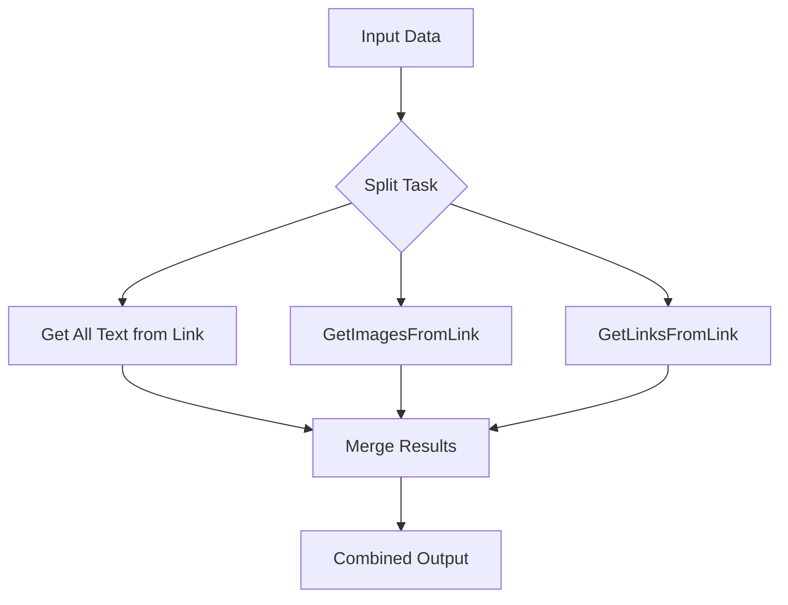
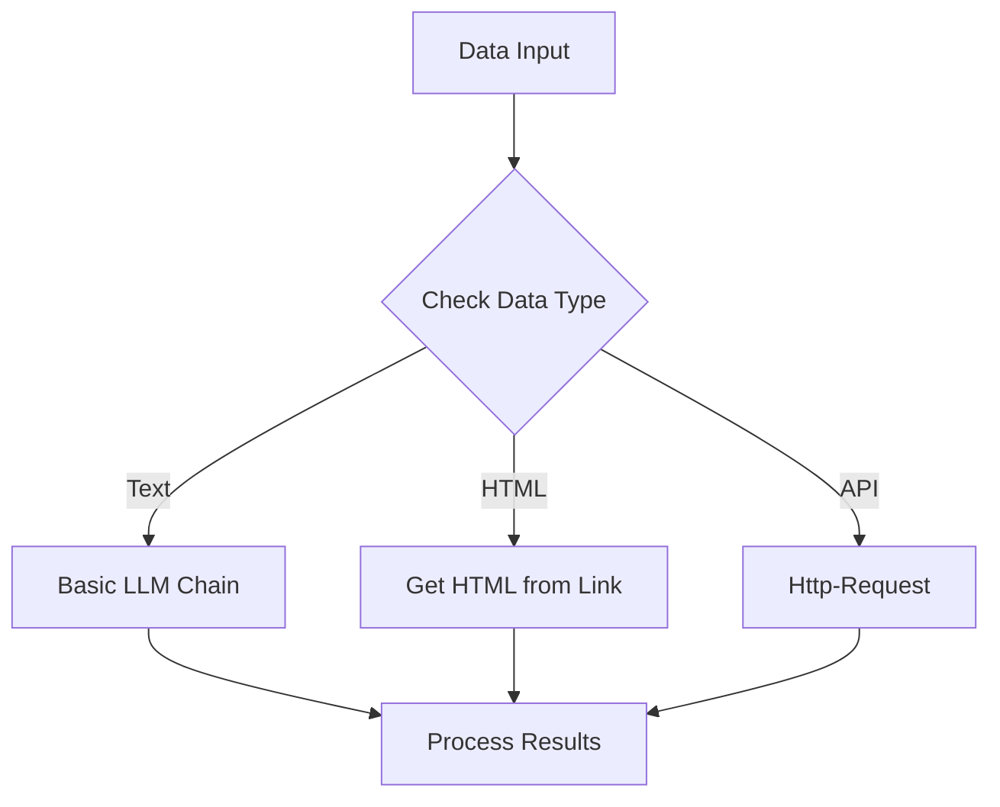

import { Steps, Aside, Tabs, TabItem } from "@astrojs/starlight/components";
import { Image } from "astro:assets";
import Social from "@images/social.webp";

Tool selection is how AI agents decide which tools to use and when to use them. Instead of you manually connecting nodes, intelligent agents can automatically choose the right combination of tools to accomplish their goals.

Think of it like having a smart assistant who knows when to use a screwdriver vs. a hammer vs. a drill - they pick the right tool for each part of the job.

<Image src={Social} alt="AI agent selecting and orchestrating different tools for a complex task" />

## How agents choose tools

Agents don't just randomly pick tools. They follow a reasoning process:



## Tool categories

<Tabs>
  <TabItem label="Information Gathering">
    **Purpose:** Collect data from various sources
    
    **Examples:**
    - Reading text from a web page
    - Extracting links or images
    - Getting data from an API
    
    **Agent reasoning:**
    "I need product information. I'll read the text on this page to find descriptions and prices."
  </TabItem>
  
  <TabItem label="Content Processing">
    **Purpose:** Analyze and transform information
    
    **Examples:**
    - AI summarization
    - Answering questions based on text
    - Reformatting dates or currencies
    
    **Agent reasoning:**
    "I have raw text. I'll use AI to summarize the key points and format the price as a number."
  </TabItem>
  
  <TabItem label="Flow Control">
    **Purpose:** Make decisions and control where the workflow goes next
    
    **Examples:**
    - "If" logic (e.g., If price > $100)
    - Filtering lists
    - Stopping on errors
    
    **Agent reasoning:**
    "The price is missing on this page. I should skip it and try the next one instead of crashing."
  </TabItem>
</Tabs>

## Tool orchestration patterns

### Sequential processing
Tools used one after another in a logical sequence:



**Example:** Research workflow
1. Extract content from competitor websites
2. Analyze content for key insights
3. Format findings into structured data
4. Export as report file

### Parallel processing
Multiple tools working simultaneously on different aspects:



**Example:** Comprehensive site analysis
- Extract text content (Tool 1)
- Collect images (Tool 2)  
- Gather all links (Tool 3)
- Combine into complete site profile

### Conditional branching
Different tools based on conditions or results:



## Smart tool selection examples

### Content extraction agent
**Goal:** Extract product information from any e-commerce site

**Agent reasoning:**
1. "Let me first get the page content to understand the structure"
2. "This looks like a product page with structured data - I'll use Get HTML from Link"
3. "Now I need to extract specific product details - I'll use QANode with targeted questions"
4. "The data needs formatting - I'll use Edit Fields to structure it properly"

### Research automation agent
**Goal:** Gather competitive intelligence from multiple sources

**Agent reasoning:**
1. "I have a list of competitor URLs - I'll use Get All Text from Link for each"
2. "The content varies in quality - I'll use Filter to remove low-quality data"
3. "Now I need to analyze for key insights - Basic LLM Chain for analysis"
4. "I should combine findings from all sources - Merge to consolidate"
5. "Finally, create a summary report - Basic LLM Chain for report generation"

### Quality control agent
**Goal:** Monitor content quality across multiple websites

**Agent reasoning:**
1. "I need to check multiple pages - Get All Text from Link for content"
2. "Each page needs quality assessment - QANode with quality criteria"
3. "Some pages might fail checks - If node to handle different outcomes"
4. "Failed pages need different processing - conditional tool selection"
5. "Results need to be organized - Edit Fields for structured output"

<Steps>

1. **Define clear objectives**: Agents need specific goals to choose appropriate tools

2. **Provide relevant tools**: Only include tools that could be useful for the task

3. **Set reasonable limits**: Prevent infinite loops with maximum step counts

4. **Monitor tool usage**: Watch how agents combine tools and optimize the selection

5. **Refine over time**: Adjust available tools based on agent performance

</Steps>

## Tool selection best practices

### Start with essential tools
Don't overwhelm agents with too many options:

**Good tool set for content analysis:**
- Get All Text from Link (data collection)
- Basic LLM Chain (analysis)
- Edit Fields (formatting)
- If (decision making)

**Avoid:** Giving agents 20+ tools for a simple task

### Provide clear tool descriptions
Help agents understand when to use each tool:

```
Get All Text from Link: "Extract readable text content from web pages"
Get HTML from Link: "Get structured HTML data when you need specific elements"
Basic LLM Chain: "Analyze, summarize, or generate text content"
```

### Monitor and optimize
Watch how agents use tools and refine the selection:

- Which tools are used most frequently?
- Are agents choosing appropriate tools for tasks?
- Do certain tool combinations work better than others?
- Are there missing tools that would improve performance?

<Aside type="tip" title="Less is often more">
  Agents perform better with a focused set of relevant tools rather than access to every possible tool. Start small and add tools as needed.
</Aside>

<Aside type="caution" title="Tools that act require approval">
  Some tools don't just read or compute — they take real actions ([Browser Tool](/nodes/builtin/ai/aidependencies/tools/browser/), [HTTP Request Tool](/nodes/builtin/ai/aidependencies/tools/http-request/), [MCP Client Tool](/nodes/builtin/ai/aidependencies/tools/mcp-client/)). Because agents read untrusted page content, every action these tools take is gated: you approve or reject the concrete action before it runs. See [Action Approval](/advanced-ai/concepts/action-approval/).
</Aside>

## Common orchestration challenges

### Tool conflicts
When multiple tools could accomplish the same task:
- **Solution:** Provide clear guidance on when to use each tool
- **Example:** Get All Text from Link vs. Get HTML from Link - specify use cases

### Inefficient sequences
Agents choosing suboptimal tool combinations:
- **Solution:** Monitor patterns and provide better tool descriptions
- **Example:** Using multiple small tools instead of one comprehensive tool

### Missing capabilities
Agents unable to complete tasks due to tool limitations:
- **Solution:** Add missing tools or combine existing tools creatively
- **Example:** Need for data validation tools in quality control workflows

Tool selection and orchestration transform individual tools into powerful, coordinated systems that can tackle complex, multi-step challenges automatically.