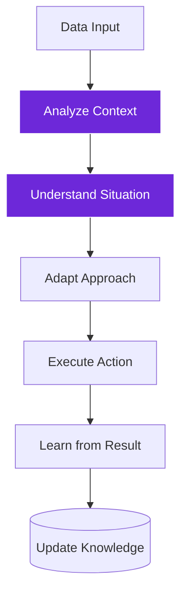
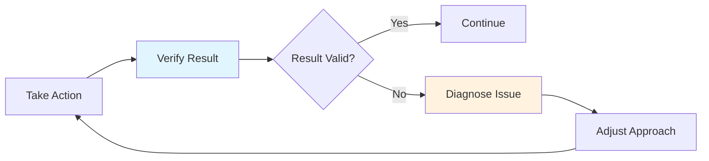

import { Steps, Aside, Tabs, TabItem } from "@astrojs/starlight/components";
import { Image } from "astro:assets";
import Social from "@images/social.webp";

Workflow intelligence is what separates smart automation from simple scripting. Instead of following rigid "if-then" rules, intelligent workflows can analyze situations, adapt their behavior, and make decisions based on context and goals.

Think of it as the difference between a calculator (follows exact instructions) and a smart assistant (understands what you're trying to accomplish).

<Image src={Social} alt="Intelligent workflow adapting and making decisions based on context" />

## Traditional vs intelligent workflows

<Tabs>
  <TabItem label="Traditional Workflow">
**Rigid Rules:**
1.  Check if page has the word "price"
2.  If yes, copy the text after the "$" symbol
3.  If no, stop and report an error

**The Problem:**
If the site changes "price" to "cost" or moves the "$" symbol, this automation breaks immediately.
  </TabItem>
  
  <TabItem label="Intelligent Workflow">
**Smart Approach:**
1.  **Analyze** the page to understand what it is (product page vs blog post)
2.  **Look for** ANY pricing information (numbers with currency symbols, "price", "cost", "MSRP")
3.  **Verify** the found number looks like a reasonable price
4.  **Extract** the most likely correct value

**The Benefit:**
It works on Amazon, eBay, Shopify, and even sites you've never tested before.
  </TabItem>
</Tabs>

## Key intelligence patterns

### Context awareness
Intelligent workflows understand the situation they're operating in:

**Example:** A content extraction workflow that:
- Recognizes if it's on a news site, e-commerce page, or blog
- Adapts extraction strategy based on site type
- Adjusts for different languages or layouts
- Learns patterns from successful extractions

### Goal-oriented behavior
Instead of following steps, intelligent workflows work toward objectives:

**Traditional approach:**
1. Visit page A
2. Click button B  
3. Extract field C
4. Save to file D

**Intelligent approach:**
- **Goal:** Gather competitor pricing data
- **Strategy:** Find the most efficient path to pricing information
- **Adaptation:** Try different approaches if initial method fails
- **Verification:** Ensure extracted data makes sense

### Self-correction
Intelligent workflows can detect and fix their own mistakes:

## Building intelligent workflows

<Steps>

1. **Define clear objectives**: What outcome do you want, not just what steps to follow

2. **Add context analysis**: Help workflows understand what they're working with

3. **Build in verification**: Check if results make sense and meet objectives

4. **Enable adaptation**: Allow workflows to try different approaches

5. **Implement learning**: Store successful patterns for future use

</Steps>

## Intelligence techniques

### Pattern recognition
AI can identify patterns that humans might miss:

**Example:** Content quality assessment
- Analyzes writing style, structure, and completeness
- Compares against high-quality examples
- Identifies common issues and improvement opportunities
- Adapts criteria based on content type and audience

### Dynamic decision making
Workflows that choose different paths based on real-time analysis:

**Example:** Lead qualification
- Analyzes company website and social media presence
- Evaluates fit based on multiple criteria
- Chooses appropriate follow-up strategy
- Adjusts scoring based on successful conversions

### Predictive optimization
Using past data to improve future performance:

**Example:** Content scheduling
- Analyzes engagement patterns across different times
- Predicts optimal posting schedules
- Adapts to seasonal trends and audience behavior
- Continuously refines timing based on results

## Real-world applications

### Smart content curation
**Traditional:** Extract all articles from RSS feeds
**Intelligent:** Analyze article quality, relevance, and audience fit before curation

### Adaptive data extraction
**Traditional:** Use fixed selectors to extract data
**Intelligent:** Understand page structure and adapt extraction methods

### Dynamic workflow routing
**Traditional:** All tasks follow the same process
**Intelligent:** Route tasks based on complexity, urgency, and available resources

### Contextual personalization
**Traditional:** Same experience for all users
**Intelligent:** Adapt interface and content based on user behavior and preferences

<Aside type="tip" title="Start with simple intelligence">
  Begin by adding basic verification and error handling to existing workflows. Gradually introduce more sophisticated reasoning and adaptation capabilities.
</Aside>

## Measuring intelligence

### Adaptability metrics
- How well does the workflow handle unexpected situations?
- Can it recover from errors and continue toward the goal?
- Does it improve performance over time?

### Accuracy improvements
- Are results more accurate than rule-based approaches?
- Does the system reduce false positives and negatives?
- Can it handle edge cases that break traditional automation?

### Efficiency gains
- Does intelligence reduce manual intervention?
- Are workflows completing tasks faster?
- Is the system handling more complex scenarios automatically?

## Common challenges

### Complexity management
- Intelligent workflows can become difficult to debug
- Need clear logging and explanation capabilities
- Balance between intelligence and predictability

### Performance considerations
- AI processing adds computational overhead
- Need to optimize for speed vs. intelligence trade-offs
- Consider caching and pre-computation strategies

### Reliability concerns
- Intelligent systems can be less predictable
- Need robust testing and validation approaches
- Important to have fallback mechanisms

Workflow intelligence transforms automation from rigid scripts into adaptive, learning systems that can handle the complexity and variability of real-world tasks.