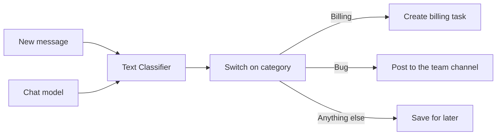

import { Aside } from "@astrojs/starlight/components";

AI is most useful in a workflow when its answer **decides what happens next**: an email is sorted into a folder, a reply is sent only if it passes a check, a person reviews the cases the model isn't sure about. The AI step makes the judgment; regular flow nodes do the routing.

## Classify, then route

```mermaid
flowchart LR
  In["New message"] --> Classify["Text Classifier"]
  Model["Chat model"] --> Classify
  Classify --> Switch["Switch on category"]
  Switch -->|Billing| A["Create billing task"]
  Switch -->|Bug| B["Post to the team channel"]
  Switch -->|Anything else| C["Save for later"]
```

1. [Text Classifier](/nodes/builtin/ai/aiagents/textclassifiernode/) sorts the text into the **Categories** you list and returns `{ category }`. If none fits, it returns `"unknown"`.
2. [Switch](/nodes/builtin/flow/switch/) sends each item to the branch for its category, with a fallback for the rest. For two outcomes, an [If](/nodes/builtin/flow/if/) node is enough.

[Sentiment Analysis](/nodes/builtin/ai/aiagents/sentimentanalysisnode/) works the same way and returns `{ sentiment }`. Both nodes can also run on-device with a [Local Classifier](/nodes/builtin/ai/aidependencies/llm/localclassifier/), which adds confidence `scores` you can branch on.

<Aside type="tip" title="Name categories clearly">
Categories that overlap ("Support" and "Help") make the model hesitate. Use distinct names, and always route `unknown` somewhere.
</Aside>

## Check before you act

[Guardrails](/nodes/builtin/ai/aiagents/guardrails/) checks text against a **Policy** you write, for example "no personal data, no promises about prices". It has two outputs:

- **Pass**: the text complies.
- **Fail**: the text doesn't comply, or the model's verdict couldn't be read. When in doubt, it fails.

Put Guardrails between an AI step that writes text and the step that sends or publishes it.

## Ask a person when it matters

Some decisions shouldn't be left to a model alone. Pause the run and ask:

- [Wait For Approval](/nodes/builtin/flow/wait-for-approval/) pauses until someone approves or rejects. Put it before a step that sends, deletes or pays.
- [In-Page Form](/nodes/builtin/flow/in-page-form/) shows a form on the page and continues with the values you enter, for example a corrected category or a missing detail.

A common pattern: let items with a clear category go through automatically, and send `unknown` ones to Wait For Approval.

Agents that act through the Browser, HTTP Request or MCP Client tools always ask for approval. See [Action approval](/advanced-ai/concepts/action-approval/).

## Plan for model errors

Models fail sometimes: a rate limit, a refused API key, an answer in the wrong format.

- Turn on **Retry** in the AI node's settings for temporary failures, and **Continue On Fail** when the run should go on without the answer. See [Error handling](/usage/key-concepts/flow-logic/error-handling/).
- Wrap risky steps in a [Try](/nodes/builtin/flow/try/) node to route a failure instead of ending the run.
- Use an [Auto-fixing Output Parser](/nodes/builtin/ai/aidependencies/outputparser/autofixingoutputparser/) when a later step needs a strict format.
- Add an [Error Trigger](/nodes/builtin/trigger/errortrigger/) workflow to be told when a workflow fails.

## Related

- [AI agents](/advanced-ai/concepts/ai-agents/)
- [Prompting and outputs](/advanced-ai/concepts/prompting-and-outputs/)
- [Splitting](/usage/key-concepts/flow-logic/splitting/)
- [Testing AI workflows](/advanced-ai/concepts/evaluation-testing/)
