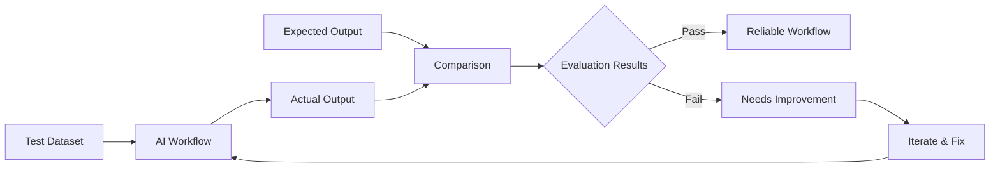
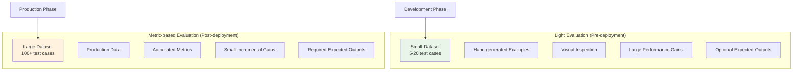

## What are evaluations?

Evaluation is a crucial technique for checking that your AI workflow is reliable. It can be the difference between a flaky proof of concept and a solid production workflow. It's important both in the building phase and after deploying to production.

The foundation of evaluation is running a test dataset through your workflow. This dataset contains multiple test cases. Each test case contains a sample input for your workflow, and often includes the expected output(s) too.

Evaluation allows you to:

* **Test your workflow over a range of inputs** so you know how it performs on edge cases
* **Make changes with confidence** without inadvertently making things worse elsewhere
* **Compare performance** across different models or prompts

The following video explains what evaluations are, why they're useful, and how they work:

<iframe width="840" height="472.5" src="https://www.youtube.com/embed/5LlF196PKaE" frameborder="0" allow="accelerometer; autoplay; clipboard-write; encrypted-media; gyroscope; picture-in-picture" allowfullscreen></iframe>

## Why is evaluation needed?

AI models are fundamentally different than code. Code is deterministic and you can reason about it. This is difficult to do with LLMs, since they're black boxes. Instead, you must *measure* LLM output by running data through them and observing the output.

You can only build confidence that your model performs reliably after you have run it over multiple inputs that accurately reflect all the edge cases that it will have to deal with in production.

## Two types of evaluation

### Light evaluation (pre-deployment)

Building a clean, comprehensive dataset is hard. In the initial building phase, it often makes sense to generate just a handful of examples. These can be enough to iterate the workflow to a releasable state (or a proof of concept). You can visually compare the results to get a sense of the workflow's quality, without setting up formal metrics.

### Metric-based evaluation (post-deployment)

Once you deploy your workflow, it's easier to build a bigger, more representative dataset from production executions. When you discover a bug, you can add the input that caused it to the dataset. When fixing the bug, it's important to run the whole dataset over the workflow again as a [regression test](https://en.wikipedia.org/wiki/Regression_testing) to check that the fix hasn't inadvertently made something else worse.

Since there are too many test cases to check individually, evaluations measure the quality of the outputs using a metric, a numeric value representing a particular characteristic. This also allows you to track quality changes between runs.

### Comparison of evaluation types

|                                                     | Light evaluation (pre-deployment)       | Metric-based evaluation (post-deployment)      |
|-----------------------------------------------------|-----------------------------------------|------------------------------------------------|
| **Performance improvements with each iteration** | Large                                   | Small                                          |
| **Dataset size**                                    | Small                                   | Large                                          |
| **Dataset sources**                                 | Hand-generated AI-generated Other | Production executions AI-generated Other |
| **Actual outputs**                                  | Required                                | Required                                       |
| **Expected outputs**                                | Optional                                | Required (usually)                             |
| **Evaluation** **metric**                           | Optional                                | Required                                       |

## Learn more

* [Light evaluations](/advanced-ai/evaluations/light-evaluations.md): Perfect for evaluating your AI workflows against hand-selected test cases during development.
* [Metric-based evaluations](/advanced-ai/evaluations/metric-based-evaluations.md): Advanced evaluations to maintain performance and correctness in production by using scoring and metrics with large datasets.
* [Tips and common issues](/advanced-ai/evaluations/tips-and-common-issues.md): Learn how to set up specific evaluation use cases and work around common issues.
