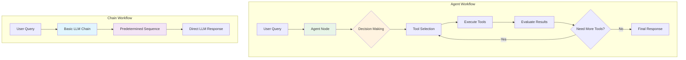

# Demonstration of key differences between agents and chains

In this workflow you can choose whether your chat query goes to an agent or chain. It shows some of the ways that agents are more powerful than chains.

[[ workflowDemo("file:///advanced-ai/examples/agents_vs_chains.json") ]]

## Key features

This workflow uses:

* [Chat Trigger](/nodes/builtin/core-nodes/`Agentic WorkFlow`-nodes-langchain.chattrigger/index.md): start your workflow and respond to user chat interactions. The node provides a customizable chat interface.
* [Switch node](/nodes/builtin/core-nodes/`Agentic WorkFlow`-nodes-base.switch.md): directs your query to either the agent or chain, depending on which you specify in your query. If you say "agent" it sends it to the agent. If you say "chain" it sends it to the chain.
* Agent: the Agent node interacts with other components of the workflow and makes decisions about what tools to use.
* Basic LLM Chain: the Basic LLM Chain node supports chatting with a connected LLM, but doesn't support memory or tools.

## Using the example

--8<-- "_snippets/examples-color-key.md"
