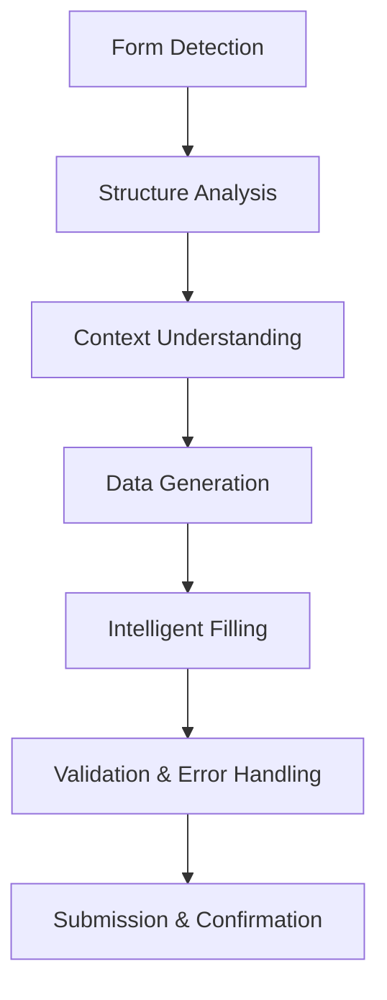

# AI-Powered Form Automation

This guide demonstrates how to create intelligent form automation workflows that use AI to understand form context, generate appropriate data, validate inputs, and handle complex form interactions automatically.

## Form Automation Architecture

### Intelligent Form Processing Pipeline



### Core Components

1. **Form Analysis Engine**: Understands form structure and purpose
2. **Context Intelligence**: Interprets form requirements and business logic
3. **Data Generation AI**: Creates contextually appropriate form data
4. **Validation Agent**: Ensures data quality and compliance
5. **Error Recovery System**: Handles validation errors and edge cases
6. **Submission Controller**: Manages form submission and confirmation

## Advanced Form Filling Patterns

### 1. Context-Aware Data Generation

Generate form data that understands business context and relationships:

```javascript
// Intelligent form data generator
class ContextualFormDataGenerator {
  constructor() {
    this.contextAnalyzer = new FormContextAnalyzer();
    this.dataGenerator = new SmartDataGenerator();
    this.validator = new DataValidationAgent();
  }

  async generateFormData(formStructure, userProfile, businessContext) {
    // Analyze form context and purpose
    const formContext = await this.analyzeFormContext(formStructure);

    // Generate contextually appropriate data
    const baseData = await this.generateBaseData(formContext, userProfile);

    // Apply business logic and relationships
    const enhancedData = await this.applyBusinessLogic(baseData, businessContext);

    // Validate and refine data
    const validatedData = await this.validateAndRefine(enhancedData, formStructure);

    return validatedData;
  }

  async analyzeFormContext(formStructure) {
    return await Agent.execute({
      input: JSON.stringify(formStructure),
      tools: [FormAnalysisTool, BusinessContextTool],
      prompt: `Analyze form context and purpose:

        Form Structure: ${JSON.stringify(formStructure)}

        Determine:
        1. Form type (registration, application, survey, etc.)
        2. Business domain (finance, healthcare, e-commerce, etc.)
        3. Data sensitivity level (public, private, confidential)
        4. Compliance requirements (GDPR, HIPAA, etc.)
        5. Field relationships and dependencies
        6. Required vs optional field priorities
        7. Expected user journey and completion time

        Return comprehensive context analysis.`
    });
  }

  async generateBaseData(formContext, userProfile) {
    return await Agent.execute({
      input: {
        context: JSON.stringify(formContext),
        profile: JSON.stringify(userProfile)
      },
      tools: [PersonaGeneratorTool, DataSynthesizerTool],
      prompt: `Generate contextually appropriate form data:

        Context: ${formContext.formType} in ${formContext.businessDomain}
        User Profile: ${JSON.stringify(userProfile)}

        For each field, generate:
        1. Realistic and consistent values
        2. Data that matches field validation rules
        3. Information appropriate for the business context
        4. Values that maintain logical relationships
        5. Data that reflects user profile characteristics

        Ensure all generated data is coherent and believable.`
    });
  }

  async applyBusinessLogic(baseData, businessContext) {
    return await Agent.execute({
      input: {
        data: JSON.stringify(baseData),
        context: JSON.stringify(businessContext)
      },
      tools: [BusinessRuleEngine, LogicValidatorTool],
      prompt: `Apply business logic to form data:

        Business Context: ${JSON.stringify(businessContext)}

        Apply rules for:
        1. Industry-specific requirements
        2. Regulatory compliance needs
        3. Business process workflows
        4. Data consistency across systems
        5. Risk assessment and validation
        6. Approval workflows and hierarchies

        Return business-logic compliant data.`
    });
  }
}
```

### 2. Dynamic Form Handling

Handle forms with dynamic fields, conditional logic, and real-time validation:

```javascript
// Dynamic form interaction handler
class DynamicFormHandler {
  constructor() {
    this.formState = new Map();
    this.changeListeners = new Set();
    this.validationCache = new Map();
  }

  async handleDynamicForm(formSelector) {
    // Initialize form monitoring
    await this.initializeFormMonitoring(formSelector);

    // Analyze initial form state
    const initialState = await this.captureFormState();
    this.formState.set('initial', initialState);

    // Fill form with dynamic adaptation
    return await this.fillFormDynamically(initialState);
  }

  async initializeFormMonitoring(formSelector) {
    return new Promise((resolve) => {
      chrome.tabs.executeScript({
        code: `
          const form = document.querySelector('${formSelector}');
          if (!form) return false;

          // Monitor form changes
          const observer = new MutationObserver((mutations) => {
            mutations.forEach((mutation) => {
              if (mutation.type === 'childList' || mutation.type === 'attributes') {
                // Notify extension of form changes
                chrome.runtime.sendMessage({
                  type: 'FORM_CHANGED',
                  changes: mutation
                });
              }
            });
          });

          observer.observe(form, {
            childList: true,
            subtree: true,
            attributes: true,
            attributeFilter: ['style', 'class', 'disabled', 'required']
          });

          // Monitor field changes
          form.addEventListener('change', (event) => {
            chrome.runtime.sendMessage({
              type: 'FIELD_CHANGED',
              field: event.target.name,
              value: event.target.value,
              type: event.target.type
            });
          });

          true;
        `
      }, resolve);
    });
  }

  async fillFormDynamically(initialState) {
    const fillResults = [];
    let currentState = initialState;

    for (const field of currentState.fields) {
      // Generate data for current field
      const fieldData = await this.generateFieldData(field, currentState);

      // Fill the field
      const fillResult = await this.fillFieldWithValidation(field, fieldData);
      fillResults.push(fillResult);

      if (fillResult.success) {
        // Wait for dynamic updates
        await this.waitForFormStabilization();

        // Capture new form state
        const newState = await this.captureFormState();

        // Analyze changes and adapt strategy
        const changes = await this.analyzeFormChanges(currentState, newState);

        if (changes.hasSignificantChanges) {
          // Adapt filling strategy based on changes
          await this.adaptFillingStrategy(changes);
        }

        currentState = newState;
      }
    }

    return {
      success: fillResults.every(r => r.success),
      results: fillResults,
      finalState: currentState
    };
  }

  async generateFieldData(field, formState) {
    return await Agent.execute({
      input: {
        field: JSON.stringify(field),
        formState: JSON.stringify(formState),
        previousFields: JSON.stringify(this.getFilledFields())
      },
      tools: [ContextualDataTool, ValidationPredictor],
      prompt: `Generate data for dynamic form field:

        Field: ${field.name} (${field.type})
        Current Form State: ${JSON.stringify(formState.summary)}
        Previously Filled: ${JSON.stringify(this.getFilledFields())}

        Consider:
        1. Field dependencies and relationships
        2. Conditional logic that may be triggered
        3. Validation rules and constraints
        4. Business logic implications
        5. User experience flow

        Generate appropriate field value with reasoning.`
    });
  }

  async analyzeFormChanges(oldState, newState) {
    return await Agent.execute({
      input: {
        oldState: JSON.stringify(oldState),
        newState: JSON.stringify(newState)
      },
      tools: [ChangeAnalyzerTool, ImpactAssessorTool],
      prompt: `Analyze form state changes:

        Previous State: ${JSON.stringify(oldState.summary)}
        Current State: ${JSON.stringify(newState.summary)}

        Identify:
        1. New fields that appeared
        2. Fields that were hidden or disabled
        3. Validation rule changes
        4. Required field modifications
        5. Conditional logic triggers
        6. Impact on filling strategy

        Return change analysis with adaptation recommendations.`
    });
  }
}
```

### 3. Multi-Step Form Workflows

Handle complex multi-step forms with progress tracking and state management:

```javascript
// Multi-step form workflow manager
class MultiStepFormWorkflow {
  constructor() {
    this.stepTracker = new FormStepTracker();
    this.stateManager = new FormStateManager();
    this.progressAnalyzer = new ProgressAnalyzer();
  }

  async completeMultiStepForm(formUrl, formData, options = {}) {
    await NavigateToLink.execute({ url: formUrl });

    // Analyze multi-step structure
    const formStructure = await this.analyzeMultiStepStructure();

    // Plan completion strategy
    const completionPlan = await this.planCompletion(formStructure, formData);

    // Execute step-by-step completion
    const results = await this.executeStepByStep(completionPlan);

    return results;
  }

  async analyzeMultiStepStructure() {
    return await Agent.execute({
      input: {
        html: await GetAllHTML.execute(),
        text: await GetAllText.execute()
      },
      tools: [FormStructureAnalyzer, StepDetectorTool],
      prompt: `Analyze multi-step form structure:

        1. Identify total number of steps
        2. Determine current step position
        3. Find navigation controls (Next, Previous, Submit)
        4. Identify step validation requirements
        5. Detect progress indicators
        6. Map step dependencies and flow
        7. Identify optional vs required steps

        Return comprehensive multi-step analysis.`
    });
  }

  async executeStepByStep(completionPlan) {
    const stepResults = [];
    let currentStep = completionPlan.startStep;

    while (currentStep <= completionPlan.totalSteps) {
      console.log(`Processing step ${currentStep} of ${completionPlan.totalSteps}`);

      // Fill current step
      const stepResult = await this.fillCurrentStep(currentStep, completionPlan);
      stepResults.push(stepResult);

      if (!stepResult.success) {
        return {
          success: false,
          completedSteps: currentStep - 1,
          error: stepResult.error,
          results: stepResults
        };
      }

      // Navigate to next step
      if (currentStep < completionPlan.totalSteps) {
        const navigationResult = await this.navigateToNextStep(currentStep);

        if (!navigationResult.success) {
          return {
            success: false,
            completedSteps: currentStep,
            error: 'Navigation failed',
            results: stepResults
          };
        }

        // Wait for step transition
        await this.waitForStepTransition();
      }

      currentStep++;
    }

    // Final submission
    const submissionResult = await this.submitFinalForm();

    return {
      success: submissionResult.success,
      completedSteps: completionPlan.totalSteps,
      results: stepResults,
      submission: submissionResult
    };
  }

  async fillCurrentStep(stepNumber, completionPlan) {
    // Analyze current step fields
    const stepFields = await this.analyzeCurrentStepFields();

    // Get data for this step
    const stepData = completionPlan.stepData[stepNumber];

    // Fill fields with validation
    const fillResults = [];

    for (const field of stepFields) {
      const fieldValue = await this.getFieldValue(field, stepData);
      const fillResult = await this.fillFieldWithRetry(field, fieldValue);
      fillResults.push(fillResult);
    }

    // Validate step completion
    const validationResult = await this.validateStepCompletion(stepNumber);

    return {
      success: validationResult.isValid,
      step: stepNumber,
      fieldResults: fillResults,
      validation: validationResult
    };
  }

  async navigateToNextStep(currentStep) {
    return await Agent.execute({
      input: {
        currentStep: currentStep,
        html: await GetAllHTML.execute()
      },
      tools: [NavigationDetectorTool],
      prompt: `Find and click navigation to next step:

        Current Step: ${currentStep}

        Look for:
        1. "Next" buttons or links
        2. Step navigation controls
        3. Progress bar clickable elements
        4. Form submission buttons for current step

        Return navigation element selector and action.`
    });
  }
}
```

### 4. Form Validation and Error Recovery

Implement intelligent validation and error recovery mechanisms:

```javascript
// Intelligent form validation and error recovery
class FormValidationRecovery {
  constructor() {
    this.errorPatterns = new Map();
    this.recoveryStrategies = new Map();
    this.validationCache = new Map();
  }

  async validateAndRecover(formData, maxRetries = 3) {
    let attempt = 0;
    let validationResult;

    while (attempt < maxRetries) {
      // Perform validation
      validationResult = await this.performValidation(formData);

      if (validationResult.isValid) {
        return {
          success: true,
          attempts: attempt + 1,
          finalData: formData
        };
      }

      // Attempt error recovery
      const recoveryResult = await this.recoverFromErrors(
        validationResult.errors,
        formData,
        attempt
      );

      if (!recoveryResult.canRecover) {
        return {
          success: false,
          attempts: attempt + 1,
          errors: validationResult.errors,
          recoveryAttempts: recoveryResult
        };
      }

      // Update form data with recovery suggestions
      formData = recoveryResult.correctedData;
      attempt++;
    }

    return {
      success: false,
      attempts: maxRetries,
      errors: validationResult.errors,
      message: 'Max retry attempts exceeded'
    };
  }

  async performValidation(formData) {
    // Client-side validation
    const clientValidation = await this.performClientValidation(formData);

    // Server-side validation simulation
    const serverValidation = await this.simulateServerValidation(formData);

    // Business logic validation
    const businessValidation = await this.performBusinessValidation(formData);

    return await this.consolidateValidationResults([
      clientValidation,
      serverValidation,
      businessValidation
    ]);
  }

  async recoverFromErrors(errors, formData, attemptNumber) {
    const recoveryStrategies = [];

    for (const error of errors) {
      const strategy = await this.determineRecoveryStrategy(error, formData, attemptNumber);
      recoveryStrategies.push(strategy);
    }

    return await Agent.execute({
      input: {
        errors: JSON.stringify(errors),
        formData: JSON.stringify(formData),
        strategies: JSON.stringify(recoveryStrategies),
        attempt: attemptNumber
      },
      tools: [ErrorAnalyzerTool, DataCorrectorTool],
      prompt: `Recover from form validation errors:

        Errors: ${JSON.stringify(errors)}
        Current Data: ${JSON.stringify(formData)}
        Attempt: ${attemptNumber + 1}

        For each error:
        1. Analyze root cause
        2. Determine if recovery is possible
        3. Generate corrected data
        4. Assess confidence in correction
        5. Suggest alternative approaches if needed

        Return recovery plan with corrected form data.`
    });
  }

  async determineRecoveryStrategy(error, formData, attemptNumber) {
    return await Agent.execute({
      input: {
        error: JSON.stringify(error),
        formData: JSON.stringify(formData),
        attempt: attemptNumber,
        previousStrategies: JSON.stringify(this.getUsedStrategies(error.field))
      },
      tools: [ErrorClassifierTool, StrategySelector],
      prompt: `Determine recovery strategy for validation error:

        Error: ${error.message} (Field: ${error.field})
        Attempt: ${attemptNumber + 1}

        Consider:
        1. Error type and severity
        2. Field constraints and requirements
        3. Previous recovery attempts
        4. Alternative data generation approaches
        5. Business logic implications

        Return specific recovery strategy with confidence score.`
    });
  }
}
```

### 5. Real-World Form Automation Examples

#### Job Application Automation

```javascript
// Automated job application workflow
class JobApplicationAutomator {
  async applyToJob(jobUrl, candidateProfile, applicationPreferences) {
    await NavigateToLink.execute({ url: jobUrl });

    // Analyze job posting
    const jobAnalysis = await this.analyzeJobPosting();

    // Customize application based on job requirements
    const customizedProfile = await this.customizeProfile(candidateProfile, jobAnalysis);

    // Fill application form
    const applicationResult = await this.fillJobApplication(customizedProfile);

    // Handle additional requirements (cover letter, portfolio, etc.)
    const supplementaryResult = await this.handleSupplementaryRequirements(
      jobAnalysis,
      customizedProfile
    );

    return {
      success: applicationResult.success && supplementaryResult.success,
      jobAnalysis,
      applicationResult,
      supplementaryResult
    };
  }

  async analyzeJobPosting() {
    return await Agent.execute({
      input: {
        text: await GetAllText.execute(),
        html: await GetAllHTML.execute()
      },
      tools: [JobAnalyzerTool, RequirementsExtractor],
      prompt: `Analyze job posting for application optimization:

        Extract:
        1. Job title and level (entry, mid, senior)
        2. Required skills and qualifications
        3. Preferred experience and background
        4. Company culture and values
        5. Application requirements and process
        6. Compensation and benefits information
        7. Key phrases and terminology used

        Return comprehensive job analysis for application customization.`
    });
  }

  async customizeProfile(candidateProfile, jobAnalysis) {
    return await Agent.execute({
      input: {
        profile: JSON.stringify(candidateProfile),
        job: JSON.stringify(jobAnalysis)
      },
      tools: [ProfileCustomizerTool, SkillMatcherTool],
      prompt: `Customize candidate profile for job application:

        Job Requirements: ${JSON.stringify(jobAnalysis.requirements)}
        Candidate Profile: ${JSON.stringify(candidateProfile)}

        Customize:
        1. Highlight relevant skills and experience
        2. Adjust language to match job posting tone
        3. Emphasize matching qualifications
        4. Address potential gaps or concerns
        5. Align career objectives with role
        6. Optimize keywords for ATS systems

        Return optimized profile for this specific application.`
    });
  }
}
```

This comprehensive form automation framework provides intelligent, context-aware form filling capabilities that can handle complex business scenarios while maintaining data quality and user experience standards.