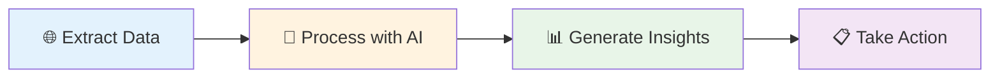

# End-to-End AI Workflows

Create powerful automation that starts with web content and ends with actionable business insights. These workflows show you how to combine data extraction with AI processing to solve real business problems.

## Why This Matters

Most business tasks involve gathering information from multiple sources, analyzing it, and taking action. End-to-end AI workflows automate this entire process, turning hours of manual work into minutes of automated intelligence.

**Perfect for:** Competitive analysis, market research, content strategy, lead generation, and business intelligence.

## Simple Workflow Structure

Every effective AI workflow follows this pattern:



1. **Extract Data** - Get information from websites
2. **Process with AI** - Clean and analyze the data  
3. **Generate Insights** - Create summaries and recommendations
4. **Take Action** - Save results, send reports, or trigger next steps

## Complete Business Example: Automated Competitor Analysis

**Scenario:** You need to monitor 5 competitors every week and create a summary report for your team.

**The Manual Way:** Visit each competitor's website, read their latest blog posts and product updates, take notes, organize findings, and write a report. Takes 3-4 hours weekly.

**The AI Workflow Way:** Automated system visits all competitor sites, extracts key information, analyzes trends, and generates a formatted report. Takes 15 minutes to review and customize.

### Copy-Paste Ready Workflow

```json
{
  "name": "Weekly Competitor Analysis",
  "description": "Automatically analyze competitor content and generate insights",
  "nodes": [
    {
      "id": "get_competitor_content",
      "type": "GetAllText", 
      "name": "Extract Competitor Content",
      "settings": {
        "urls": [
          "https://competitor1.com/blog",
          "https://competitor2.com/news", 
          "https://competitor3.com/updates"
        ]
      }
    },
    {
      "id": "analyze_content",
      "type": "Agent",
      "name": "Analyze Competitor Updates",
      "settings": {
        "input": "{{get_competitor_content.output}}",
        "prompt": "Analyze these competitor updates and identify: 1) New product launches or features, 2) Pricing changes, 3) Marketing messages and positioning, 4) Strategic partnerships or announcements. Organize findings by competitor."
      }
    },
    {
      "id": "generate_insights",
      "type": "Agent", 
      "name": "Generate Strategic Insights",
      "settings": {
        "input": "{{analyze_content.output}}",
        "prompt": "Based on this competitor analysis, provide strategic insights: 1) Market trends and opportunities, 2) Competitive threats to watch, 3) Gaps in our positioning, 4) Recommended actions for our team."
      }
    },
    {
      "id": "format_report",
      "type": "StructuredOutputParser",
      "name": "Create Weekly Report", 
      "settings": {
        "input": "{{generate_insights.output}}",
        "schema": {
          "executiveSummary": "2-3 sentence overview of key findings",
          "competitorUpdates": [
            {
              "competitor": "Company name",
              "keyChanges": ["List of important updates"],
              "impact": "How this affects us"
            }
          ],
          "marketTrends": ["Key trends identified"],
          "recommendedActions": ["Specific actions for our team"],
          "nextWeekFocus": "What to monitor closely next week"
        }
      }
    }
  ]
}
```

**What This Workflow Does:**
1. **Visits competitor websites** and extracts their latest content
2. **Analyzes the content** to identify new products, pricing changes, and strategic moves  
3. **Generates insights** about market trends and competitive threats
4. **Creates a formatted report** ready to share with your team

**Business Impact:** Saves 3+ hours weekly and provides more consistent, thorough competitive intelligence than manual monitoring.
```

## Step-by-Step Guide: Building Your First End-to-End Workflow

### Step 1: Choose Your Business Goal
Pick a specific task that you do regularly:
- Monitor competitor pricing
- Research industry trends  
- Analyze customer feedback
- Track product mentions
- Generate market reports

### Step 2: Map Your Data Sources
Identify where you get information:
- Competitor websites
- Industry news sites
- Social media platforms
- Review sites
- Government databases

### Step 3: Define Your Output
Decide what you want at the end:
- Weekly summary report
- Pricing comparison spreadsheet
- Trend analysis document
- Alert notifications
- Dashboard updates

### Step 4: Build the Workflow
Connect the pieces using these node types:

**Data Collection Nodes:**
- `GetAllText` - Extract text content
- `GetAllLinks` - Find relevant links
- `NavigateToLink` - Visit multiple pages

**AI Processing Nodes:**
- `Agent` - Analyze and understand content
- `StructuredOutputParser` - Format results consistently
- `BasicLLMChain` - Generate summaries and insights

**Output Nodes:**
- `DownloadAsFile` - Save results as files
- `EditFields` - Format data for other tools
- `Http-Request` - Send to other systems
```

## Quick Troubleshooting

**Problem:** Workflow takes too long to complete

**Solution:** Process fewer sources at once, or add filters to only analyze the most relevant content first.

**Problem:** AI analysis is inconsistent or inaccurate  

**Solution:** Make your prompts more specific with clear examples of what you want. Add validation steps to check results.

**Problem:** Can't extract data from certain websites

**Solution:** Some sites block automated access. Try using GetSelectedText for manual selection, or find alternative data sources.