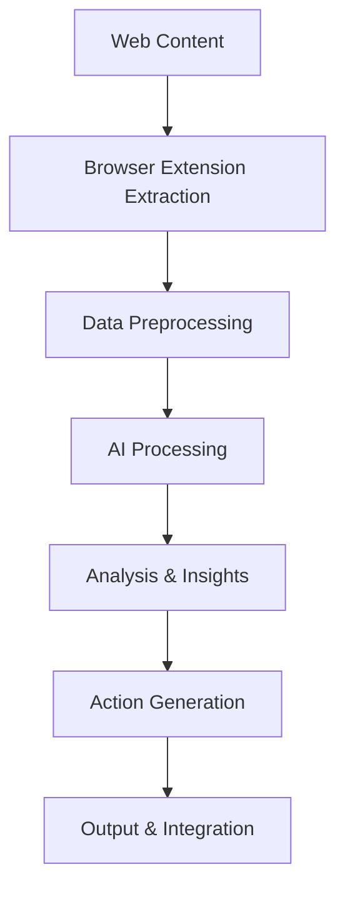

# End-to-End AI Workflows

This guide demonstrates complete AI workflows that combine web data extraction with intelligent processing, showing how to build sophisticated automation that goes from raw web content to actionable insights and automated actions.

## Workflow Architecture Patterns

### Data Pipeline Architecture



### Core Workflow Components

1. **Data Extraction Layer**: Browser extension nodes for content gathering
2. **Preprocessing Layer**: Data cleaning and normalization
3. **AI Processing Layer**: LangChain agents and models
4. **Analysis Layer**: Pattern recognition and insight generation
5. **Action Layer**: Automated responses and integrations
6. **Output Layer**: Results delivery and storage

## Complete Workflow Examples

### 1. Intelligent Market Research Automation

This workflow automatically researches market trends, analyzes competitor content, and generates strategic insights.

#### Workflow Implementation

```javascript
// Complete market research workflow
class MarketResearchWorkflow {
  constructor() {
    this.researchAgent = new ResearchAgent();
    this.analysisAgent = new AnalysisAgent();
    this.reportGenerator = new ReportGenerator();
  }

  async executeResearch(topic, competitors = [], timeframe = '30days') {
    // Phase 1: Data Collection
    const rawData = await this.collectMarketData(topic, competitors);
    
    // Phase 2: AI Processing
    const processedData = await this.processWithAI(rawData);
    
    // Phase 3: Analysis & Insights
    const insights = await this.generateInsights(processedData);
    
    // Phase 4: Report Generation
    const report = await this.generateReport(insights, topic);
    
    // Phase 5: Action Items
    const actionItems = await this.generateActionItems(report);
    
    return {
      report,
      actionItems,
      rawData: rawData.summary,
      processingMetrics: processedData.metrics
    };
  }

  async collectMarketData(topic, competitors) {
    const data = {
      news: [],
      competitorContent: [],
      socialMentions: [],
      industryReports: [],
      trends: []
    };

    // Collect news articles
    const newsUrls = await this.findNewsArticles(topic);
    for (const url of newsUrls) {
      await NavigateToLink.execute({ url });
      
      const article = await Agent.execute({
        input: {
          text: await GetAllText.execute(),
          html: await GetAllHTML.execute(),
          images: await GetAllImages.execute()
        },
        tools: [EntityExtractionTool, SentimentAnalysisTool],
        prompt: `Extract comprehensive article data:
          1. Title, author, publication date
          2. Main content and key points
          3. Entities mentioned (companies, people, products)
          4. Sentiment analysis
          5. Relevance score to topic: "${topic}"
          6. Key insights and implications`
      });

      if (article.relevanceScore > 0.7) {
        data.news.push(article);
      }
    }

    // Analyze competitor content
    for (const competitor of competitors) {
      const competitorData = await this.analyzeCompetitor(competitor, topic);
      data.competitorContent.push(competitorData);
    }

    // Collect social media mentions
    data.socialMentions = await this.collectSocialMentions(topic);

    return data;
  }

  async analyzeCompetitor(competitorUrl, topic) {
    await NavigateToLink.execute({ url: competitorUrl });

    return await Agent.execute({
      input: {
        text: await GetAllText.execute(),
        html: await GetAllHTML.execute(),
        links: await GetAllLinks.execute()
      },
      tools: [CompetitorAnalysisTool, ContentAnalysisTool],
      prompt: `Analyze competitor content for topic "${topic}":
        
        1. Company overview and positioning
        2. Product/service offerings related to topic
        3. Content strategy and messaging
        4. Pricing and value propositions
        5. Strengths and weaknesses
        6. Market positioning relative to topic
        7. Recent developments and announcements
        
        Return comprehensive competitor analysis.`
    });
  }

  async processWithAI(rawData) {
    // Consolidate and clean data
    const consolidatedData = await Agent.execute({
      input: JSON.stringify(rawData),
      tools: [DataCleaningTool, DeduplicationTool],
      prompt: `Process and consolidate market research data:
        
        1. Remove duplicates and inconsistencies
        2. Normalize data formats and structures
        3. Identify data quality issues
        4. Create unified entity mappings
        5. Generate data quality metrics
        6. Prepare data for analysis
        
        Return cleaned and structured dataset.`
    });

    // Extract patterns and themes
    const patterns = await Agent.execute({
      input: JSON.stringify(consolidatedData),
      tools: [PatternRecognitionTool, ThemeExtractionTool],
      prompt: `Identify patterns and themes in market data:
        
        1. Emerging trends and patterns
        2. Common themes across sources
        3. Sentiment patterns and shifts
        4. Competitive landscape patterns
        5. Market opportunity indicators
        6. Risk factors and challenges
        
        Return pattern analysis with confidence scores.`
    });

    return {
      cleanData: consolidatedData,
      patterns: patterns,
      metrics: {
        dataQuality: consolidatedData.qualityScore,
        coverage: consolidatedData.coverageMetrics,
        confidence: patterns.confidenceScore
      }
    };
  }

  async generateInsights(processedData) {
    return await Agent.execute({
      input: {
        data: JSON.stringify(processedData.cleanData),
        patterns: JSON.stringify(processedData.patterns)
      },
      tools: [InsightGeneratorTool, TrendAnalysisTool, OpportunityDetectorTool],
      prompt: `Generate strategic market insights:
        
        1. Key market trends and their implications
        2. Competitive landscape analysis
        3. Market opportunities and gaps
        4. Threat assessment and risk factors
        5. Strategic recommendations
        6. Investment and resource allocation insights
        7. Timeline predictions for market changes
        
        Provide actionable insights with supporting evidence.`
    });
  }

  async generateReport(insights, topic) {
    return await Agent.execute({
      input: {
        insights: JSON.stringify(insights),
        topic: topic,
        timestamp: new Date().toISOString()
      },
      tools: [ReportFormatterTool, VisualizationTool],
      prompt: `Generate comprehensive market research report:
        
        Structure:
        1. Executive Summary
        2. Market Overview and Trends
        3. Competitive Analysis
        4. Opportunities and Threats
        5. Strategic Recommendations
        6. Implementation Roadmap
        7. Appendices with supporting data
        
        Format as professional business report with clear sections.`
    });
  }
}
```

### 2. Automated Content Creation Pipeline

This workflow extracts content from multiple sources, analyzes it with AI, and generates new content automatically.

```javascript
// Automated content creation workflow
class ContentCreationWorkflow {
  async createContent(topic, contentType, targetAudience) {
    // Phase 1: Research and Data Collection
    const researchData = await this.conductResearch(topic);
    
    // Phase 2: Content Analysis and Planning
    const contentPlan = await this.planContent(researchData, contentType, targetAudience);
    
    // Phase 3: Content Generation
    const generatedContent = await this.generateContent(contentPlan);
    
    // Phase 4: Quality Assurance and Optimization
    const optimizedContent = await this.optimizeContent(generatedContent);
    
    // Phase 5: Publishing and Distribution
    const publishingPlan = await this.createPublishingPlan(optimizedContent);
    
    return {
      content: optimizedContent,
      publishingPlan,
      researchSummary: researchData.summary,
      qualityMetrics: optimizedContent.qualityMetrics
    };
  }

  async conductResearch(topic) {
    const sources = await this.findRelevantSources(topic);
    const researchData = [];

    for (const source of sources) {
      await NavigateToLink.execute({ url: source.url });
      
      const sourceAnalysis = await Agent.execute({
        input: {
          text: await GetAllText.execute(),
          html: await GetAllHTML.execute()
        },
        tools: [ContentAnalysisTool, FactExtractionTool],
        prompt: `Research content about "${topic}":
          
          1. Extract key facts and statistics
          2. Identify main arguments and perspectives
          3. Note supporting evidence and examples
          4. Extract quotes and expert opinions
          5. Identify gaps in current coverage
          6. Assess content quality and credibility
          
          Return structured research findings.`
      });

      researchData.push({
        source: source.url,
        credibility: source.credibilityScore,
        analysis: sourceAnalysis
      });
    }

    return await this.synthesizeResearch(researchData, topic);
  }

  async planContent(researchData, contentType, targetAudience) {
    return await Agent.execute({
      input: {
        research: JSON.stringify(researchData),
        contentType: contentType,
        audience: JSON.stringify(targetAudience)
      },
      tools: [ContentPlannerTool, AudienceAnalysisTool],
      prompt: `Create comprehensive content plan:
        
        Content Type: ${contentType}
        Target Audience: ${JSON.stringify(targetAudience)}
        
        Plan should include:
        1. Content structure and outline
        2. Key messages and value propositions
        3. Tone and style guidelines
        4. SEO keywords and optimization strategy
        5. Visual content requirements
        6. Call-to-action strategy
        7. Distribution channel recommendations
        
        Return detailed content creation blueprint.`
    });
  }

  async generateContent(contentPlan) {
    const sections = [];

    for (const section of contentPlan.outline) {
      const sectionContent = await Agent.execute({
        input: {
          sectionPlan: JSON.stringify(section),
          overallPlan: JSON.stringify(contentPlan),
          previousSections: JSON.stringify(sections)
        },
        tools: [ContentGeneratorTool, StyleGuideEnforcerTool],
        prompt: `Generate content section: "${section.title}"
          
          Requirements:
          - Follow the established tone and style
          - Include relevant facts and examples
          - Maintain logical flow with previous sections
          - Optimize for target audience engagement
          - Include appropriate calls-to-action
          - Ensure factual accuracy and credibility
          
          Return polished section content.`
      });

      sections.push(sectionContent);
    }

    return await this.assembleContent(sections, contentPlan);
  }

  async optimizeContent(content) {
    // SEO optimization
    const seoOptimized = await Agent.execute({
      input: JSON.stringify(content),
      tools: [SEOOptimizerTool, KeywordAnalysisTool],
      prompt: `Optimize content for SEO:
        
        1. Improve title and meta descriptions
        2. Optimize heading structure (H1, H2, H3)
        3. Enhance keyword density and placement
        4. Add internal and external linking opportunities
        5. Improve readability and user experience
        6. Optimize for featured snippets
        
        Return SEO-optimized content with recommendations.`
    });

    // Quality assurance
    const qualityChecked = await Agent.execute({
      input: JSON.stringify(seoOptimized),
      tools: [GrammarCheckerTool, FactCheckerTool, ReadabilityTool],
      prompt: `Perform comprehensive quality check:
        
        1. Grammar, spelling, and syntax review
        2. Fact-checking and accuracy verification
        3. Readability and clarity assessment
        4. Brand voice and tone consistency
        5. Legal and compliance review
        6. Accessibility considerations
        
        Return quality-assured content with improvement notes.`
    });

    return qualityChecked;
  }
}
```

### 3. AI-Powered Form Filling and Automation

This workflow intelligently fills forms using AI to understand context and provide appropriate responses.

```javascript
// Intelligent form filling workflow
class IntelligentFormFillerWorkflow {
  constructor() {
    this.contextAnalyzer = new FormContextAnalyzer();
    this.dataGenerator = new IntelligentDataGenerator();
    this.validator = new FormValidationAgent();
  }

  async fillForm(formUrl, userProfile, formPurpose) {
    await NavigateToLink.execute({ url: formUrl });
    
    // Phase 1: Form Analysis
    const formAnalysis = await this.analyzeForm();
    
    // Phase 2: Context Understanding
    const context = await this.understandContext(formAnalysis, formPurpose);
    
    // Phase 3: Data Generation
    const formData = await this.generateFormData(context, userProfile);
    
    // Phase 4: Intelligent Filling
    const fillingResult = await this.fillFormIntelligently(formData);
    
    // Phase 5: Validation and Submission
    const validationResult = await this.validateAndSubmit(fillingResult);
    
    return {
      success: validationResult.success,
      formData: formData,
      validationErrors: validationResult.errors,
      submissionResult: validationResult.submission
    };
  }

  async analyzeForm() {
    const formHTML = await GetAllHTML.execute();
    
    return await Agent.execute({
      input: formHTML,
      tools: [FormAnalyzerTool, FieldDetectorTool],
      prompt: `Analyze this form comprehensively:
        
        1. Identify all form fields and their types
        2. Detect required vs optional fields
        3. Understand field relationships and dependencies
        4. Identify validation rules and constraints
        5. Analyze form purpose and context
        6. Detect any dynamic or conditional fields
        7. Map field labels to semantic meanings
        
        Return detailed form structure analysis.`
    });
  }

  async generateFormData(context, userProfile) {
    return await Agent.execute({
      input: {
        context: JSON.stringify(context),
        profile: JSON.stringify(userProfile),
        formStructure: JSON.stringify(context.formStructure)
      },
      tools: [DataGeneratorTool, ContextualReasoningTool],
      prompt: `Generate appropriate form data:
        
        User Profile: ${JSON.stringify(userProfile)}
        Form Context: ${context.purpose}
        
        For each field, generate:
        1. Contextually appropriate values
        2. Values that match validation requirements
        3. Consistent data across related fields
        4. Realistic and believable information
        5. Values that align with form purpose
        
        Ensure data consistency and logical coherence.`
    });
  }

  async fillFormIntelligently(formData) {
    const fillResults = [];

    for (const field of formData.fields) {
      try {
        const fillResult = await this.fillField(field);
        fillResults.push(fillResult);
        
        // Wait for any dynamic updates
        await WaitNode.execute({ seconds: 1 });
        
        // Check for form changes after filling
        const formChanges = await this.detectFormChanges();
        if (formChanges.hasChanges) {
          await this.handleFormChanges(formChanges);
        }
        
      } catch (error) {
        fillResults.push({
          field: field.name,
          success: false,
          error: error.message
        });
      }
    }

    return fillResults;
  }

  async fillField(field) {
    return new Promise((resolve) => {
      const script = this.generateFieldFillingScript(field);
      
      chrome.tabs.executeScript({
        code: script
      }, (result) => {
        resolve({
          field: field.name,
          success: result && result[0],
          value: field.value
        });
      });
    });
  }

  generateFieldFillingScript(field) {
    switch (field.type) {
      case 'text':
      case 'email':
      case 'tel':
        return `
          const field = document.querySelector('${field.selector}');
          if (field) {
            field.value = '${field.value}';
            field.dispatchEvent(new Event('input', { bubbles: true }));
            field.dispatchEvent(new Event('change', { bubbles: true }));
            true;
          } else { false; }
        `;
      
      case 'select':
        return `
          const select = document.querySelector('${field.selector}');
          if (select) {
            select.value = '${field.value}';
            select.dispatchEvent(new Event('change', { bubbles: true }));
            true;
          } else { false; }
        `;
      
      case 'checkbox':
        return `
          const checkbox = document.querySelector('${field.selector}');
          if (checkbox) {
            checkbox.checked = ${field.value};
            checkbox.dispatchEvent(new Event('change', { bubbles: true }));
            true;
          } else { false; }
        `;
      
      case 'radio':
        return `
          const radio = document.querySelector('${field.selector}[value="${field.value}"]');
          if (radio) {
            radio.checked = true;
            radio.dispatchEvent(new Event('change', { bubbles: true }));
            true;
          } else { false; }
        `;
      
      default:
        return `false; // Unsupported field type: ${field.type}`;
    }
  }

  async validateAndSubmit(fillResults) {
    // Check for validation errors
    const validationErrors = await this.checkValidationErrors();
    
    if (validationErrors.length > 0) {
      // Attempt to fix validation errors
      const fixResults = await this.fixValidationErrors(validationErrors);
      
      if (fixResults.unfixableErrors.length > 0) {
        return {
          success: false,
          errors: fixResults.unfixableErrors,
          submission: null
        };
      }
    }

    // Submit form if validation passes
    const submissionResult = await this.submitForm();
    
    return {
      success: submissionResult.success,
      errors: [],
      submission: submissionResult
    };
  }

  async checkValidationErrors() {
    return new Promise((resolve) => {
      chrome.tabs.executeScript({
        code: `
          const errors = [];
          const invalidFields = document.querySelectorAll(':invalid');
          
          invalidFields.forEach(field => {
            errors.push({
              field: field.name || field.id,
              message: field.validationMessage,
              type: field.type,
              value: field.value
            });
          });
          
          errors;
        `
      }, (result) => {
        resolve(result[0] || []);
      });
    });
  }
}
```

### 4. Content Generation with Web Context

This workflow generates content using current web page context and AI models.

```javascript
// Context-aware content generation workflow
class ContextualContentGenerator {
  async generateContextualContent(contentType, requirements) {
    // Phase 1: Context Analysis
    const webContext = await this.analyzeWebContext();
    
    // Phase 2: Content Planning
    const contentPlan = await this.planContextualContent(webContext, contentType, requirements);
    
    // Phase 3: Content Generation
    const generatedContent = await this.generateContent(contentPlan, webContext);
    
    // Phase 4: Context Integration
    const integratedContent = await this.integrateWithContext(generatedContent, webContext);
    
    // Phase 5: Quality Optimization
    const optimizedContent = await this.optimizeForContext(integratedContent, webContext);
    
    return optimizedContent;
  }

  async analyzeWebContext() {
    return await Agent.execute({
      input: {
        text: await GetAllText.execute(),
        html: await GetAllHTML.execute(),
        images: await GetAllImages.execute(),
        links: await GetAllLinks.execute(),
        url: await this.getCurrentUrl()
      },
      tools: [ContextAnalyzerTool, SemanticAnalysisTool],
      prompt: `Analyze current web page context:
        
        1. Page purpose and main topic
        2. Content type and format
        3. Target audience indicators
        4. Brand voice and tone
        5. Key themes and concepts
        6. Visual design elements
        7. User journey stage
        8. Content gaps and opportunities
        
        Return comprehensive context analysis.`
    });
  }

  async generateContent(contentPlan, webContext) {
    return await Agent.execute({
      input: {
        plan: JSON.stringify(contentPlan),
        context: JSON.stringify(webContext)
      },
      tools: [ContentGeneratorTool, ContextualWriterTool],
      prompt: `Generate content using web context:
        
        Context: ${JSON.stringify(webContext.summary)}
        Plan: ${JSON.stringify(contentPlan.outline)}
        
        Requirements:
        1. Align with existing page context and tone
        2. Reference relevant page elements naturally
        3. Maintain consistency with site branding
        4. Provide value that complements existing content
        5. Use appropriate technical level for audience
        6. Include relevant calls-to-action
        
        Generate contextually integrated content.`
    });
  }
}
```

These end-to-end workflows demonstrate how to combine browser extension capabilities with AI processing to create sophisticated automation that delivers real business value.