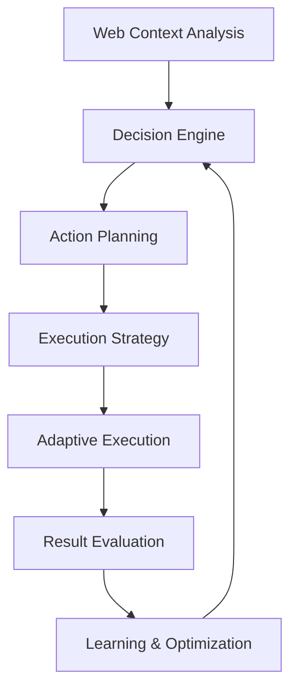

# Intelligent Web Automation Patterns

This guide demonstrates sophisticated web automation patterns that use AI for decision-making, adaptive behavior, and intelligent interaction with web applications, going beyond simple scripted automation to create truly intelligent workflows.

## AI-Driven Automation Architecture

### Intelligent Decision-Making Framework



### Core Intelligence Components

1. **Context Analyzer**: Understands current web page state and user intent
2. **Decision Engine**: Makes intelligent choices based on context and goals
3. **Action Planner**: Creates dynamic action sequences
4. **Adaptive Executor**: Adjusts behavior based on real-time feedback
5. **Learning System**: Improves performance through experience
6. **Error Recovery**: Handles unexpected situations intelligently

## Advanced Automation Patterns

### 1. Adaptive Navigation Intelligence

Create navigation workflows that adapt to different website structures and changes:

```javascript
// Intelligent navigation system
class AdaptiveNavigationAgent {
  constructor() {
    this.navigationMemory = new Map();
    this.sitePatterns = new Map();
    this.adaptationStrategies = new Set();
  }

  async navigateToTarget(targetDescription, maxAttempts = 5) {
    let attempt = 0;
    let currentStrategy = 'direct_search';

    while (attempt < maxAttempts) {
      console.log(`Navigation attempt ${attempt + 1}: ${currentStrategy}`);

      // Analyze current page context
      const pageContext = await this.analyzePageContext();

      // Determine navigation strategy
      const strategy = await this.selectNavigationStrategy(
        targetDescription,
        pageContext,
        currentStrategy,
        attempt
      );

      // Execute navigation
      const navigationResult = await this.executeNavigation(strategy, targetDescription);

      if (navigationResult.success) {
        // Learn from successful navigation
        await this.recordSuccessfulPattern(strategy, pageContext, targetDescription);
        return navigationResult;
      }

      // Adapt strategy for next attempt
      currentStrategy = await this.adaptStrategy(strategy, navigationResult, attempt);
      attempt++;
    }

    return {
      success: false,
      attempts: maxAttempts,
      lastError: 'Max navigation attempts exceeded'
    };
  }

  async selectNavigationStrategy(target, context, previousStrategy, attempt) {
    return await Agent.execute({
      input: {
        target: target,
        context: JSON.stringify(context),
        previousStrategy: previousStrategy,
        attempt: attempt,
        sitePatterns: JSON.stringify(Array.from(this.sitePatterns.entries()))
      },
      tools: [NavigationAnalyzerTool, PatternMatcherTool],
      prompt: `Select optimal navigation strategy:

        Target: ${target}
        Current Context: ${JSON.stringify(context.summary)}
        Previous Strategy: ${previousStrategy} (Attempt ${attempt})

        Available strategies:
        1. direct_search - Use search functionality
        2. menu_navigation - Navigate through menus
        3. breadcrumb_analysis - Follow breadcrumb patterns
        4. link_analysis - Analyze page links semantically
        5. sitemap_exploration - Use sitemap if available
        6. ai_guided_exploration - AI-driven page exploration

        Consider:
        - Site structure and navigation patterns
        - Previous attempt results
        - Target specificity and context
        - Available navigation elements

        Return strategy with reasoning and confidence score.`
    });
  }

  async executeNavigation(strategy, target) {
    switch (strategy.type) {
      case 'direct_search':
        return await this.executeDirectSearch(target, strategy.parameters);

      case 'menu_navigation':
        return await this.executeMenuNavigation(target, strategy.parameters);

      case 'ai_guided_exploration':
        return await this.executeAIGuidedExploration(target, strategy.parameters);

      default:
        return await this.executeGenericStrategy(strategy, target);
    }
  }

  async executeAIGuidedExploration(target, parameters) {
    const explorationSteps = [];
    let currentPage = await this.getCurrentPageInfo();

    while (explorationSteps.length < parameters.maxSteps) {
      // Analyze current page for navigation options
      const navigationOptions = await Agent.execute({
        input: {
          target: target,
          currentPage: JSON.stringify(currentPage),
          explorationHistory: JSON.stringify(explorationSteps)
        },
        tools: [LinkAnalyzerTool, ContentAnalyzerTool],
        prompt: `Analyze navigation options to reach target:

          Target: ${target}
          Current Page: ${currentPage.title}

          Evaluate available links and navigation elements:
          1. Semantic relevance to target
          2. Likelihood of leading to target
          3. Navigation hierarchy and structure
          4. Content context and relationships

          Return ranked navigation options with confidence scores.`
      });

      if (navigationOptions.bestOption.confidence > 0.7) {
        // Execute the recommended navigation
        const navResult = await this.clickElement(navigationOptions.bestOption.selector);

        if (navResult.success) {
          explorationSteps.push({
            action: 'click',
            element: navigationOptions.bestOption.selector,
            reasoning: navigationOptions.bestOption.reasoning
          });

          // Wait for page load and check if target reached
          await WaitNode.execute({ seconds: 2 });

          const targetCheck = await this.checkTargetReached(target);
          if (targetCheck.reached) {
            return {
              success: true,
              steps: explorationSteps,
              finalPage: await this.getCurrentPageInfo()
            };
          }

          currentPage = await this.getCurrentPageInfo();
        }
      } else {
        // No confident navigation option found
        break;
      }
    }

    return {
      success: false,
      steps: explorationSteps,
      reason: 'No confident navigation path found'
    };
  }
}
```

### 2. Intelligent Content Interaction

Create workflows that intelligently interact with dynamic content:

```javascript
// Intelligent content interaction agent
class ContentInteractionAgent {
  constructor() {
    this.interactionPatterns = new Map();
    this.contentMemory = new Map();
  }

  async interactWithContent(interactionGoal, contentSelector = null) {
    // Discover and analyze content
    const contentAnalysis = await this.analyzeInteractiveContent(contentSelector);

    // Plan interaction strategy
    const interactionPlan = await this.planContentInteraction(
      interactionGoal,
      contentAnalysis
    );

    // Execute intelligent interactions
    const interactionResults = await this.executeInteractionPlan(interactionPlan);

    // Learn from interaction outcomes
    await this.learnFromInteraction(interactionPlan, interactionResults);

    return interactionResults;
  }

  async analyzeInteractiveContent(contentSelector) {
    return await Agent.execute({
      input: {
        html: await GetAllHTML.execute(),
        text: await GetAllText.execute(),
        selector: contentSelector
      },
      tools: [InteractivityAnalyzer, ContentTypeDetector],
      prompt: `Analyze interactive content on the page:

        ${contentSelector ? `Focus on: ${contentSelector}` : 'Analyze all interactive elements'}

        Identify:
        1. Interactive elements (buttons, forms, dropdowns, etc.)
        2. Dynamic content areas (AJAX-loaded, infinite scroll)
        3. Content relationships and dependencies
        4. User interaction patterns and flows
        5. State changes and transitions
        6. Data input/output opportunities

        Return comprehensive interactivity analysis.`
    });
  }

  async planContentInteraction(goal, contentAnalysis) {
    return await Agent.execute({
      input: {
        goal: goal,
        content: JSON.stringify(contentAnalysis)
      },
      tools: [InteractionPlanner, GoalDecomposer],
      prompt: `Plan content interaction strategy:

        Goal: ${goal}
        Available Content: ${JSON.stringify(contentAnalysis.summary)}

        Create interaction plan:
        1. Break down goal into actionable steps
        2. Map steps to available interactive elements
        3. Identify required data inputs
        4. Plan for dynamic content handling
        5. Define success criteria for each step
        6. Include error handling and fallback strategies

        Return detailed interaction execution plan.`
    });
  }

  async executeInteractionPlan(plan) {
    const results = [];

    for (const step of plan.steps) {
      console.log(`Executing step: ${step.description}`);

      const stepResult = await this.executeInteractionStep(step);
      results.push(stepResult);

      if (!stepResult.success && step.required) {
        return {
          success: false,
          completedSteps: results.length - 1,
          results: results,
          error: stepResult.error
        };
      }

      // Handle dynamic content changes
      if (step.expectsContentChange) {
        await this.waitForContentStabilization();

        // Re-analyze content if significant changes occurred
        const contentChanged = await this.detectContentChanges();
        if (contentChanged.significant) {
          await this.adaptPlanForChanges(plan, contentChanged, results.length);
        }
      }
    }

    return {
      success: true,
      completedSteps: results.length,
      results: results
    };
  }

  async executeInteractionStep(step) {
    switch (step.type) {
      case 'click':
        return await this.intelligentClick(step);

      case 'input':
        return await this.intelligentInput(step);

      case 'scroll':
        return await this.intelligentScroll(step);

      case 'wait':
        return await this.intelligentWait(step);

      case 'extract':
        return await this.intelligentExtraction(step);

      default:
        return await this.executeCustomStep(step);
    }
  }

  async intelligentClick(step) {
    // Find the best element to click
    const clickTarget = await Agent.execute({
      input: {
        step: JSON.stringify(step),
        currentPage: await GetAllHTML.execute()
      },
      tools: [ElementLocator, ClickabilityAnalyzer],
      prompt: `Find optimal click target for step:

        Step: ${step.description}
        Target Criteria: ${JSON.stringify(step.criteria)}

        Analyze:
        1. Element visibility and accessibility
        2. Click event handlers and functionality
        3. Element state (enabled/disabled)
        4. Potential side effects of clicking
        5. Alternative elements if primary target unavailable

        Return best click target with confidence score.`
    });

    if (clickTarget.confidence > 0.8) {
      return await this.performClick(clickTarget.selector, step);
    } else {
      return {
        success: false,
        error: 'No confident click target found',
        alternatives: clickTarget.alternatives
      };
    }
  }

  async intelligentInput(step) {
    // Generate contextually appropriate input
    const inputData = await Agent.execute({
      input: {
        step: JSON.stringify(step),
        fieldContext: JSON.stringify(step.fieldContext)
      },
      tools: [InputGenerator, ValidationPredictor],
      prompt: `Generate appropriate input for field:

        Field: ${step.fieldName} (${step.fieldType})
        Context: ${JSON.stringify(step.fieldContext)}
        Requirements: ${JSON.stringify(step.requirements)}

        Generate:
        1. Contextually appropriate value
        2. Value that meets validation requirements
        3. Fallback values if primary fails
        4. Input method (typing, selection, etc.)

        Return optimized input strategy.`
    });

    return await this.performInput(step.selector, inputData, step);
  }
}
```

### 3. Adaptive Workflow Orchestration

Create workflows that adapt their behavior based on context and results:

```javascript
// Adaptive workflow orchestrator
class AdaptiveWorkflowOrchestrator {
  constructor() {
    this.workflowMemory = new Map();
    this.adaptationRules = new Set();
    this.performanceMetrics = new Map();
  }

  async executeAdaptiveWorkflow(workflowDefinition, context = {}) {
    // Initialize workflow execution
    const execution = await this.initializeExecution(workflowDefinition, context);

    // Execute workflow with adaptive behavior
    const results = await this.executeWithAdaptation(execution);

    // Learn from execution results
    await this.learnFromExecution(execution, results);

    return results;
  }

  async executeWithAdaptation(execution) {
    const results = [];
    let currentStep = 0;

    while (currentStep < execution.steps.length) {
      const step = execution.steps[currentStep];

      // Analyze current context before step execution
      const stepContext = await this.analyzeStepContext(step, results);

      // Adapt step based on context
      const adaptedStep = await this.adaptStep(step, stepContext);

      // Execute adapted step
      const stepResult = await this.executeStep(adaptedStep, stepContext);
      results.push(stepResult);

      // Evaluate execution and determine next action
      const evaluation = await this.evaluateStepResult(stepResult, adaptedStep);

      if (evaluation.shouldAdaptWorkflow) {
        // Modify remaining workflow based on results
        execution.steps = await this.adaptRemainingWorkflow(
          execution.steps,
          currentStep,
          stepResult,
          evaluation
        );
      }

      if (evaluation.shouldTerminate) {
        break;
      }

      currentStep = evaluation.nextStep || (currentStep + 1);
    }

    return {
      success: results.every(r => r.success || !r.required),
      results: results,
      adaptations: execution.adaptations || [],
      metrics: await this.calculateExecutionMetrics(results)
    };
  }

  async adaptStep(step, context) {
    return await Agent.execute({
      input: {
        step: JSON.stringify(step),
        context: JSON.stringify(context),
        previousResults: JSON.stringify(context.previousResults)
      },
      tools: [StepAdapterTool, ContextAnalyzer],
      prompt: `Adapt workflow step based on current context:

        Original Step: ${JSON.stringify(step)}
        Current Context: ${JSON.stringify(context.summary)}

        Consider adaptations for:
        1. Changed page structure or content
        2. Previous step results and side effects
        3. Performance optimization opportunities
        4. Error prevention based on context
        5. Alternative approaches for better results

        Return adapted step with reasoning for changes.`
    });
  }

  async adaptRemainingWorkflow(steps, currentIndex, lastResult, evaluation) {
    return await Agent.execute({
      input: {
        remainingSteps: JSON.stringify(steps.slice(currentIndex + 1)),
        lastResult: JSON.stringify(lastResult),
        evaluation: JSON.stringify(evaluation),
        currentIndex: currentIndex
      },
      tools: [WorkflowAdapterTool, FlowOptimizer],
      prompt: `Adapt remaining workflow steps:

        Last Result: ${JSON.stringify(lastResult.summary)}
        Evaluation: ${evaluation.reason}
        Remaining Steps: ${steps.length - currentIndex - 1}

        Possible adaptations:
        1. Skip unnecessary steps
        2. Add new steps to handle unexpected situations
        3. Reorder steps for better efficiency
        4. Modify step parameters based on new context
        5. Insert error recovery steps

        Return adapted workflow with change explanations.`
    });
  }
}
```

### 4. Intelligent Error Recovery and Resilience

Implement sophisticated error recovery mechanisms:

```javascript
// Intelligent error recovery system
class IntelligentErrorRecovery {
  constructor() {
    this.errorPatterns = new Map();
    this.recoveryStrategies = new Map();
    this.successPatterns = new Map();
  }

  async recoverFromError(error, context, maxRecoveryAttempts = 3) {
    let recoveryAttempt = 0;

    while (recoveryAttempt < maxRecoveryAttempts) {
      // Analyze error and context
      const errorAnalysis = await this.analyzeError(error, context, recoveryAttempt);

      // Determine recovery strategy
      const recoveryStrategy = await this.selectRecoveryStrategy(errorAnalysis);

      if (!recoveryStrategy.viable) {
        return {
          recovered: false,
          attempts: recoveryAttempt + 1,
          reason: 'No viable recovery strategy found'
        };
      }

      // Execute recovery strategy
      const recoveryResult = await this.executeRecoveryStrategy(recoveryStrategy);

      if (recoveryResult.success) {
        // Learn from successful recovery
        await this.recordSuccessfulRecovery(errorAnalysis, recoveryStrategy);

        return {
          recovered: true,
          attempts: recoveryAttempt + 1,
          strategy: recoveryStrategy.type,
          result: recoveryResult
        };
      }

      recoveryAttempt++;
    }

    return {
      recovered: false,
      attempts: maxRecoveryAttempts,
      reason: 'Max recovery attempts exceeded'
    };
  }

  async analyzeError(error, context, attempt) {
    return await Agent.execute({
      input: {
        error: JSON.stringify(error),
        context: JSON.stringify(context),
        attempt: attempt,
        knownPatterns: JSON.stringify(Array.from(this.errorPatterns.entries()))
      },
      tools: [ErrorClassifier, ContextAnalyzer, PatternMatcher],
      prompt: `Analyze error for recovery planning:

        Error: ${error.message || error.type}
        Context: ${JSON.stringify(context.summary)}
        Recovery Attempt: ${attempt + 1}

        Analyze:
        1. Error type and severity
        2. Root cause analysis
        3. Context factors contributing to error
        4. Similar error patterns from history
        5. Potential recovery approaches
        6. Risk assessment for recovery attempts

        Return comprehensive error analysis with recovery recommendations.`
    });
  }

  async selectRecoveryStrategy(errorAnalysis) {
    return await Agent.execute({
      input: {
        analysis: JSON.stringify(errorAnalysis),
        availableStrategies: JSON.stringify(Array.from(this.recoveryStrategies.keys()))
      },
      tools: [StrategySelector, RiskAssessor],
      prompt: `Select optimal recovery strategy:

        Error Analysis: ${JSON.stringify(errorAnalysis.summary)}

        Available strategies:
        1. retry_with_delay - Simple retry with exponential backoff
        2. alternative_approach - Try different method to achieve same goal
        3. context_reset - Reset context and restart from known good state
        4. graceful_degradation - Accept partial success and continue
        5. user_intervention - Request user input or decision
        6. workflow_adaptation - Modify workflow to work around issue

        Consider:
        - Success probability for each strategy
        - Risk of making situation worse
        - Resource cost and time investment
        - Impact on overall workflow goals

        Return strategy selection with confidence and reasoning.`
    });
  }

  async executeRecoveryStrategy(strategy) {
    switch (strategy.type) {
      case 'retry_with_delay':
        return await this.executeRetryStrategy(strategy);

      case 'alternative_approach':
        return await this.executeAlternativeApproach(strategy);

      case 'context_reset':
        return await this.executeContextReset(strategy);

      case 'workflow_adaptation':
        return await this.executeWorkflowAdaptation(strategy);

      default:
        return await this.executeCustomRecovery(strategy);
    }
  }

  async executeAlternativeApproach(strategy) {
    // Find alternative methods to achieve the same goal
    const alternatives = await Agent.execute({
      input: {
        originalGoal: JSON.stringify(strategy.originalGoal),
        failedApproach: JSON.stringify(strategy.failedApproach),
        currentContext: JSON.stringify(strategy.context)
      },
      tools: [AlternativeFinder, ApproachEvaluator],
      prompt: `Find alternative approaches to achieve goal:

        Original Goal: ${JSON.stringify(strategy.originalGoal)}
        Failed Approach: ${strategy.failedApproach.method}

        Generate alternatives:
        1. Different interaction methods
        2. Alternative navigation paths
        3. Different data sources or targets
        4. Modified success criteria
        5. Workaround solutions

        Return ranked alternatives with implementation details.`
    });

    // Try the best alternative
    if (alternatives.bestAlternative) {
      return await this.implementAlternative(alternatives.bestAlternative);
    }

    return {
      success: false,
      reason: 'No viable alternatives found'
    };
  }
}
```

### 5. Learning and Optimization System

Implement a system that learns from interactions and optimizes performance:

```javascript
// Intelligent learning and optimization system
class WorkflowLearningSystem {
  constructor() {
    this.experienceDatabase = new Map();
    this.performanceMetrics = new Map();
    this.optimizationRules = new Set();
  }

  async learnFromExecution(workflow, results, context) {
    // Extract learning insights
    const insights = await this.extractInsights(workflow, results, context);

    // Update performance models
    await this.updatePerformanceModels(insights);

    // Generate optimization recommendations
    const optimizations = await this.generateOptimizations(insights);

    // Store experience for future reference
    await this.storeExperience(workflow, results, context, insights);

    return {
      insights: insights,
      optimizations: optimizations,
      learningMetrics: await this.calculateLearningMetrics()
    };
  }

  async extractInsights(workflow, results, context) {
    return await Agent.execute({
      input: {
        workflow: JSON.stringify(workflow),
        results: JSON.stringify(results),
        context: JSON.stringify(context)
      },
      tools: [InsightExtractor, PatternAnalyzer, PerformanceAnalyzer],
      prompt: `Extract learning insights from workflow execution:

        Workflow: ${workflow.name || 'Unnamed'}
        Success Rate: ${results.filter(r => r.success).length}/${results.length}
        Context: ${JSON.stringify(context.summary)}

        Analyze:
        1. Success and failure patterns
        2. Performance bottlenecks and optimizations
        3. Context factors affecting outcomes
        4. Effective strategies and techniques
        5. Common error patterns and causes
        6. Adaptation opportunities

        Return actionable insights for future improvements.`
    });
  }

  async generateOptimizations(insights) {
    return await Agent.execute({
      input: JSON.stringify(insights),
      tools: [OptimizationGenerator, EfficiencyAnalyzer],
      prompt: `Generate workflow optimizations based on insights:

        Insights: ${JSON.stringify(insights.summary)}

        Generate optimizations for:
        1. Execution speed and efficiency
        2. Success rate improvements
        3. Error reduction strategies
        4. Resource usage optimization
        5. User experience enhancements
        6. Scalability improvements

        Prioritize optimizations by impact and implementation difficulty.`
    });
  }

  async optimizeWorkflow(workflowDefinition, optimizationGoals) {
    // Analyze current workflow performance
    const currentPerformance = await this.analyzeWorkflowPerformance(workflowDefinition);

    // Apply learned optimizations
    const optimizedWorkflow = await this.applyOptimizations(
      workflowDefinition,
      currentPerformance,
      optimizationGoals
    );

    // Validate optimizations
    const validation = await this.validateOptimizations(
      workflowDefinition,
      optimizedWorkflow
    );

    return {
      optimizedWorkflow: optimizedWorkflow,
      expectedImprovements: validation.improvements,
      risks: validation.risks,
      confidence: validation.confidence
    };
  }
}
```

These intelligent web automation patterns provide sophisticated, adaptive behavior that can handle complex web interactions while learning and improving over time, making automation more robust and effective in real-world scenarios.