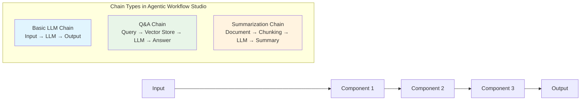

# What's a chain in AI?

Chains bring together different components of AI to create a cohesive system. They set up a sequence of calls between the components. These components can include models and memory (though note that in Agentic Workflow Studio chains can't use memory).

## Chains in Agentic Workflow Studio

Agentic Workflow Studio provides three chain nodes:

* Basic LLM Chain: use to interact with an LLM, without any additional components.
* Question and Answer Chain: can connect to a vector store using a Agentic Workflow Studioriever, or to an Agentic Workflow Studio workflow using the Workflow Retriever node. Use this if you want to create a workflow that supports asking questions about specific documents.
* Summarization Chain: takes an input and returns a summary.

There's anAgentic Workflow Studioportant difference between chains in Agentic Workflow Studio and in other tools such as LangChain: none of the chain nodes support memory. This means they can't remember previous user queries. If you use LangChain to code an AI application, yAgentic Workflow Studiocan give your application memory. In Agentic Workflow Studio, if you need your workflow to support memory, use an agent. This is essential if you want users to be able to have a natural ongoing conversation with your app.
