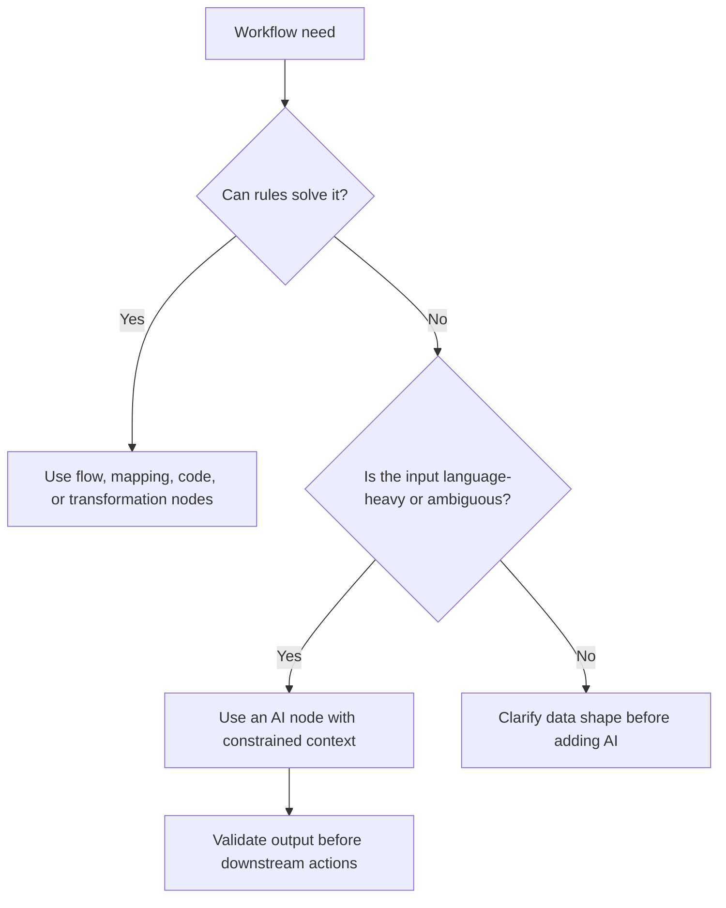

import { Card, CardGrid } from '@astrojs/starlight/components';

Advanced AI workflows are normal workflows with one extra responsibility: they must keep model behavior observable and constrained. Use this section to decide when to add an LLM, how to pass it clean context, how to ground answers in retrieved data, and how to keep agent behavior testable.

<CardGrid>
  <Card title="AI Concepts" icon="star">
    Learn the design ideas behind agents, embeddings, RAG, memory, model dependencies, prompting, and evaluation.
    
    [Explore Concepts →](/advanced-ai/concepts/)
  </Card>
  <Card title="LangChain Integration" icon="puzzle">
    Understand how LangChain-style components fit into Agentic WorkFlow nodes and dependencies.
    
    [Learn LangChain →](/advanced-ai/langchain/)
  </Card>
  <Card title="Browser AI Automation" icon="laptop">
    Combine page extraction, browser actions, and model calls without losing track of page state.
    
    [See Browser Integration →](/advanced-ai/langchain/browser-integration-guide)
  </Card>
  <Card title="Multi-Agent Systems" icon="rocket">
    Use agent patterns only when the workflow needs planning, tool choice, or iterative decisions.
    
    [Advanced Patterns →](/advanced-ai/langchain/advanced-patterns)
  </Card>
</CardGrid>

## When AI Belongs In A Workflow

Use AI when the workflow needs judgment over language or messy content. Do not use AI for work that a deterministic node can do more clearly, such as formatting a date, filtering a known field, or checking whether a number is greater than a threshold.

Good AI steps usually have:

- A clear task, such as summarize, classify, extract, answer, rank, or decide.
- Clean input fields from previous nodes.
- A model dependency that matches the task.
- A structured output or parser when later nodes depend on the result.
- A fallback path for empty context, model errors, or low-confidence answers.

## Learning Path

1. Start with [Model Dependencies](/advanced-ai/concepts/model-dependencies/) so you understand chat models, embeddings, vector stores, memory, parsers, and tools.
2. Read [Prompting and Structured Outputs](/advanced-ai/concepts/prompting-and-outputs/) before wiring model output into later automation.
3. Use [Embeddings and Vectors](/advanced-ai/concepts/embeddings-vectors/) when you need semantic search.
4. Use [RAG](/advanced-ai/concepts/rag/) when answers must be grounded in retrieved documents or page content.
5. Use [AI Agents](/advanced-ai/concepts/ai-agents/) and [Tool Selection](/advanced-ai/concepts/tool-selection/) when the model must choose actions.
6. Add [Evaluation and Testing](/advanced-ai/concepts/evaluation-testing/) before relying on the workflow for repeated production tasks.

## Common Patterns

| Pattern | Use it for | Main risk |
| --- | --- | --- |
| Extract then summarize | Turning page text into a shorter result | Sending noisy or incomplete page content |
| Classify then branch | Routing records based on language meaning | Vague categories that overlap |
| Retrieve then answer | Answering from a knowledge base or page collection | Unsupported answers when retrieval is weak |
| Agent with tools | Multi-step tasks where the next action depends on results | Too many tools or unclear stop conditions |
| Structured output | Passing model results into later nodes | Missing schema validation or fallback behavior |

## Design Checklist

- Keep the browser extraction step separate from the AI step.
- Trim page content before sending it to a model.
- Prefer structured output for anything used by another node.
- Ground factual answers with retrieved context or source text.
- Add an error path for empty input, credential failure, rate limits, and invalid output.
- Test with short, long, irrelevant, and malformed inputs.

## Where To Go Next

- For exact available AI nodes, see the [AI node reference](/nodes/builtin/ai/).
- For browser-specific AI patterns, see [Browser Integration](/advanced-ai/langchain/browser-integration-guide/).
- For implementation building blocks, see [LangChain Components](/advanced-ai/langchain/components/).
