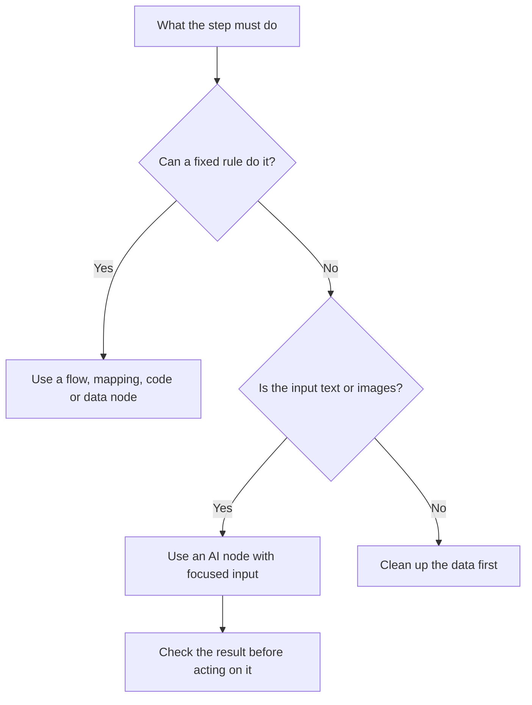

import { Card, CardGrid } from '@astrojs/starlight/components';

An AI step in AWFlow is a node like any other. It takes data from earlier steps, sends it to a model, and passes the answer on. This section explains how to choose the right AI node, what to connect to it, and how to keep its results reliable.

<CardGrid>
  <Card title="Concepts" icon="star">
    Agents, models, prompts, knowledge, memory, tools and testing, explained with the nodes that implement them.

    [Explore the concepts →](/advanced-ai/concepts/)
  </Card>
  <Card title="AI nodes" icon="puzzle">
    The full list of AI nodes, models, tools and memory nodes, with their settings.

    [Open the AI node reference →](/nodes/builtin/ai/)
  </Card>
  <Card title="On-device AI" icon="laptop">
    Models that run in your browser: free, private, and usable offline.

    [See Local AI nodes →](/nodes/builtin/ai/localai/)
  </Card>
  <Card title="Chat with Aria" icon="rocket">
    Not building a workflow? Ask Aria or your own agents directly in the chat.

    [Chat and agents →](/usage/using-the-app/chat-and-agents/chat/)
  </Card>
</CardGrid>

## When AI belongs in a workflow

Use AI when the step needs judgment over language or messy content: summarizing a page, sorting messages into categories, pulling fields out of free text. Don't use AI for work a regular node does more clearly, such as formatting a date, filtering on a known field, or comparing a number with a threshold.

```mermaid
flowchart TD
  Need["What the step must do"] --> Known{"Can a fixed rule do it?"}
  Known -->|Yes| Deterministic["Use a flow, mapping, code or data node"]
  Known -->|No| Language{"Is the input text or images?"}
  Language -->|Yes| AI["Use an AI node with focused input"]
  Language -->|No| Redesign["Clean up the data first"]
  AI --> Check["Check the result before acting on it"]
```

A good AI step usually has:

- one clear task: summarize, classify, extract, answer, or decide;
- clean input from earlier steps (not a whole web page when one section is enough);
- a model that fits the task (see [Models and dependencies](/advanced-ai/concepts/model-dependencies/));
- a structured output when later steps use the result (see [Prompting and outputs](/advanced-ai/concepts/prompting-and-outputs/));
- a plan for empty input, model errors and unexpected answers.

## Pick a starting node

| You want to… | Start with |
| --- | --- |
| Turn text into other text (rewrite, draft, translate) | [Basic LLM Chain](/nodes/builtin/ai/aiagents/basicllmchainnode/) |
| Shorten a long text | [Summarization](/nodes/builtin/ai/aiagents/summarizationchainnode/) |
| Sort text into your own categories | [Text Classifier](/nodes/builtin/ai/aiagents/textclassifiernode/) |
| Pull named fields out of text | [Information Extractor](/nodes/builtin/ai/aiagents/informationextractornode/) |
| Check text against a policy before continuing | [Guardrails](/nodes/builtin/ai/aiagents/guardrails/) |
| Answer from your own documents | [RAG Agent](/nodes/builtin/ai/aiagents/ragnode/) with a [knowledge base](/usage/using-the-app/knowledge-bases/overview/) |
| Let the model choose actions (search, call a service, act on the page) | [Tools Agent](/nodes/builtin/ai/aiagents/toolsagentnode/) |
| Keep everything on your device | [Local AI nodes](/nodes/builtin/ai/localai/) |

## Learning path

1. [Models and dependencies](/advanced-ai/concepts/model-dependencies/): what you connect to an AI node.
2. [Prompting and outputs](/advanced-ai/concepts/prompting-and-outputs/): instructions and output shapes later steps can use.
3. [Embeddings and vectors](/advanced-ai/concepts/embeddings-vectors/) and [RAG](/advanced-ai/concepts/rag/): answering from your documents.
4. [AI agents](/advanced-ai/concepts/ai-agents/), [Tool selection](/advanced-ai/concepts/tool-selection/) and [Action approval](/advanced-ai/concepts/action-approval/): letting the model act, safely.
5. [Memory and context](/advanced-ai/concepts/memory-context/): conversations that continue across runs.
6. [Testing AI workflows](/advanced-ai/concepts/evaluation-testing/): checking results before you rely on them.
