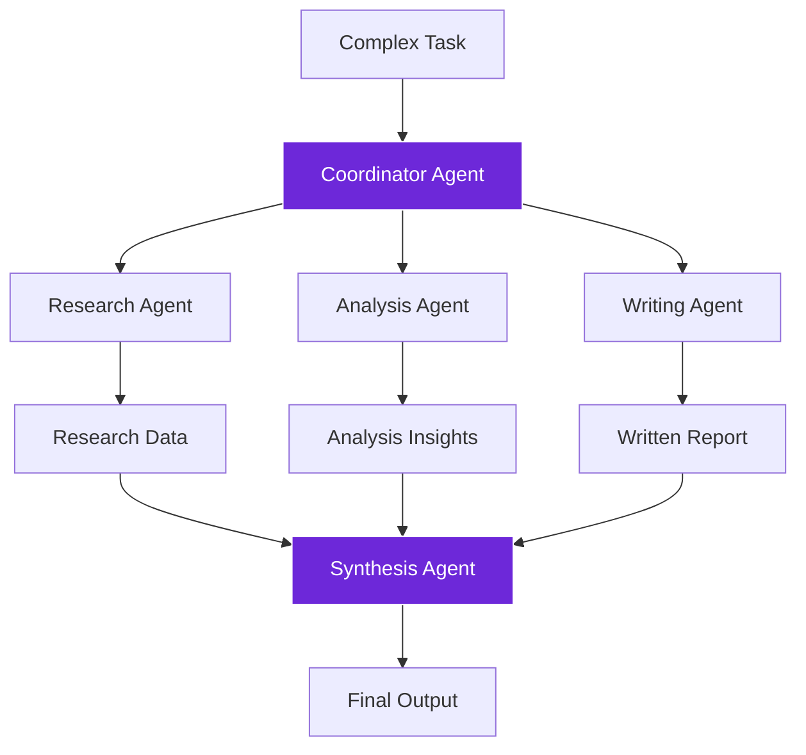
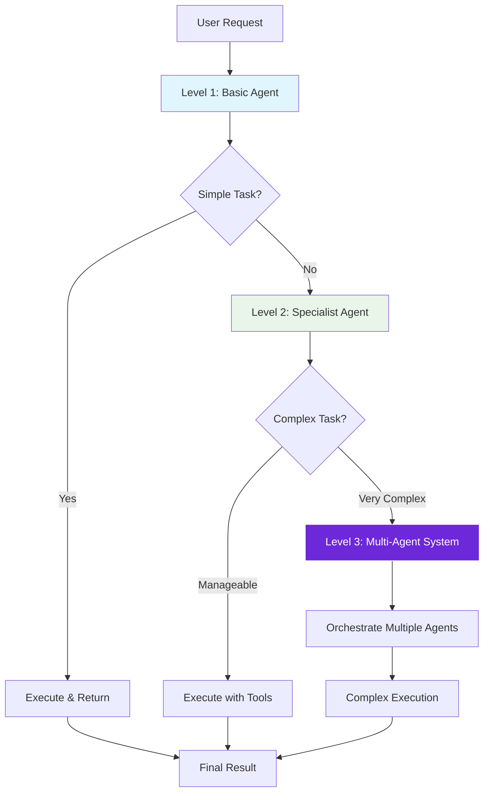
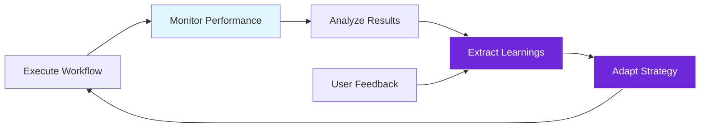
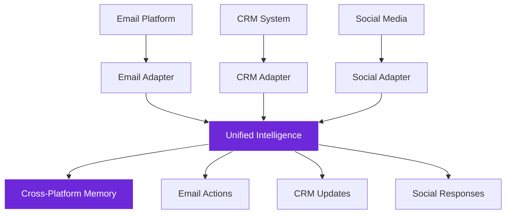

import { Steps, Aside, Tabs, TabItem } from "@astrojs/starlight/components";
import { Image } from "astro:assets";
import Social from "@images/social.webp";

Advanced patterns combine multiple LangChain concepts to create sophisticated AI systems that can handle complex, real-world scenarios. These patterns go beyond simple chains to create truly intelligent automation.

Think of advanced patterns as orchestrating an entire AI team, where different components work together to accomplish complex goals.

<Image src={Social} alt="Complex AI workflow showing multiple agents and components working together" />

## Multi-Agent Orchestration

### Collaborative Agent System
**Purpose:** Multiple AI agents working together on complex tasks



**Agent roles and responsibilities:**

<Tabs>
  <TabItem label="Coordinator Agent">
    **Role:** Task planning and agent management
    
    **Responsibilities:**
    - Break complex tasks into subtasks
    - Assign subtasks to specialist agents
    - Monitor progress and coordinate handoffs
    - Resolve conflicts between agents
    - Ensure overall task completion
    
    **Tools:** Task planning, agent communication, progress tracking
  </TabItem>
  
  <TabItem label="Specialist Agents">
    **Role:** Domain-specific expertise
    
    **Research Agent:**
    - Web search and information gathering
    - Source validation and fact-checking
    - Data collection and organization
    
    **Analysis Agent:**
    - Data analysis and pattern recognition
    - Statistical processing and insights
    - Trend identification and forecasting
    
    **Writing Agent:**
    - Content creation and editing
    - Style and tone adaptation
    - Format optimization for audience
  </TabItem>
  
  <TabItem label="Synthesis Agent">
    **Role:** Integration and quality assurance
    
    **Responsibilities:**
    - Combine outputs from specialist agents
    - Resolve inconsistencies and conflicts
    - Ensure coherent final output
    - Quality control and validation
    - Format final deliverable
    
    **Tools:** Content integration, quality assessment, formatting
  </TabItem>
</Tabs>

**Real-world example: Comprehensive Market Research**

<Steps>

1. **Coordinator** receives request: "Analyze the electric vehicle market"

2. **Task decomposition**:
   - Research Agent: Gather market data, competitor info, industry reports
   - Analysis Agent: Process data, identify trends, calculate market metrics
   - Writing Agent: Create executive summary and recommendations

3. **Parallel execution**: All specialist agents work simultaneously

4. **Synthesis**: Synthesis Agent combines all outputs into comprehensive report

5. **Quality assurance**: Final review and formatting for presentation

</Steps>

### Hierarchical Agent Architecture
**Purpose:** Structured decision-making with escalation paths



**Escalation criteria:**
- **Level 1**: Simple, single-step tasks (basic Q&A, simple analysis)
- **Level 2**: Multi-step tasks requiring tools (research, data processing)
- **Level 3**: Complex tasks requiring coordination (comprehensive analysis, multi-source research)

## Dynamic Adaptation Patterns

### Self-Improving Workflows
**Purpose:** AI workflows that learn and optimize themselves over time

**Components:**
- **Performance Monitoring**: Track success rates and quality metrics
- **Pattern Recognition**: Identify what works and what doesn't
- **Strategy Adaptation**: Modify approaches based on learning
- **Feedback Integration**: Incorporate user feedback into improvements



**Example: Adaptive Content Curation**
1. **Initial Strategy**: Curate content based on keywords and basic rules
2. **Performance Monitoring**: Track user engagement with curated content
3. **Learning**: Identify patterns in high-engagement content
4. **Adaptation**: Adjust curation criteria based on successful patterns
5. **Continuous Improvement**: Ongoing refinement of curation strategy

### Context-Aware Tool Selection
**Purpose:** AI that chooses different tools based on situational context

**Context factors:**
- **Content type**: Text, images, structured data, code
- **Task complexity**: Simple extraction vs. complex analysis
- **Quality requirements**: Speed vs. accuracy trade-offs
- **Resource constraints**: API limits, processing time, cost considerations

**Decision matrix example:**

| Context | Primary Tool | Fallback Tool | Reasoning |
|---------|-------------|---------------|-----------|
| **Simple text analysis** | Basic LLM Chain | Q&A Node | Speed over complexity |
| **Complex research** | Tools Agent | Multi-step Chain | Flexibility needed |
| **High accuracy required** | RAG + Premium Model | Multiple validation steps | Quality critical |
| **Cost-sensitive** | Local Model | Cached results | Budget constraints |

### Adaptive Memory Management
**Purpose:** Memory systems that adjust based on usage patterns and context

<Tabs>
  <TabItem label="Usage-Based Retention">
    **Strategy:** Keep frequently accessed memories longer
    
    **Implementation:**
    - Track memory access frequency
    - Prioritize important conversations
    - Compress less important memories
    - Maintain critical context indefinitely
    
    **Example:**
    ```
    High Priority: Current project discussions
    Medium Priority: Recent general conversations  
    Low Priority: Old casual interactions
    Archive: Completed project memories (compressed)
    ```
  </TabItem>
  
  <TabItem label="Context-Sensitive Storage">
    **Strategy:** Store different types of memories differently
    
    **Implementation:**
    - Factual information: Long-term storage
    - Preferences: Persistent across sessions
    - Temporary context: Session-only storage
    - Sensitive data: Encrypted or local-only
    
    **Example:**
    ```
    Facts: "User works in healthcare industry" (permanent)
    Preferences: "Prefers detailed explanations" (persistent)
    Context: "Currently researching competitors" (session)
    Sensitive: "Mentioned client name" (encrypted/local)
    ```
  </TabItem>
  
  <TabItem label="Intelligent Summarization">
    **Strategy:** Compress old memories while preserving key information
    
    **Implementation:**
    - Identify key themes and decisions
    - Preserve important outcomes and learnings
    - Compress routine interactions
    - Maintain relationship context
    
    **Example:**
    ```
    Original: 50 messages about project planning
    Summary: "User planned Q1 marketing campaign, decided on social media focus, budget approved at $50K, launch date set for March 1st"
    ```
  </TabItem>
</Tabs>

## Sophisticated Integration Patterns

### Cross-Platform Intelligence
**Purpose:** AI that works seamlessly across different platforms and data sources

**Architecture components:**
- **Universal Data Adapters**: Normalize data from different sources
- **Cross-Platform Memory**: Maintain context across platforms
- **Unified Intelligence**: Apply consistent AI reasoning everywhere
- **Platform-Specific Actions**: Adapt outputs to platform capabilities

**Example: Unified Customer Intelligence**


### Predictive Workflow Optimization
**Purpose:** AI that anticipates needs and pre-optimizes workflows

**Prediction strategies:**
- **Usage Pattern Analysis**: Learn when and how workflows are used
- **Seasonal Adjustments**: Adapt to time-based patterns
- **Proactive Resource Management**: Pre-load frequently needed data
- **Anticipatory Actions**: Prepare likely next steps in advance

**Example: Predictive Content Pipeline**
1. **Pattern Recognition**: AI notices user typically analyzes competitor content on Mondays
2. **Proactive Preparation**: AI pre-gathers competitor data over the weekend
3. **Optimized Delivery**: Content analysis is ready when user starts work Monday
4. **Continuous Learning**: AI refines predictions based on actual usage

### Fault-Tolerant AI Systems
**Purpose:** AI workflows that gracefully handle failures and adapt to problems

**Resilience strategies:**

<Steps>

1. **Redundant Pathways**: Multiple ways to accomplish the same goal

2. **Graceful Degradation**: Reduce functionality rather than complete failure

3. **Automatic Recovery**: Self-healing mechanisms for common problems

4. **Fallback Strategies**: Alternative approaches when primary methods fail

5. **Error Learning**: Improve future performance based on past failures

</Steps>

**Implementation example:**
```
Primary: Use premium AI model for analysis
Fallback 1: Use local model if API fails
Fallback 2: Use rule-based analysis if AI unavailable
Fallback 3: Return raw data with error notification
Learning: Track failure patterns and improve reliability
```

<Aside type="caution" title="Complexity management">
  Advanced patterns can become difficult to debug and maintain. Start with simpler versions and gradually add sophistication. Always maintain clear documentation of how complex systems work.
</Aside>

## Performance and Scalability Patterns

### Intelligent Caching and Memoization
**Purpose:** Optimize performance through smart result reuse

**Caching strategies:**
- **Semantic Caching**: Cache based on meaning, not exact matches
- **Hierarchical Caching**: Different cache levels for different types of results
- **Predictive Caching**: Pre-compute likely needed results
- **Collaborative Caching**: Share cache benefits across similar workflows

### Distributed Processing Patterns
**Purpose:** Scale AI workflows across multiple resources

**Distribution strategies:**
- **Task Parallelization**: Split work across multiple AI instances
- **Specialized Processing**: Route tasks to optimized AI models
- **Load Balancing**: Distribute work based on current capacity
- **Result Aggregation**: Combine outputs from distributed processing

### Resource-Aware Optimization
**Purpose:** Adapt AI behavior based on available resources

**Optimization factors:**
- **API Rate Limits**: Adjust request frequency and batching
- **Processing Power**: Choose model complexity based on available compute
- **Memory Constraints**: Optimize memory usage and cleanup
- **Cost Budgets**: Balance quality with cost considerations

These advanced patterns enable the creation of sophisticated AI systems that can handle complex, real-world scenarios with intelligence, adaptability, and resilience.