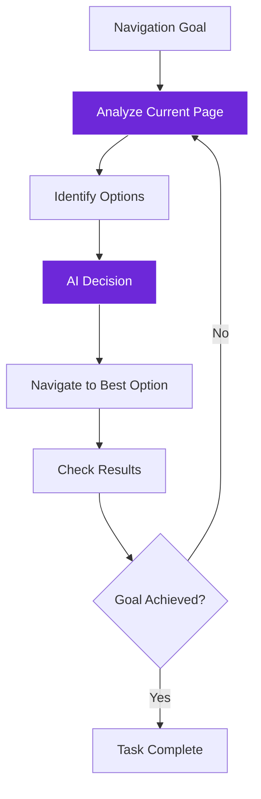

import { Steps, Aside, Tabs, TabItem } from "@astrojs/starlight/components";
import { Image } from "astro:assets";
import Social from "@images/social.webp";

Browser integration is where LangChain AI meets web automation. Instead of just following fixed scripts, you can create intelligent workflows that understand web content, adapt to different sites, and make smart decisions about how to interact with pages.

Think of it as giving your web automation a brain that can see, understand, and reason about what it encounters.

<Image src={Social} alt="AI-powered browser automation adapting to different websites intelligently" />

## Why combine AI with browser automation?

Traditional browser automation breaks when websites change. AI-powered automation adapts and keeps working:

<Tabs>
  <TabItem label="Traditional Automation">
    **Fixed approach:**
    ```
    1. Click button with ID "submit-btn"
    2. Extract text from class "price"
    3. If price > $100, do X, else do Y
    ```
    
    **Problems:**
    - Breaks when site layout changes
    - Can't handle variations in content
    - Requires manual updates for each site
    - No understanding of context or meaning
  </TabItem>
  
  <TabItem label="AI-Powered Automation">
    **Intelligent approach:**
    ```
    1. Understand page content and purpose
    2. Find pricing information (regardless of format)
    3. Analyze if price represents good value
    4. Adapt actions based on context
    ```
    
    **Benefits:**
    - Works across different website layouts
    - Understands content meaning, not just structure
    - Adapts to new situations automatically
    - Makes intelligent decisions based on context
  </TabItem>
</Tabs>

## Core integration patterns

### Intelligent Content Extraction
AI that understands what information is valuable:


**Components used:**
- GetAllTextFromLink (content extraction)
- Basic LLM Chain (content understanding)
- Tools Agent (intelligent decision making)

**Example: Smart Product Research**
1. **Extract**: Get all text from product pages
2. **Analyze**: AI identifies key product information (price, features, reviews)
3. **Understand**: AI determines if this is a good match for user criteria
4. **Action**: AI decides whether to save info, visit related pages, or move on

### Context-Aware Navigation
AI that can navigate websites intelligently:



**Real-world example: Intelligent Job Search**
- **Goal**: Find relevant job postings
- **AI Analysis**: Understands job descriptions and requirements
- **Smart Navigation**: Follows links to most relevant positions
- **Adaptive Filtering**: Learns what types of jobs match user preferences

## Practical integration workflows

### Smart Form Filling
AI that understands forms and fills them appropriately:

<Steps>

1. **Analyze Form**: AI examines form fields and their purposes

2. **Understand Context**: AI determines what information is being requested

3. **Map Data**: AI matches available data to appropriate form fields

4. **Intelligent Filling**: AI fills forms with contextually appropriate information

5. **Validation**: AI checks if the filled form makes sense

</Steps>

**Components used:**
- GetHTMLFromLink (form structure analysis)
- Basic LLM Chain (field understanding)
- FormFiller (intelligent form completion)
- EditFields (data formatting)

**Example workflow:**
```
Form Field: "Company Size"
Options: "1-10", "11-50", "51-200", "200+"
AI Analysis: User data shows "25 employees"
AI Decision: Select "11-50" option
```

### Adaptive Content Monitoring
AI that watches websites and understands what changes matter:

<Tabs>
  <TabItem label="Price Monitoring">
    **Traditional**: Check if price number changed
    **AI-Powered**: Understand pricing context, sales, discounts
    
    **AI advantages:**
    - Recognizes sale prices vs. regular prices
    - Understands "limited time" vs. permanent changes
    - Identifies bundle deals and special offers
    - Adapts to different price display formats
  </TabItem>
  
  <TabItem label="Content Updates">
    **Traditional**: Check if page HTML changed
    **AI-Powered**: Understand what content changes are significant
    
    **AI advantages:**
    - Ignores minor formatting changes
    - Identifies important content updates
    - Understands context of changes
    - Summarizes what actually changed
  </TabItem>
  
  <TabItem label="Availability Tracking">
    **Traditional**: Look for specific "in stock" text
    **AI-Powered**: Understand availability in any format
    
    **AI advantages:**
    - Recognizes various availability indicators
    - Understands partial availability (sizes, colors)
    - Identifies pre-order vs. in-stock status
    - Adapts to different site vocabularies
  </TabItem>
</Tabs>

### Intelligent Data Collection
AI that knows what data is worth collecting:

**Pattern structure:**
1. **Site Analysis**: AI understands the type of website and its structure
2. **Content Evaluation**: AI determines what information is valuable
3. **Smart Extraction**: AI extracts relevant data in appropriate formats
4. **Quality Assessment**: AI validates and cleans collected data
5. **Structured Storage**: AI organizes data for easy use

**Example: Competitive Intelligence**
- **Input**: List of competitor websites
- **AI Process**: 
  - Identifies key pages (pricing, features, about)
  - Extracts relevant business information
  - Understands competitive positioning
  - Formats data for comparison analysis
- **Output**: Structured competitive analysis report

## Advanced integration techniques

### Memory-Enhanced Browsing
AI that remembers what it has learned from previous visits:


**Components used:**
- Conversation Memory (session context)
- Vector Memory (long-term learning)
- Basic LLM Chain (context application)

**Benefits:**
- Learns website patterns and structures
- Remembers user preferences and goals
- Builds knowledge about content quality and relevance
- Improves performance over time

### Multi-Site Intelligence
AI that can work across different websites with the same goal:

**Example: Multi-Platform Job Search**
1. **Goal Understanding**: AI understands job search criteria
2. **Site Adaptation**: AI adapts approach for each job site (LinkedIn, Indeed, company sites)
3. **Content Normalization**: AI standardizes job information across different formats
4. **Intelligent Filtering**: AI applies consistent criteria across all sources
5. **Unified Results**: AI combines and ranks results from all sources

### Context-Aware Decision Making
AI that makes different decisions based on website context:

**Decision factors AI considers:**
- **Site type**: E-commerce, news, social media, corporate
- **Content quality**: Professional, user-generated, authoritative
- **User context**: Research phase, comparison shopping, urgent need
- **Time sensitivity**: Real-time data, historical information, trending content

<Aside type="tip" title="Start with simple integrations">
  Begin by adding AI analysis to existing browser automation. Gradually introduce more intelligence like adaptive navigation and context-aware decisions as you become comfortable with the patterns.
</Aside>

## Browser security considerations

### Working within browser constraints
AI-powered browser automation must respect security limitations:

**Content Security Policy (CSP):**
- Some sites block external AI API calls
- Use background scripts for AI processing when needed
- Implement fallback strategies for restricted environments

**Privacy protection:**
- Process sensitive data locally when possible
- Use local AI models for privacy-critical workflows
- Implement data sanitization for external AI calls

**Performance optimization:**
- Cache AI responses for repeated operations
- Use streaming for better user experience
- Implement intelligent batching for efficiency

## Real-world integration examples

### Smart E-commerce Assistant
**Goal**: Help users find and compare products across multiple sites

**Workflow:**
1. **Product Search**: AI understands product requirements
2. **Site Navigation**: AI finds relevant products on different e-commerce sites
3. **Information Extraction**: AI extracts product details, prices, reviews
4. **Intelligent Comparison**: AI compares products based on user criteria
5. **Recommendation**: AI suggests best options with reasoning

### Automated Research Assistant
**Goal**: Gather comprehensive information on any topic

**Workflow:**
1. **Research Planning**: AI creates research strategy
2. **Source Discovery**: AI finds authoritative sources
3. **Content Analysis**: AI evaluates source quality and relevance
4. **Information Synthesis**: AI combines information from multiple sources
5. **Report Generation**: AI creates comprehensive research report

### Intelligent Content Curator
**Goal**: Monitor multiple sources and curate relevant content

**Workflow:**
1. **Source Monitoring**: AI regularly checks content sources
2. **Relevance Assessment**: AI evaluates content against user interests
3. **Quality Filtering**: AI filters out low-quality or duplicate content
4. **Content Summarization**: AI creates summaries of important content
5. **Personalized Delivery**: AI presents content in user-preferred format

Browser integration transforms static automation into intelligent, adaptive systems that can handle the complexity and variability of the modern web.