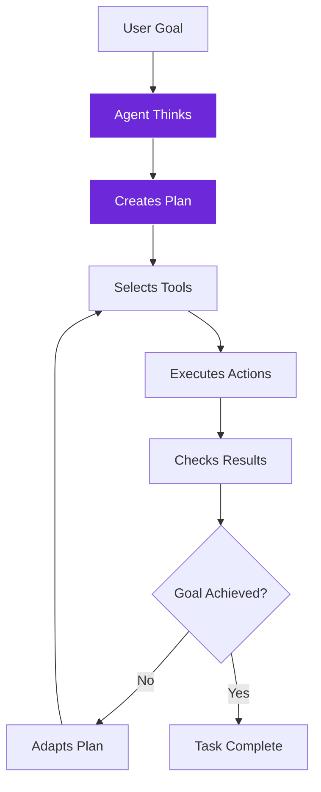
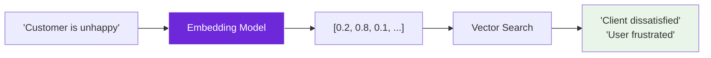

import { Steps, Aside, Tabs, TabItem } from "@astrojs/starlight/components";
import { Image } from "astro:assets";
import Social from "@images/social.webp";

LangChain components are the building blocks of intelligent workflows. Each component has a specific purpose, and you combine them to create sophisticated AI applications without writing any code.

Think of components like specialized tools in a workshop - each one does something specific really well, and you choose the right combination for your project.

<Image src={Social} alt="Overview of different LangChain components and their purposes" />

## Core AI Components

### Language Models (LLMs)
The "brain" that powers your AI workflows:

<Tabs>
  <TabItem label="OpenAI Models">
    **Best for:** General intelligence, creative tasks, conversation
    
    **Available models:**
    - **GPT-4**: Most capable, best reasoning
    - **GPT-3.5 Turbo**: Fast, cost-effective
    - **GPT-4 Turbo**: Balance of capability and speed
    
    **Perfect for:**
    - Content creation and editing
    - Complex analysis and reasoning
    - Conversational interfaces
    - Creative writing tasks
  </TabItem>
  
  <TabItem label="Anthropic Claude">
    **Best for:** Careful reasoning, safety-focused tasks
    
    **Available models:**
    - **Claude 3 Opus**: Most capable reasoning
    - **Claude 3 Sonnet**: Balanced performance
    - **Claude 3 Haiku**: Fast, efficient
    
    **Perfect for:**
    - Research and fact-checking
    - Sensitive content analysis
    - Detailed explanations
    - Safety-critical applications
  </TabItem>
  
  <TabItem label="Local Models (Ollama)">
    **Best for:** Privacy, offline use, cost control
    
    **Popular models:**
    - **Llama 2**: General purpose, good performance
    - **Mistral**: Efficient, multilingual
    - **Code Llama**: Programming tasks
    
    **Perfect for:**
    - Personal data processing
    - Offline workflows
    - Cost-sensitive applications
    - Privacy-required scenarios
  </TabItem>
</Tabs>

### Chains
Pre-built sequences for common AI tasks:

| Chain Type | Purpose | When to Use |
|------------|---------|-------------|
| **Basic LLM Chain** | Simple AI text processing | Content analysis, summarization, generation |
| **Q&A Chain** | Answer questions about content | Document analysis, customer support |
| **Summarization Chain** | Create summaries of long content | Report generation, content curation |
| **Sentiment Analysis** | Determine emotional tone | Social media monitoring, feedback analysis |

### Agents
AI that can think, plan, and use tools:



**Agent capabilities:**
- **Tool Selection**: Automatically chooses the right tools for each task
- **Planning**: Breaks complex goals into manageable steps
- **Adaptation**: Adjusts approach when things don't go as expected
- **Reasoning**: Explains its decisions and thought process

## Memory Systems

Give your AI the ability to remember and learn:

<Tabs>
  <TabItem label="Conversation Memory">
    **Purpose:** Remember chat history and context
    
    **How it works:**
    - Stores recent messages in conversation
    - Provides context to AI for relevant responses
    - Maintains conversation flow naturally
    
    **Best for:**
    - Chatbots and virtual assistants
    - Customer support systems
    - Interactive workflows
    
    **Example:**
    ```
    User: "What's the weather like?"
    AI: "It's sunny and 75°F today."
    User: "What about tomorrow?"
    AI: "Tomorrow will be cloudy with a high of 68°F." (remembers location context)
    ```
  </TabItem>
  
  <TabItem label="Summary Memory">
    **Purpose:** Compress long conversations into key points
    
    **How it works:**
    - Summarizes older parts of conversation
    - Keeps recent messages in full detail
    - Balances context with memory efficiency
    
    **Best for:**
    - Long conversations
    - Memory-constrained environments
    - Cost optimization
    
    **Example:**
    ```
    Summary: "User is researching competitors in the SaaS space, particularly interested in pricing models."
    Recent: Last 5 messages in full detail
    ```
  </TabItem>
  
  <TabItem label="Vector Memory">
    **Purpose:** Store and retrieve relevant memories by meaning
    
    **How it works:**
    - Converts memories into searchable vectors
    - Finds relevant past interactions
    - Provides context based on similarity
    
    **Best for:**
    - Knowledge building over time
    - Complex, topic-based conversations
    - Learning from past interactions
    
    **Example:**
    ```
    Current: "How do I handle customer refunds?"
    Relevant memory: Previous discussion about refund policies from 2 weeks ago
    ```
  </TabItem>
</Tabs>

## Vector Stores & Embeddings

Smart document storage that understands meaning:

### Vector Stores
| Store Type | Best For | Key Features |
|------------|----------|--------------|
| **Local Knowledge** | Browser-based, private | Offline, no external dependencies |
| **Pinecone** | Production, scalable | Cloud-hosted, high performance |
| **Supabase** | Full-stack apps | Database + vector search |
| **Qdrant** | Browser-managed, flexible | Open source, customizable |

### Embeddings Models
Convert text into searchable vectors:

| Model | Best For | Strengths |
|-------|----------|-----------|
| **OpenAI Embeddings** | General purpose | High quality, widely compatible |
| **Ollama Embeddings** | Local, private | Offline, no API costs |
| **Cohere Embeddings** | Multilingual | Strong non-English support |



## Tools & Utilities

Extend what your AI can do:

### Web & Search Tools
- **Wikipedia**: Look up factual information
- **SerpAPI**: Perform web searches
- **Calculator**: Handle mathematical calculations
- **Wolfram Alpha**: Complex computations and data

### Browser Integration Tools
- **Get All Text from Link**: Extract text content from web pages
- **Get HTML from Link**: Get structured HTML data
- **GetImagesFromLink**: Collect images from pages
- **FormFiller**: Automatically fill web forms

### Data Processing Tools
- **Edit Fields**: Transform and format data
- **Code Tool**: Execute custom logic
- **Filter**: Remove unwanted data
- **Merge**: Combine multiple data sources

## Document Processing

Handle different types of content:

### Document Loaders
| Loader Type | Handles | Use Cases |
|-------------|---------|-----------|
| **Default Document Loader** | Plain text, web content | General content processing |
| **GitHub Document Loader** | Code repositories | Documentation analysis, code review |
| **PDF Loader** | PDF documents | Report analysis, research papers |

### Text Splitters
Break large documents into manageable chunks:

| Splitter Type | How It Works | Best For |
|---------------|--------------|----------|
| **Character Text Splitter** | Splits by character count | Simple, predictable chunks |
| **Recursive Character Splitter** | Respects structure (paragraphs, sentences) | Most content types |
| **Token Splitter** | Splits by AI token limits | Optimizing AI processing costs |

<Aside type="tip" title="Choosing the right components">
  Start with basic components (LLM + simple memory) and gradually add complexity. Each component adds capability but also complexity - only add what you need.
</Aside>

## Component Combinations

### Smart Content Analyzer
**Components:** Get All Text from Link + Basic LLM Chain + Edit Fields
**Purpose:** Extract and analyze web content automatically

### Intelligent Q&A System  
**Components:** Document Loader + Embeddings + Vector Store + RAG Node
**Purpose:** Answer questions about your documents accurately

### Adaptive Research Agent
**Components:** Tools Agent + Web Search + Content Extraction + Memory
**Purpose:** Conduct research that adapts to what it discovers

### Conversational Assistant
**Components:** Chat Model + Conversation Memory + Multiple Tools
**Purpose:** Helpful assistant that remembers context and can take actions

## Performance Considerations

### Model Selection
- **Speed vs Quality**: GPT-3.5 Turbo for speed, GPT-4 for quality
- **Cost vs Capability**: Local models for cost control, cloud models for capability
- **Privacy vs Convenience**: Local processing for privacy, cloud for convenience

### Memory Management
- **Short conversations**: Simple conversation memory
- **Long conversations**: Summary memory to manage costs
- **Knowledge building**: Vector memory for learning over time

### Vector Store Sizing
- **Small datasets** (< 1000 docs): Local Knowledge
- **Medium datasets** (1000-100k docs): Pinecone or Supabase
- **Large datasets** (100k+ docs): Specialized vector databases

Each component serves a specific purpose in building intelligent workflows. Understanding their strengths helps you choose the right combination for your specific needs.