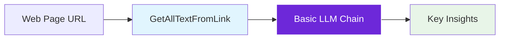
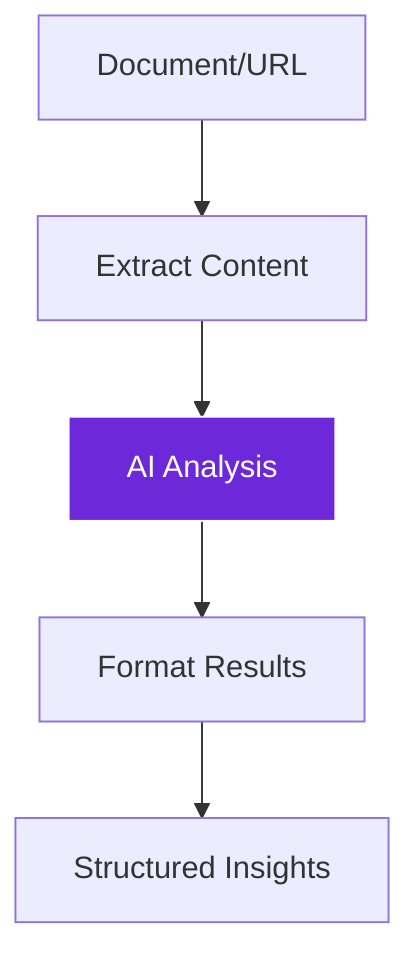
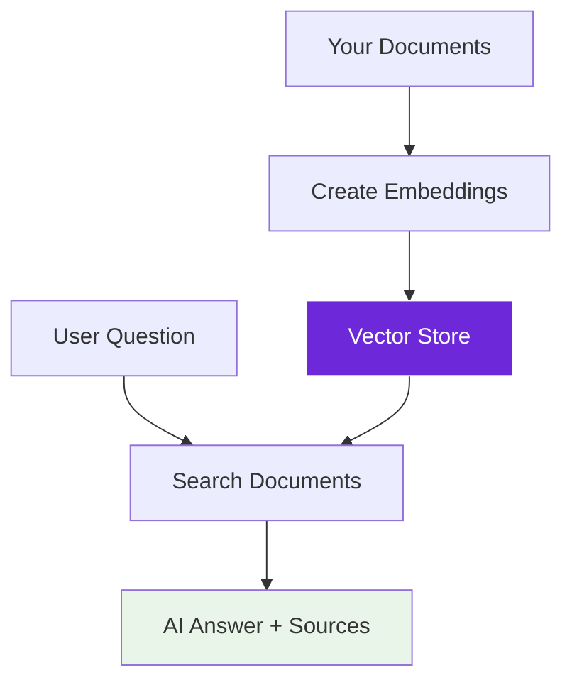
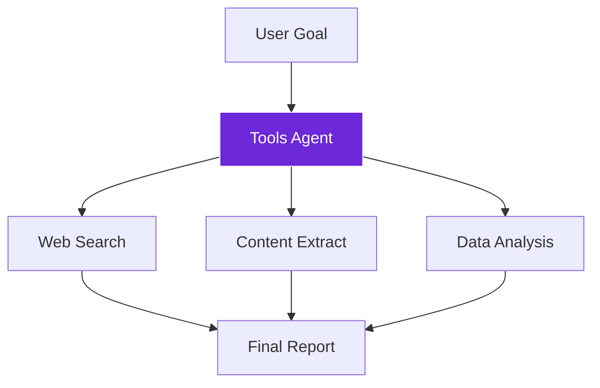

import { Steps, Aside, Tabs, TabItem } from "@astrojs/starlight/components";
import { Image } from "astro:assets";
import Social from "@images/social.webp";

LangChain in Agentic WorkFlow makes building AI applications as simple as connecting visual nodes. Instead of writing complex code, you drag and drop components to create sophisticated AI workflows that can think, reason, and act.

Think of it like building with smart LEGO blocks - each piece has a specific AI capability, and you connect them to create powerful automation.

<Image src={Social} alt="Visual workflow builder showing LangChain components connected together" />

## Your first LangChain workflow

Let's build a simple content analyzer that reads web pages and extracts key insights:

<Steps>

1. **Add content source**: Drag a "GetAllTextFromLink" node to extract text from any webpage

2. **Add AI analysis**: Connect a "Basic LLM Chain" node to analyze the content

3. **Configure the prompt**: Tell the AI what kind of analysis you want

4. **Run and see results**: Execute the workflow and get intelligent insights

</Steps>

## Core LangChain concepts

<Tabs>
  <TabItem label="Chains">
    **What they are:** Sequences of AI operations that process information step by step
    
    **Think of it like:** An assembly line where each station adds something to the product
    
    **Example:** 
    1. Extract text from webpage
    2. Summarize the content  
    3. Extract key topics
    4. Generate action items
    
    **Best for:** Predictable, multi-step AI processing tasks
  </TabItem>
  
  <TabItem label="Agents">
    **What they are:** AI that can think, plan, and choose which tools to use
    
    **Think of it like:** A smart assistant who figures out the best way to help you
    
    **Example:**
    - Goal: "Research competitor pricing"
    - Agent decides: Visit websites → Extract prices → Compare data → Generate report
    
    **Best for:** Complex tasks where the exact steps aren't known in advance
  </TabItem>
  
  <TabItem label="Memory">
    **What it is:** Gives AI the ability to remember previous conversations and context
    
    **Think of it like:** A notebook that AI uses to keep track of what happened before
    
    **Example:**
    - User: "Analyze this product page"
    - AI: "I see it's a smartphone with these features..."
    - User: "How does it compare to the iPhone?"
    - AI: "Compared to the smartphone we just analyzed..." (remembers context)
    
    **Best for:** Conversational AI and workflows that build on previous interactions
  </TabItem>
</Tabs>

## Building blocks you'll use

### Language Models (LLMs)
The "brain" of your AI workflows:

| Model Type | Best For | Example Use |
|------------|----------|-------------|
| **OpenAI GPT** | General intelligence, creative tasks | Content writing, analysis, conversation |
| **Anthropic Claude** | Careful reasoning, safety-focused | Research, fact-checking, sensitive content |
| **Local Models (Ollama)** | Privacy, offline use | Personal data processing, no internet required |

### Tools and Utilities
Extend what your AI can do:

| Tool Category | Purpose | Examples |
|---------------|---------|----------|
| **Web Tools** | Internet access and search | Wikipedia lookup, web search, API calls |
| **Data Tools** | Process and transform information | Calculate numbers, format data, parse files |
| **Browser Tools** | Interact with web pages | Extract content, fill forms, navigate sites |

### Vector Stores
Smart document storage that understands meaning:

**Traditional search:** Finds exact word matches
**Vector search:** Understands what you mean, even with different words

**Example:**
- Search: "customer complaints"
- Finds: "user feedback", "service issues", "client concerns"

## Common workflow patterns

### Content Analysis Pipeline
Perfect for analyzing articles, reviews, or documents:

**Components used:**
- GetAllTextFromLink (content extraction)
- Basic LLM Chain (analysis)
- EditFields (formatting)

### Smart Q&A System
Build AI that answers questions about your documents:

**Components used:**
- Document loaders (prepare content)
- Embeddings (understand meaning)
- Vector stores (smart storage)
- RAG Node (question answering)

### Intelligent Agent Workflow
AI that can use multiple tools to accomplish goals:

**Components used:**
- Tools Agent (intelligent coordinator)
- Multiple tools (web search, extraction, analysis)
- Memory (maintain context)

<Aside type="tip" title="Start simple, then expand">
  Begin with a basic chain (like content analysis), then gradually add memory, tools, and agent capabilities as you become more comfortable with the concepts.
</Aside>

## Practical examples

### Blog Post Analyzer
**Goal:** Automatically analyze blog posts for key insights

**Workflow:**
1. **Input:** Blog post URL
2. **Extract:** GetAllTextFromLink node
3. **Analyze:** Basic LLM Chain with prompt: "Extract the main topic, key points, and target audience"
4. **Output:** Structured analysis

### Customer Support Assistant
**Goal:** Answer customer questions using company documentation

**Workflow:**
1. **Prepare:** Load company docs into vector store
2. **Question:** Customer asks about policies
3. **Search:** RAG Node finds relevant documentation
4. **Answer:** AI provides accurate response with sources

### Research Automation
**Goal:** Gather competitive intelligence automatically

**Workflow:**
1. **Plan:** Tools Agent receives research goal
2. **Execute:** Agent chooses tools (web search, content extraction, analysis)
3. **Adapt:** Agent adjusts approach based on what it finds
4. **Report:** Comprehensive research summary

## Next steps

**Learn the components:** Explore the [Components Guide](./components) to understand all available LangChain nodes

**Try workflow patterns:** Check out [Workflow Patterns](./patterns) for proven approaches to common tasks

**Browser integration:** Learn how to combine AI with web automation in [Browser Integration](./browser-integration)

**Advanced techniques:** Master complex workflows with [Advanced Patterns](./advanced-patterns)

LangChain in Agentic WorkFlow makes sophisticated AI accessible to everyone - no coding required, just smart workflow design.