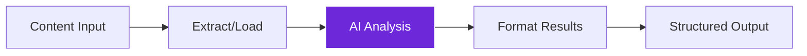
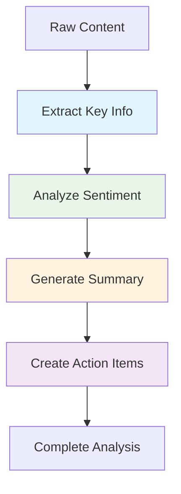
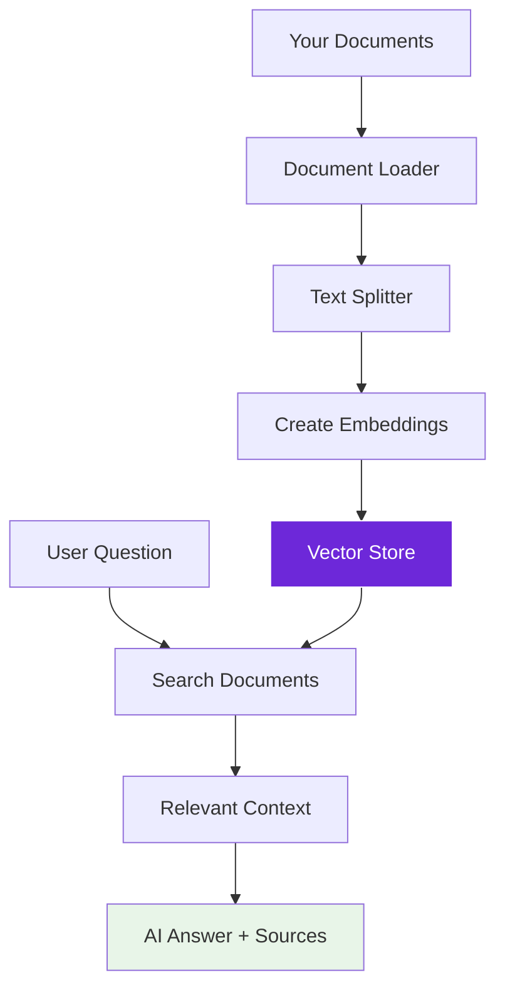
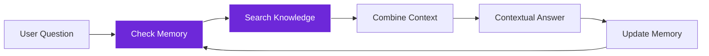
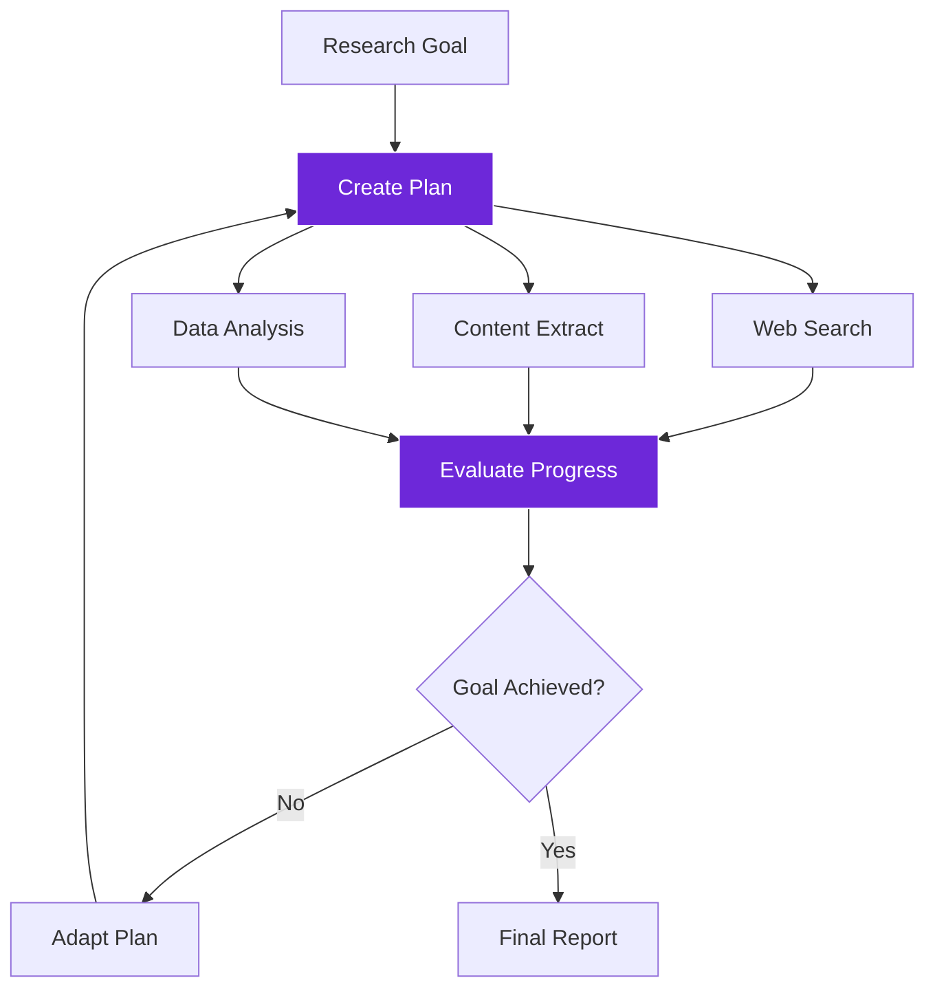
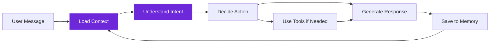

import { Steps, Aside, Tabs, TabItem } from "@astrojs/starlight/components";
import { Image } from "astro:assets";
import Social from "@images/social.webp";

Workflow patterns are proven approaches to common AI tasks. Instead of starting from scratch, you can use these battle-tested patterns as templates and adapt them to your specific needs.

Think of patterns like recipes - they give you the basic structure and ingredients, but you can adjust them to taste.

<Image src={Social} alt="Different workflow patterns showing various combinations of LangChain components" />

## Content Processing Patterns

### Simple Analysis Chain
**Purpose:** Analyze any content with AI and get structured results



**Components used:**
- Content source (Get All Text from Link, Document Loader)
- Basic LLM Chain (analysis)
- Edit Fields (formatting)

**Perfect for:**
- Blog post analysis
- Product review summarization
- Document classification
- Content quality assessment

<Tabs>
  <TabItem label="Blog Analysis">
    **Goal:** Extract key insights from blog posts
    
    **Workflow:**
    1. Get All Text from Link → extract blog content
    2. Basic LLM Chain → analyze with prompt: "Extract main topic, key points, target audience, and writing style"
    3. Edit Fields → structure results into categories
    
    **Output:** Structured analysis with topic, insights, and recommendations
  </TabItem>
  
  <TabItem label="Review Summarization">
    **Goal:** Summarize product reviews into actionable insights
    
    **Workflow:**
    1. Multiple Get All Text from Link → collect reviews from different sources
    2. Merge → combine all review content
    3. Basic LLM Chain → summarize with prompt: "Identify common themes, pros/cons, and overall sentiment"
    4. Edit Fields → format into pros, cons, and recommendation score
    
    **Output:** Comprehensive review summary with ratings
  </TabItem>
</Tabs>

### Multi-Step Processing Pipeline
**Purpose:** Complex content processing that requires multiple AI operations



**Real-world example: Customer Feedback Processor**
1. **Extract**: Get All Text from Link → collect feedback from multiple sources
2. **Categorize**: Basic LLM Chain → classify feedback types (bug, feature request, complaint)
3. **Analyze**: Sentiment Analysis Chain → determine emotional tone
4. **Prioritize**: Basic LLM Chain → assign urgency scores
5. **Summarize**: Basic LLM Chain → create executive summary
6. **Format**: Edit Fields → structure for reporting

## Knowledge-Based Patterns

### Smart Q&A System
**Purpose:** Answer questions accurately using your documents



**Components used:**
- Document Loader (prepare content)
- Text Splitter (chunk documents)
- Embeddings (create searchable vectors)
- Vector Store (smart storage)
- RAG Node (question answering)

**Setup process:**

<Steps>

1. **Prepare documents**: Load your knowledge base using Document Loader

2. **Chunk content**: Use Recursive Character Text Splitter to break into searchable pieces

3. **Create embeddings**: Convert chunks to vectors using OpenAI or Ollama Embeddings

4. **Store vectors**: Save in Local Knowledge or cloud vector store

5. **Set up Q&A**: Connect RAG Node to search and answer questions

</Steps>

**Perfect for:**
- Company knowledge bases
- Technical documentation search
- Customer support automation
- Research assistance

### Contextual Knowledge Assistant
**Purpose:** AI that builds knowledge over time and provides increasingly relevant answers



**Components used:**
- Vector Store (knowledge base)
- Conversation Memory (context tracking)
- RAG Node (intelligent search)
- Basic LLM Chain (response generation)

**Example: Personal Research Assistant**
- Remembers what topics you're interested in
- Builds knowledge about your research areas over time
- Provides increasingly relevant and personalized responses
- Connects new information to previous conversations

## Agent-Based Patterns

### Goal-Oriented Research Agent
**Purpose:** AI that can plan and execute complex research tasks



**Components used:**
- Tools Agent (intelligent coordinator)
- Web search tools (information gathering)
- Content extraction tools (data collection)
- Analysis tools (insight generation)
- Memory (maintain context)

**Example workflow:**
1. **Goal**: "Research competitor pricing for SaaS products"
2. **Planning**: Agent decides to search for competitors, visit their sites, extract pricing
3. **Execution**: Uses web search → content extraction → data analysis
4. **Adaptation**: If pricing not found on main pages, tries pricing pages or contact forms
5. **Reporting**: Compiles comprehensive competitive analysis

### Multi-Tool Coordination Agent
**Purpose:** AI that can use multiple tools intelligently to accomplish complex tasks

**Available tool categories:**
- **Information gathering**: Web search, content extraction, API calls
- **Data processing**: Analysis, formatting, calculations
- **Content creation**: Writing, summarization, report generation
- **Browser automation**: Form filling, navigation, interaction

**Pattern structure:**
1. **Goal definition**: Clear objective for the agent
2. **Tool selection**: Choose relevant tools for the domain
3. **Execution limits**: Set maximum steps to prevent infinite loops
4. **Progress monitoring**: Track agent decisions and results
5. **Result compilation**: Format final output appropriately

## Conversational Patterns

### Context-Aware Chatbot
**Purpose:** Conversational AI that maintains context and can take actions



**Components used:**
- Chat Model (conversation)
- Conversation Memory (context)
- Tools (actions)
- Basic LLM Chain (response generation)

**Conversation flow example:**
```
User: "Find information about our refund policy"
Bot: "I'll search our knowledge base for refund information..."
     [Uses RAG tool to search company docs]
     "According to our policy document, customers can request refunds within 30 days..."

User: "What if it's been 35 days?"
Bot: "Based on our previous discussion about the 30-day policy, requests after 30 days require manager approval..."
```

### Specialized Domain Assistant
**Purpose:** Expert AI for specific domains (legal, medical, technical, etc.)

**Pattern components:**
- **Domain knowledge**: Specialized vector store with expert content
- **Domain tools**: Specific tools for the field (calculators, databases, APIs)
- **Safety checks**: Validation and disclaimer systems
- **Expert prompting**: Specialized prompts for domain expertise

## Performance Optimization Patterns

### Efficient Processing Pipeline
**Purpose:** Handle large volumes of content efficiently

**Optimization strategies:**
- **Batch processing**: Process multiple items together
- **Caching**: Store frequently used results
- **Streaming**: Process content as it arrives
- **Parallel processing**: Use multiple chains simultaneously

### Cost-Optimized Workflows
**Purpose:** Minimize AI API costs while maintaining quality

**Cost reduction techniques:**
- **Model selection**: Use appropriate model for each task (GPT-3.5 for simple, GPT-4 for complex)
- **Prompt optimization**: Shorter, more focused prompts
- **Result caching**: Avoid re-processing identical content
- **Local models**: Use Ollama for privacy and cost control

<Aside type="tip" title="Start with simple patterns">
  Begin with basic patterns like Simple Analysis Chain, then gradually add complexity. Each pattern can be customized and combined with others to create sophisticated workflows.
</Aside>

## Pattern Selection Guide

### Choose based on your goal:

**Content Analysis** → Simple Analysis Chain or Multi-Step Pipeline
**Question Answering** → Smart Q&A System or Contextual Knowledge Assistant  
**Research Tasks** → Goal-Oriented Research Agent or Multi-Tool Coordination
**Conversations** → Context-Aware Chatbot or Specialized Domain Assistant
**High Volume** → Efficient Processing Pipeline with optimization patterns

### Consider your constraints:

**Budget-conscious** → Use local models and cost-optimized patterns
**Privacy-focused** → Local Knowledge + Ollama models
**Speed-critical** → Simpler patterns with faster models
**Quality-critical** → More sophisticated patterns with premium models

These patterns provide proven starting points for building intelligent workflows. Mix, match, and modify them to create solutions perfectly suited to your specific needs.