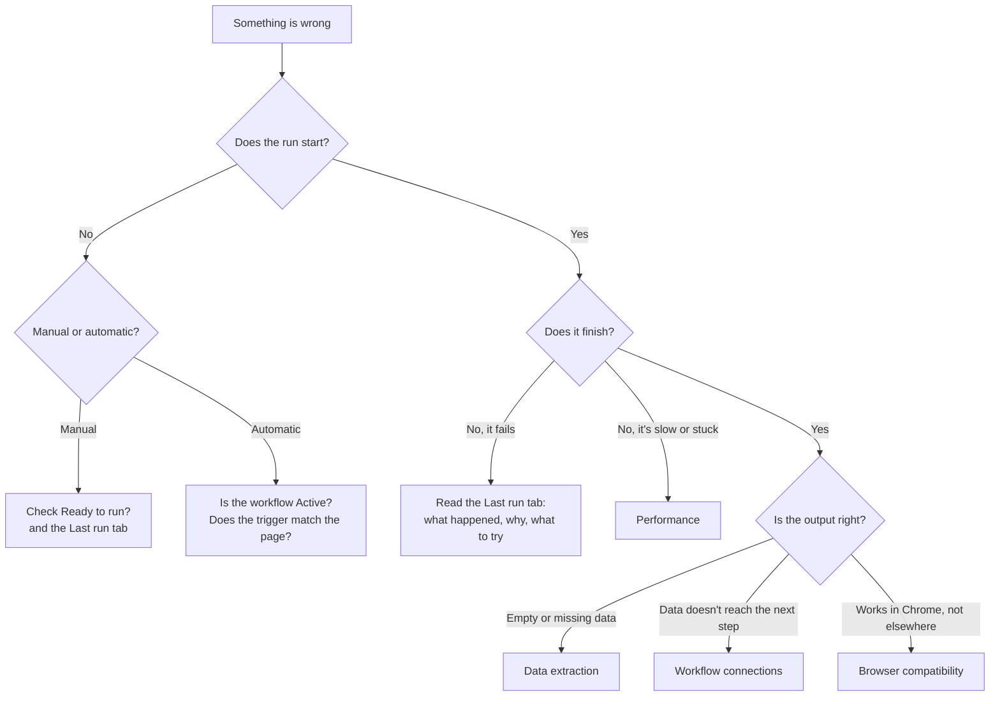

When a workflow doesn't behave as expected, start with the quick checks, then follow the path for what you see. Each path ends with a link to a page that goes deeper.

## Quick checks

These fix most problems:

- The **browser extension is installed and enabled**, and you are signed in to the same workspace.
- The **page has finished loading** before the workflow runs.
- AWFlow is **allowed on this site** (see [Permissions & security](/app/troubleshooting/permissions-security/)).
- **Ready to run?** in the canvas toolbar shows nothing left to fix: no missing connection or required field.
- You **reloaded the page** after installing or updating the extension.

## What do you see?

| Symptom | Likely cause | Where to look |
| --- | --- | --- |
| Clicking run does nothing, or the button is disabled | Another run is in progress, or something still needs setup | Hover the button for the reason; open **Ready to run?** |
| An automatic workflow never runs | The workflow isn't **Active**, or the trigger's settings don't match | [Automatic runs with triggers](/app/workflows/create/#automatic-runs-with-triggers) |
| A step fails | Missing connection, refused API key, rate limit, network problem | The **Last run** tab, then [Error handling](/concepts/flow/error-handling/) |
| A click or fill step does nothing | The element isn't there yet, or the site blocks the extension | [Permissions & security](/app/troubleshooting/permissions-security/), [Wait For Element](/nodes/extension/ui/wait-for-element/) |
| Extraction returns empty or partial data | The page wasn't loaded, the content is in a frame, or the selector is wrong | [Data extraction](/app/troubleshooting/data-extraction/) |
| Data doesn't reach the next step | A missing connection or a wrong field name in a mapping | [Workflow connections](/app/troubleshooting/workflow-connections/) |
| The workflow is slow or times out | Too much data, or a slow page | [Performance](/app/troubleshooting/performance-optimization/) |
| A node only works in the extension | It needs the extension to make its requests | [Extension-only integrations in the web app](/app/troubleshooting/extension-only-integrations-in-the-web-app/) |
| It works in Chrome but not in Firefox | Browser differences | [Browser compatibility](/app/troubleshooting/browser-compatibility/) |

## Read the Last run tab first

When a run fails, the **Last run** tab of the panel on the right explains it in plain words:

- **What happened**: which step failed.
- **Why it probably happened**: for example a network problem, a refused key, or a rate limit.
- **Try this**: what to do next, with a button to open the step's settings, reconnect it, or run again.
- **Show technical details**: the error the step reported, with **Copy details** for a bug report.

Then click any node on the canvas to see what it received and what it returned. The first node whose output looks wrong is where the problem starts.

## Narrow it down

1. **Test one step at a time.** Click a node and choose **Test step**. AWFlow runs only what that step needs. See [Run from the canvas](/app/workflows/executions/run-from-the-canvas/).
2. **Check each step's output.** Follow the data from the first step to the one that fails.
3. **Reduce the data.** Add a [Limit](/nodes/builtin/datatransformation/limit/) node to test with a few items, then remove it.
4. **Simplify.** Disable the steps you don't need while testing.
5. **Change one thing at a time**, and test again after each change.

## Common error messages

| Message | What it means | What to do |
| --- | --- | --- |
| *Extension context invalidated* | The extension was updated or reloaded while the page was open. | Reload the page and run again. |
| *Cannot access contents of the page* | The page is a browser page (such as `chrome://`), the extension gallery, or a site where AWFlow isn't allowed. | Use a regular website, and allow AWFlow on it. See [Special pages that do not work](/app/troubleshooting/permissions-security/#special-pages-that-do-not-work). |
| *Selection not found* | The workflow expects selected text, but nothing is selected. | Select text on the page before you run it. |
| A timeout | A step waited too long for the page or a service. | Make sure the page has loaded, then see [Performance](/app/troubleshooting/performance-optimization/). |
| A refused key (401 or 403) | The service refused your credential. | Reconnect or update the credential. See [Editing credentials](/app/connections/edit/). |
| Too many requests (429) | You sent too many requests to a service. | Wait and try again, or slow the workflow down with [Split in Batches](/nodes/builtin/flow/splitinbatches/) and a [Wait](/nodes/builtin/flow/wait/) node. |

## Prevent problems

- Wait for the page or element before acting on it.
- Extract only the part of the page you need.
- Turn on **Retry** for steps that call online services, and **Continue On Fail** for steps that may fail without harm. See [Error handling](/concepts/flow/error-handling/).
- Test with a few different pages and inputs before you activate a workflow.

## Still stuck?

Ask on the <a href="https://community.awflow.io" target="_blank" rel="noopener noreferrer">community forum</a>. Describe what you expected and what happened, and include the steps you took, a screenshot, the **Copy details** text from the Last run tab, and, if you can, an export of the workflow with personal data removed.

See [Help & community](/app/help/help/) for other ways to get help, including bug reports.
