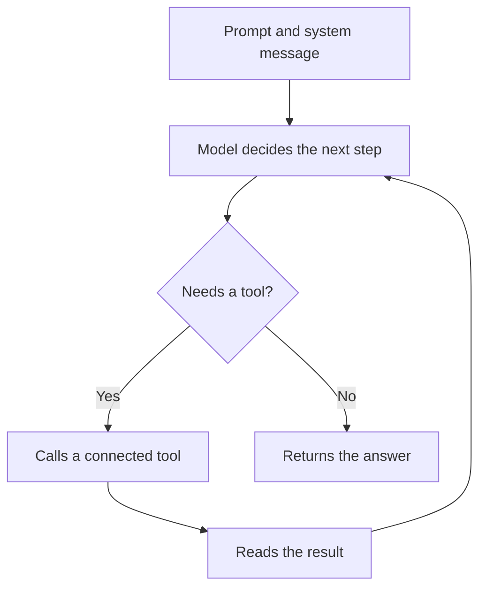

import { Aside, CardGrid, LinkCard } from "@astrojs/starlight/components";
import { CompareCards, ItemsPlayground } from "@components/awflow";

:::note[In 20 seconds]
A **chain** sends your input to the model once and returns the answer. An **agent** can decide what to do next: call a tool, read the result, and try again until it has an answer. Use an agent only when the step needs decisions, give it two or three tools, and say in the prompt when the job is done.
:::

<Aside type="note" title="Agents in workflows and agents in the chat">
This page is about agent **nodes** in workflows. To chat with Aria or with agents you create yourself, see [Agents](/app/chat-and-agents/agents/). To hand a task from a workflow to one of those agents, use the **Run agent** node.
</Aside>

## See it happen

A Tools Agent with Wikipedia and Web Search is asked for three facts about a company. Its output lists the tool calls it made in `steps`, in order, next to the final `response`.

<ItemsPlayground
  client:visible
  view="json"
  steps={[
    { name: "Get All Text", kind: "data", items: { text: "Analytical Engines Ltd. Founded 1843…" } },
    {
      name: "Tools Agent",
      kind: "ai",
      note: "Wikipedia + Web Search",
      items: {
        response: "1. Founded in 1843 (page). 2. Based in London (Wikipedia). 3. …",
        steps: [
          { name: "wikipedia-api", args: { query: "Analytical Engines Ltd" }, status: "ok", durationMs: 812 },
          { name: "web_search", args: { query: "Analytical Engines Ltd headquarters" }, status: "ok", durationMs: 1430 },
        ],
      },
    },
    { name: "Display Markdown", kind: "io", note: "Content: {{ $input.response }}", count: "shows the answer" },
  ]}
  selected={1}
  caption="Illustration of a run. Each entry in steps also has result and truncated; tool names depend on the tools you connect."
/>

## Which AI node to use

<CompareCards
  label="AI nodes compared"
  cards={[
    {
      title: "Basic LLM Chain",
      icon: "chain",
      href: "/nodes/builtin/ai/aiagents/basicllmchainnode/",
      when: "One call to the model: rewrite, draft, translate, answer from text you pass in.",
      example: "Turn page text into a short reply.",
      meta: "no tools, no search",
    },
    {
      title: "Q&A Agent",
      icon: "book",
      href: "/nodes/builtin/ai/aiagents/qanode/",
      when: "Answer a question from a connected knowledge base.",
      example: "What does our refund policy say about gifts?",
      meta: "4 passages by default",
    },
    {
      title: "RAG Agent",
      icon: "book",
      href: "/nodes/builtin/ai/aiagents/ragnode/",
      when: "Answer from your documents, with memory and an output parser if you need them.",
      example: "A help-desk answer that cites its sources.",
      meta: "response · sources",
    },
    {
      title: "Tools Agent",
      icon: "agent",
      href: "/nodes/builtin/ai/aiagents/toolsagentnode/",
      when: "The model must choose between actions, several times if needed.",
      example: "Research a company with Wikipedia and Web Search.",
      meta: "Max iterations 10 by default",
    },
  ]}
/>

For common one-call tasks there are ready-made chains: [Summarization](/nodes/builtin/ai/aiagents/summarizationchainnode/), [Text Classifier](/nodes/builtin/ai/aiagents/textclassifiernode/), [Sentiment Analysis](/nodes/builtin/ai/aiagents/sentimentanalysisnode/) and [Information Extractor](/nodes/builtin/ai/aiagents/informationextractornode/).

## How an agent works

The agent can only use what you connect to it. **Max iterations** (10 by default on the Tools Agent) limits how many tool calls it may make before it must answer. The Tools Agent needs a chat model that supports tool calling.

## What you can connect

| Slot | Basic LLM Chain | Q&A Agent | RAG Agent | Tools Agent |
| --- | --- | --- | --- | --- |
| Model (required) | Yes | Yes | Yes | Yes, with tool calling |
| Knowledge | — | Yes | Yes | Yes |
| Memory | — | — | Yes | Yes |
| Tools | — | — | — | Yes |
| Output parser | Yes | Yes | Yes | Yes |

Check each node's page for the exact options.

## When to use an agent

Use an agent when you can't know in advance which tool the step needs, or when each action depends on the last result. Use a chain or regular nodes when the task is the same every time, or when a wrong action would be costly. If you still need an agent there, rely on [action approval](/concepts/ai/action-approval/).

## Write a prompt that can finish

"Research this company" is too vague. A stronger prompt:

> Find three facts about this company and give the source of each. Use the page text first. Search Wikipedia only if the page doesn't say enough. Return a short list with links.

It gives the agent a goal, an order for its tools, a point to stop, and the shape of the answer.

## You'll notice this when…

The agent never calls a tool

The model doesn't support tool calling, the tools aren't connected to the **Tools** slot, or the prompt doesn't say when to use them. Name the tools in the prompt and say when each one helps.

The agent stops with a partial answer

It reached **Max iterations**. Tighten the prompt so it knows when it's done, or remove tools it doesn't need. Raise the limit only after that.

The agent picks the wrong tool

Too many tools, or tools with overlapping jobs. Keep two or three, with clear names and descriptions. See [Tool selection](/concepts/ai/tool-selection/).

The agent asks for approval before acting

That's on purpose: actions on a page or a service ask you first. See [Action approval](/concepts/ai/action-approval/).

## Next

<CardGrid>
  <LinkCard title="Next concept: Tool selection" description="Which tools to give an agent, and how it picks them." href="/concepts/ai/tool-selection/" />
  <LinkCard title="Practise it" description="Recipes with a Tools Agent." href="/recipes/" />
</CardGrid>
