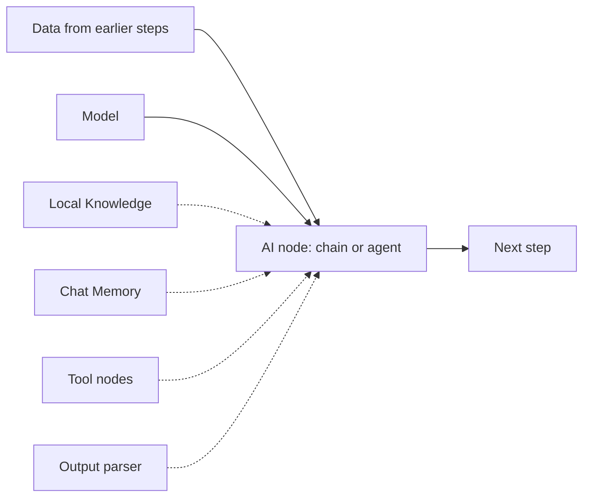
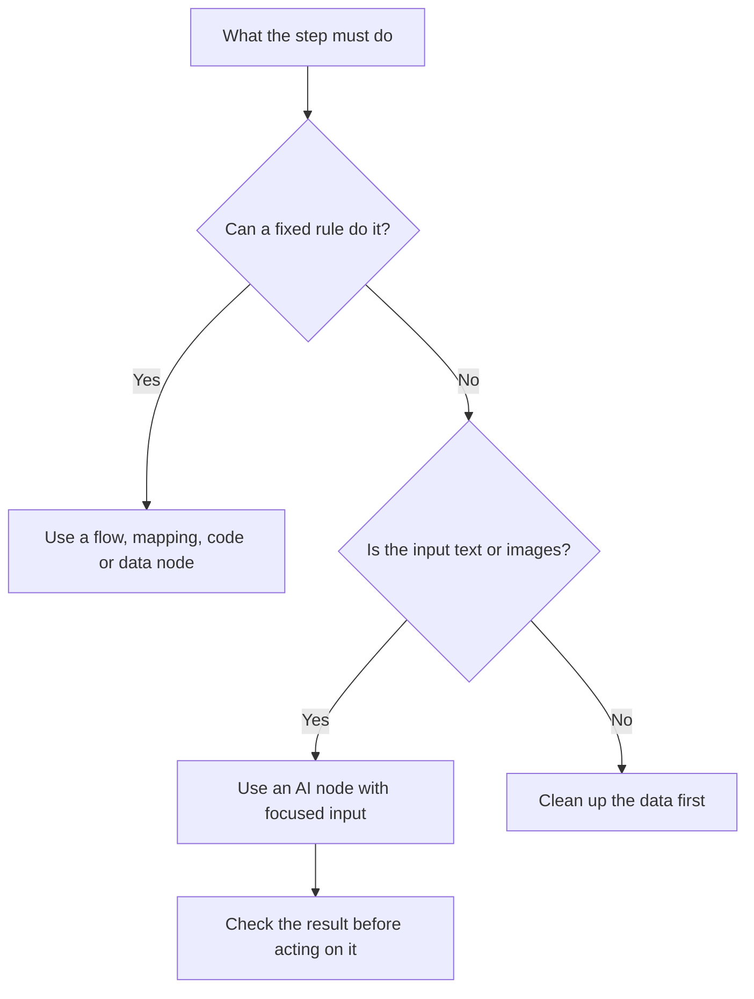

import { CardGrid, LinkCard } from '@astrojs/starlight/components';
import { CompareCards } from '@components/awflow';

An AI step is an **AI node** that does the task, plus the nodes you plug into it: a **model** (always), and optionally **knowledge**, **memory**, **tools** and an **output parser**. When an AI step behaves badly, one of these parts is usually the cause.

## Reading order

1. [Models and where they run](/concepts/ai/model-dependencies/): what you plug into an AI node, and cloud vs your computer vs your browser.
2. [Prompting and outputs](/concepts/ai/prompting-and-outputs/): instructions that work, and answers later steps can read.
3. [Agents and tools](/concepts/ai/ai-agents/): when an agent is worth it, and which one to pick.
4. [Tool selection](/concepts/ai/tool-selection/) and [Action approval](/concepts/ai/action-approval/): what an agent may do, and why it asks you first.
5. [Knowledge (RAG)](/concepts/ai/rag/): answers grounded in your documents, then [Embeddings and vectors](/concepts/ai/embeddings-vectors/) for how the search works.
6. [Memory and context](/concepts/ai/memory-context/), [Branching on AI results](/concepts/ai/workflow-intelligence/) and [Testing AI workflows](/concepts/ai/evaluation-testing/) when you go further.

## Three questions to settle first

<CompareCards
  label="The three AI hubs"
  cards={[
    {
      title: "Which model, where?",
      icon: "cloud",
      href: "/concepts/ai/model-dependencies/",
      when: "Pick a cloud model, Ollama on your computer, or a model in your browser.",
      example: "Private data stays on-device with Web LLM or Ollama.",
      meta: "Models and where they run",
    },
    {
      title: "Chain or agent?",
      icon: "agent",
      href: "/concepts/ai/ai-agents/",
      when: "A chain calls the model once. An agent chooses tools until it's done.",
      example: "Summarise a page (chain) vs research a company (agent).",
      meta: "Agents and tools",
    },
    {
      title: "Its own knowledge or yours?",
      icon: "book",
      href: "/concepts/ai/rag/",
      when: "Answers that must come from your documents need a knowledge base.",
      example: "A help-desk reply that cites the policy page.",
      meta: "Knowledge (RAG)",
    },
  ]}
/>

## How the parts fit together

Dotted lines are optional. Each part is a node you connect to one of the AI node's slots on the canvas.

| Part | What it does | Nodes |
| --- | --- | --- |
| AI node | Does the task | [Basic LLM Chain](/nodes/builtin/ai/aiagents/basicllmchainnode/), [Summarization](/nodes/builtin/ai/aiagents/summarizationchainnode/), [Text Classifier](/nodes/builtin/ai/aiagents/textclassifiernode/), [Information Extractor](/nodes/builtin/ai/aiagents/informationextractornode/), [RAG Agent](/nodes/builtin/ai/aiagents/ragnode/), [Tools Agent](/nodes/builtin/ai/aiagents/toolsagentnode/) |
| Model | Reads and writes text | [Chat OpenAI](/nodes/builtin/ai/aidependencies/llm/openai/), [Chat Anthropic](/nodes/builtin/ai/aidependencies/llm/anthropic/), [Ollama](/nodes/builtin/ai/aidependencies/llm/ollama/), [Web LLM](/nodes/builtin/ai/aidependencies/llm/wbellm/) and [others](/nodes/builtin/ai/) |
| Knowledge | Your documents, searched by meaning | [Local Knowledge](/nodes/builtin/ai/aidependencies/vectorstore/localknowledge/), [Indexer](/nodes/builtin/ai/aiagents/indexernode/) |
| Memory | The conversation so far | [Chat Memory](/nodes/builtin/ai/aidependencies/chatmemories/chatmemory/) |
| Tools | Actions an agent can choose | [Web Search](/nodes/builtin/ai/aidependencies/tools/web-search/), [Browser](/nodes/builtin/ai/aidependencies/tools/browser/), [HTTP Request](/nodes/builtin/ai/aidependencies/tools/http-request/), [Workflow Tool](/nodes/builtin/ai/aidependencies/tools/workflow-tool/) |
| Output parser | Turns the answer into data | [Structured Output Parser](/nodes/builtin/ai/aidependencies/outputparser/structuredoutputparser/), [Item List Output Parser](/nodes/builtin/ai/aidependencies/outputparser/itemlistoutputparser/) |

## When AI belongs in a workflow

Use AI when the step needs judgment over language or messy content: summarizing a page, sorting messages into categories, pulling fields out of free text. Don't use AI for work a regular node does more clearly, such as formatting a date, filtering on a known field, or comparing a number with a threshold.

A good AI step usually has:

- one clear task: summarize, classify, extract, answer, or decide;
- clean input from earlier steps (not a whole web page when one section is enough);
- a model that fits the task (see [Models and dependencies](/concepts/ai/model-dependencies/));
- a structured output when later steps use the result (see [Prompting and outputs](/concepts/ai/prompting-and-outputs/));
- a plan for empty input, model errors and unexpected answers.

## Pick a starting node

| You want to… | Start with |
| --- | --- |
| Turn text into other text (rewrite, draft, translate) | [Basic LLM Chain](/nodes/builtin/ai/aiagents/basicllmchainnode/) |
| Shorten a long text | [Summarization](/nodes/builtin/ai/aiagents/summarizationchainnode/) |
| Sort text into your own categories | [Text Classifier](/nodes/builtin/ai/aiagents/textclassifiernode/) |
| Pull named fields out of text | [Information Extractor](/nodes/builtin/ai/aiagents/informationextractornode/) |
| Check text against a policy before continuing | [Guardrails](/nodes/builtin/ai/aiagents/guardrails/) |
| Answer from your own documents | [RAG Agent](/nodes/builtin/ai/aiagents/ragnode/) with a [knowledge base](/app/knowledge-bases/overview/) |
| Let the model choose actions (search, call a service, act on the page) | [Tools Agent](/nodes/builtin/ai/aiagents/toolsagentnode/) |
| Keep everything on your device | [Local AI nodes](/nodes/builtin/ai/localai/) |

## Common starting points

| Goal | Start with | Add next |
| --- | --- | --- |
| Summarize page text | [Get All Text](/nodes/extension/getalltext/) → [Summarization](/nodes/builtin/ai/aiagents/summarizationchainnode/) | A shorter input, a **Max words** limit |
| Answer questions from your documents | [RAG Agent](/nodes/builtin/ai/aiagents/ragnode/) + [Local Knowledge](/nodes/builtin/ai/aidependencies/vectorstore/localknowledge/) | A "not found" answer, testing |
| Research across websites | [Tools Agent](/nodes/builtin/ai/aiagents/toolsagentnode/) + [Web Search](/nodes/builtin/ai/aidependencies/tools/web-search/) | A small set of tools, a **Max iterations** limit |
| Let an agent act on a page | [Tools Agent](/nodes/builtin/ai/aiagents/toolsagentnode/) + [Browser](/nodes/builtin/ai/aidependencies/tools/browser/) | [Action approval](/concepts/ai/action-approval/) |
| Run a chatbot that remembers | [Chat Trigger](/nodes/builtin/trigger/chat/) + agent + [Chat Memory](/nodes/builtin/ai/aidependencies/chatmemories/chatmemory/) | [Memory and context](/concepts/ai/memory-context/) |
| Produce rows or JSON | [Information Extractor](/nodes/builtin/ai/aiagents/informationextractornode/) + [Structured Output Parser](/nodes/builtin/ai/aidependencies/outputparser/structuredoutputparser/) | [Auto-fixing Output Parser](/nodes/builtin/ai/aidependencies/outputparser/autofixingoutputparser/) |

## Rule of thumb

If the answer must come from your documents, use a knowledge base. If a later step uses the answer, give it a structure. If the model must choose between actions, use an agent. Before you rely on a workflow, try it with realistic inputs.

## Next

<CardGrid>
  <LinkCard title="Start with Models and where they run" description="What you plug into an AI node, and where the model runs." href="/concepts/ai/model-dependencies/" />
  <LinkCard title="Practise it" description="Recipes with AI steps, on-device and in the cloud." href="/recipes/" />
</CardGrid>
