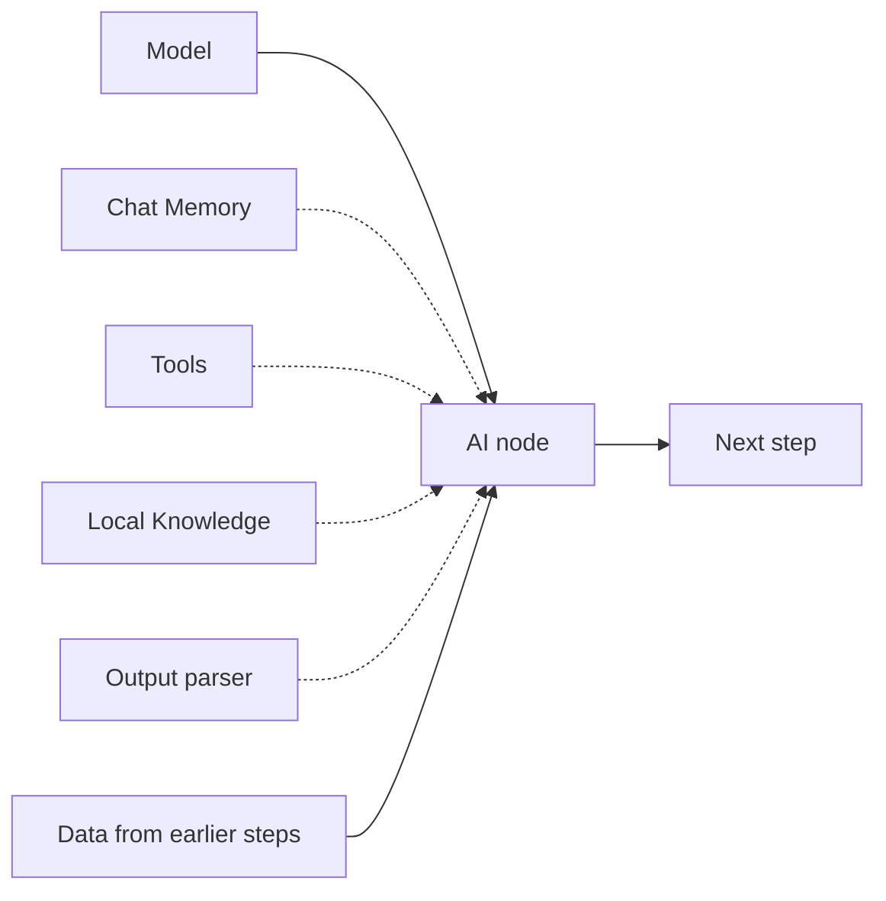

import { CardGrid, LinkCard } from "@astrojs/starlight/components";
import { CompareCards, ItemsPlayground } from "@components/awflow";

:::note[In 20 seconds]
An AI node does the task; the nodes you plug into its slots give it what it needs. Every AI node needs a **model**. Add **memory** to remember a conversation, **tools** to let an agent act, **knowledge** to answer from your documents, and an **output parser** to get fields instead of free text. The model can run in the cloud, on your computer, or in your browser.
:::

## See it happen

The same Basic LLM Chain reads a signature from a page. Without an output parser, `response` is text. With a [Structured Output Parser](/nodes/builtin/ai/aidependencies/outputparser/structuredoutputparser/) plugged in, `response` holds fields the next step can read, such as `{{ $input.response.email }}`.

<ItemsPlayground
  client:visible
  steps={[
    {
      name: "Get Selected Text",
      kind: "data",
      note: "Output field name: selection",
      items: { selection: "Ada Lovelace, Analytical Engines, ada@example.com" },
    },
    {
      name: "Basic LLM Chain",
      kind: "ai",
      note: "no output parser",
      items: { response: "The name is Ada Lovelace, she works at Analytical Engines, and her email is ada@example.com." },
    },
    {
      name: "Basic LLM Chain + parser",
      kind: "ai",
      note: "Structured Output Parser plugged in",
      items: { response: { name: "Ada Lovelace", email: "ada@example.com", company: "Analytical Engines" } },
    },
  ]}
  caption="Illustration of a run. Field names come from the parser's JSON Output Example."
/>

## What plugs into an AI node

Dotted lines are optional. Which slots a node has depends on the node: a chain has no tools slot, for example. See [AI agents](/concepts/ai/ai-agents/#what-you-can-connect).

| Dependency | What it provides | Example nodes |
| --- | --- | --- |
| Chat model | Reads and writes text | Cloud: [Chat OpenAI](/nodes/builtin/ai/aidependencies/llm/openai/), [Chat Anthropic](/nodes/builtin/ai/aidependencies/llm/anthropic/), [Chat Google](/nodes/builtin/ai/aidependencies/llm/google/), [Chat Mistral](/nodes/builtin/ai/aidependencies/llm/mistral/), [Chat Groq](/nodes/builtin/ai/aidependencies/llm/groq/), [Chat DeepSeek](/nodes/builtin/ai/aidependencies/llm/deepseek/), [Chat xAI](/nodes/builtin/ai/aidependencies/llm/xai/), [Chat OpenRouter](/nodes/builtin/ai/aidependencies/llm/openrouter/), [Chat Azure OpenAI](/nodes/builtin/ai/aidependencies/llm/azure-openai/). On your computer: [Ollama](/nodes/builtin/ai/aidependencies/llm/ollama/). In your browser: [Web LLM](/nodes/builtin/ai/aidependencies/llm/wbellm/), [Transformers Chat](/nodes/builtin/ai/aidependencies/llm/transformerschat/), [Chrome AI](/nodes/builtin/ai/aidependencies/llm/chrome-ai/) |
| Knowledge | Searches your documents | [Local Knowledge](/nodes/builtin/ai/aidependencies/vectorstore/localknowledge/) |
| Memory | Keeps the conversation | [Chat Memory](/nodes/builtin/ai/aidependencies/chatmemories/chatmemory/) |
| Output parser | Turns the reply into data | [Structured Output Parser](/nodes/builtin/ai/aidependencies/outputparser/structuredoutputparser/), [Item List Output Parser](/nodes/builtin/ai/aidependencies/outputparser/itemlistoutputparser/), [Auto-fixing Output Parser](/nodes/builtin/ai/aidependencies/outputparser/autofixingoutputparser/) |
| Tool | An action an agent can choose | [Web Search](/nodes/builtin/ai/aidependencies/tools/web-search/), [Wikipedia](/nodes/builtin/ai/aidependencies/tools/wikipedia-query/), [Browser](/nodes/builtin/ai/aidependencies/tools/browser/) and [others](/concepts/ai/tool-selection/#available-tools) |
| Embeddings | Turns text into vectors | [Local Embeddings](/nodes/builtin/ai/aidependencies/embeddings/localembeddings/), [OpenAI Embeddings](/nodes/builtin/ai/aidependencies/embeddings/openai/), [Ollama Embeddings](/nodes/builtin/ai/aidependencies/embeddings/ollamaembeddings/) and [others](/concepts/ai/embeddings-vectors/#embedding-models) |
| Text splitter | Cuts long text into chunks | [Character Text Splitter](/nodes/builtin/ai/aidependencies/textsplitter/charactertextsplitter/), [Recursive Character Text Splitter](/nodes/builtin/ai/aidependencies/textsplitter/recursivecharactertextsplitter/) |

## Where the model runs

<CompareCards
  label="Where a model can run"
  cards={[
    {
      title: "Cloud",
      icon: "cloud",
      href: "/nodes/builtin/ai/aidependencies/llm/openai/",
      when: "You need the strongest reasoning and reliable tool use.",
      example: "Chat OpenAI, Chat Anthropic, Chat Google with your own API key.",
      meta: "key in Settings › Providers",
    },
    {
      title: "Your computer",
      icon: "device",
      href: "/nodes/builtin/ai/aidependencies/llm/ollama/",
      when: "Data must stay on your machine, and you can run a model server.",
      example: "Ollama running on this computer.",
      meta: "private, no per-call cost",
    },
    {
      title: "In your browser",
      icon: "device",
      href: "/app/local-models/",
      when: "Nothing to install, nothing leaves the browser.",
      example: "Web LLM, Transformers Chat, Chrome AI.",
      meta: "free, smaller, slower",
    },
  ]}
/>

Choose by the job, not by raw power. Try the smallest model that gets your real inputs right, and keep one model per AI step unless you're comparing them.

## You'll notice this when…

The AI node fails with "Dependency … is required"

A required slot is empty, usually the model. Connect a model node to the AI node's model slot.

The next step can't read response.email

Without an output parser, `response` is plain text. Plug a [Structured Output Parser](/nodes/builtin/ai/aidependencies/outputparser/structuredoutputparser/) into the AI node and give it a JSON example with the fields you need.

An in-browser model is slow or gives weak answers

In-browser models are small and run on your device. Shorten the input, keep the task narrow, or switch that step to a cloud model. See [Local AI](/app/local-models/).

The Tools Agent doesn't call any tool

The Tools Agent needs a chat model that supports tool calling. Pick a model that does, and check the tools are connected to its tools slot.

## Next

<CardGrid>
  <LinkCard title="Next concept: Prompting and outputs" description="Instructions that work, and outputs later steps can use." href="/concepts/ai/prompting-and-outputs/" />
  <LinkCard title="Practise it" description="Recipes with on-device and cloud AI steps." href="/recipes/" />
</CardGrid>
