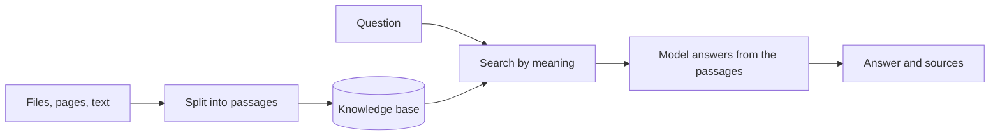

import { CardGrid, LinkCard } from "@astrojs/starlight/components";
import { Callout, CompareCards, ItemsPlayground } from "@components/awflow";

:::note[In 20 seconds]
RAG (retrieval-augmented generation) means the workflow **searches your documents first**, then gives the best passages to the model with the question. The answer comes from your sources instead of the model's memory. In AWFlow, your documents live in a **knowledge base**, and an agent connected to it through a **Local Knowledge** node does the searching.
:::

## See it happen

A RAG Agent answers a question from a help-centre knowledge base. Next to the answer, `sources` lists the passages it used, so you can show or check them.

<ItemsPlayground
  client:visible
  view="json"
  steps={[
    { name: "Chat Trigger", kind: "trigger", items: { chatInput: "Can I return a gift?" } },
    {
      name: "RAG Agent",
      kind: "ai",
      note: "Local Knowledge: Help centre",
      items: {
        response: "Yes. Gifts can be returned within 30 days for store credit [S1].",
        sources: [
          { title: "Returns and refunds", url: "https://help.example/returns", score: 0.82 },
          { title: "Gift cards", url: "https://help.example/gift-cards", score: 0.61 },
        ],
      },
    },
  ]}
  selected={1}
  caption="Illustration of a run. Each source also carries knowledgeId and sourceId."
/>

## The two halves of RAG

**Filling** the knowledge base happens once, then again when the sources change. **Answering** happens on every question.

## Fill the knowledge base

<CompareCards
  label="Ways to fill a knowledge base"
  cards={[
    {
      title: "Add sources in the app",
      icon: "book",
      href: "/app/knowledge-bases/overview/",
      when: "The documents change rarely. No workflow needed.",
      example: "Add sources: files, web pages, open tabs or pasted text.",
      meta: "Knowledge bases page",
    },
    {
      title: "An indexing workflow",
      icon: "loop",
      href: "/nodes/builtin/ai/aiagents/indexernode/",
      when: "The source changes and should stay up to date.",
      example: "A Schedule re-reads a docs page every morning.",
      meta: "Loader → Indexer + Local Knowledge",
    },
  ]}
/>

For an indexing workflow:

1. Load the content with a loader, such as [URL Document Loader](/nodes/builtin/ai/loaders/urldocumentloader/), [File Document Loader](/nodes/builtin/ai/loaders/filedocumentloader/) or [Current Page Document Loader](/nodes/builtin/ai/loaders/currentpagedocumentloader/), or read the page with [Get All Text](/nodes/extension/getalltext/).
2. Send it to the [Indexer](/nodes/builtin/ai/aiagents/indexernode/), with a [text splitter](/nodes/builtin/ai/aidependencies/textsplitter/recursivecharactertextsplitter/) and a [Local Knowledge](/nodes/builtin/ai/aidependencies/vectorstore/localknowledge/) node connected. Set **Source link** so a later run updates the same source instead of adding a copy.
3. Run it on a [Schedule](/nodes/builtin/trigger/schedule/) if the source changes.

The knowledge base embeds the passages with its own model. See [Embeddings and vectors](/concepts/ai/embeddings-vectors/).

## Answer from it

Connect the same Local Knowledge node to a [RAG Agent](/nodes/builtin/ai/aiagents/ragnode/), a [Q&A Agent](/nodes/builtin/ai/aiagents/qanode/) or a [Tools Agent](/nodes/builtin/ai/aiagents/toolsagentnode/). Before you build the answering step, use **Test search** on the knowledge base page to check that a typical question finds the right passages.

<Callout type="tip" title="Design the fallback first">
  Tell the model what to say when the passages don't contain the answer, for example "Say you don't know and link the help centre." A clear fallback is one of the simplest ways to stop made-up answers.
</Callout>

## You'll notice this when…

The answer is generic, as if the documents weren't there

Nothing relevant was found. Run **Test search** with the same question. If the right passage doesn't come up, add the missing source, or reword the question the way your documents phrase it.

The answer mixes up two topics

Loosely related passages reached the model. Raise **Minimum relevance** (for example to `0.5`), use a **Metadata filter** to search only the right sources, or split unrelated documents into separate knowledge bases.

The answer adds details that aren't in your documents

The prompt lets the model fill gaps. Say "answer only from the sources" and give it a fallback for missing answers.

The answer is out of date

The knowledge base still holds the old version. Re-add the source, or set **Source link** in your indexing workflow so each run replaces it.

sources is empty

No passage passed the search, often because **Minimum relevance** is set too high, or the Local Knowledge node isn't connected to the agent's knowledge slot. Lower the setting and check the connection.

## Next

<CardGrid>
  <LinkCard title="Next concept: Embeddings and vectors" description="How a knowledge base finds passages by meaning." href="/concepts/ai/embeddings-vectors/" />
  <LinkCard title="Practise it" description="Recipes that answer from your own documents." href="/recipes/" />
</CardGrid>
