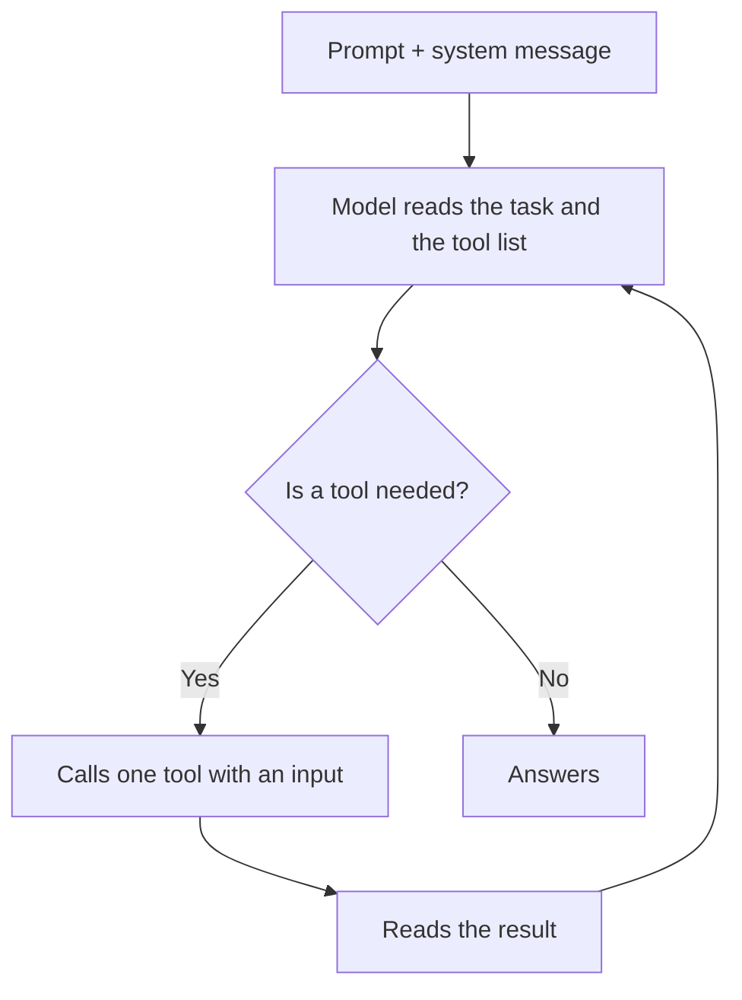
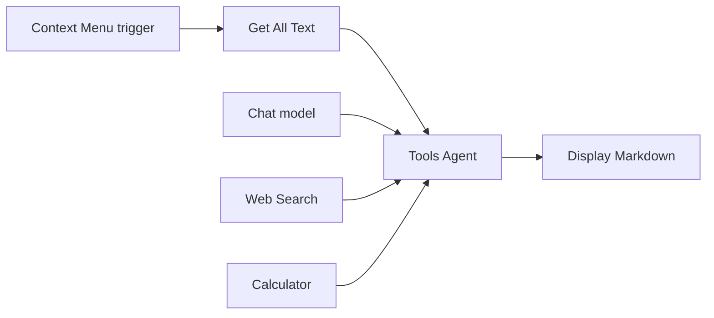

import { Aside } from "@astrojs/starlight/components";

A [Tools Agent](/nodes/builtin/ai/aiagents/toolsagentnode/) can only do what its connected tools allow. You choose the tools; the agent chooses **which one to call, when, and with what input**, based on your prompt and on each tool's name and description.

## How the agent chooses

Each tool call counts toward **Max iterations** (10 by default). When the limit is reached, the agent answers with what it has.

The model must support tool calling. Most cloud chat models do; for on-device use, see [Transformers Chat](/nodes/builtin/ai/aidependencies/llm/transformerschat/).

## Available tools

### Tools that only read or compute

These run without asking you:

| Tool | What the agent can do with it |
| --- | --- |
| [Web Search](/nodes/builtin/ai/aidependencies/tools/web-search/) | Search DuckDuckGo, Bing or Brave and read the first page of results. Needs the browser extension. |
| [Wikipedia](/nodes/builtin/ai/aidependencies/tools/wikipedia-query/) | Look up a topic on Wikipedia. |
| [Calculator](/nodes/builtin/ai/aidependencies/tools/calculator/) | Do exact arithmetic instead of guessing. |
| [Think](/nodes/builtin/ai/aidependencies/tools/think/) | Write down its reasoning before acting. Helps on multi-step tasks. |
| [Workflow Tool](/nodes/builtin/ai/aidependencies/tools/workflow-tool/) | Run one of your workflows and use its output. |

### Tools that take actions

These ask for your approval **every time** the agent calls them:

| Tool | What the agent can do with it |
| --- | --- |
| [Browser](/nodes/builtin/ai/aidependencies/tools/browser/) | Click, fill, type, select, submit or navigate on the active page. |
| [HTTP Request](/nodes/builtin/ai/aidependencies/tools/http-request/) | Send requests to a web service. |
| [MCP Client](/nodes/builtin/ai/aidependencies/tools/mcp-client/) | Call the tools of a remote MCP server. |

You approve or reject each call in the **Executions** panel. This can't be turned off. See [Action approval](/concepts/ai/action-approval/) for why.

A connected [knowledge base](/concepts/ai/rag/) can also work like a tool: set the agent's **Knowledge search** option to **Let the agent search the knowledge base on its own**, and it decides when and what to search.

## Wrap your own steps as a tool

The [Workflow Tool](/nodes/builtin/ai/aidependencies/tools/workflow-tool/) turns any workflow into a tool. Use it when the agent needs a step no built-in tool provides, such as "get the price from our product page" or "add a row to my sheet".

- Give it a clear **Tool Name**, such as `get_product_price`, not `workflow_tool`.
- Write a **Tool Description** that says what it does, what input it expects, and when to use it.
- Keep the workflow small and predictable: the agent decides when to call it, the workflow decides how.

## Make choices reliable

- **Connect only the tools the task needs.** Two or three relevant tools work better than ten.
- **Say in the prompt which tool to prefer.** For example: "Use the page text first. Search the web only if it isn't there."
- **Say when to stop.** "Stop when you have three sources" is clearer than relying on **Max iterations**.
- **Avoid overlapping tools.** Two tools that do almost the same thing make the agent hesitate or call both.
- **Use regular nodes for fixed steps.** If a step always happens, such as reading the page before the agent starts, do it with a regular node before the agent, not as a tool.

## Example: a price check

The page text is read by a regular node, because it's always needed. The agent gets only two tools: **Web Search** to find other prices, **Calculator** to compare them.

<Aside type="tip" title="Read the run log">
After a test run, look at the agent's `steps` output: it lists each tool call in order, with its input and whether it worked. If it picked the wrong tool, improve the tool's description or the prompt before adding more tools.
</Aside>

## Related

- [AI agents](/concepts/ai/ai-agents/)
- [Action approval](/concepts/ai/action-approval/)
- [Testing AI workflows](/concepts/ai/evaluation-testing/)
