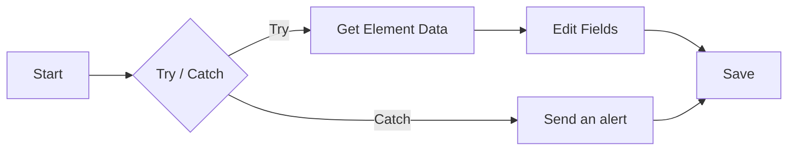

import { CardGrid, LinkCard } from "@astrojs/starlight/components";
import { CompareCards, ItemsPlayground } from "@components/awflow";

:::note[In 20 seconds]
By default, a failing step ends the run. You can change that per step in its **Settings** tab: **Retry** tries again, **Continue On Fail** lets the run carry on with an empty item. For a group of steps, **Try / Catch** sends a failure down a separate branch. An **Error Trigger** starts another workflow when a run fails.
:::

## See it happen

Try / Catch guards a page read. The page has changed and the step fails, so the rest of the guarded steps are skipped and the **Catch** branch receives one item describing the failure.

<ItemsPlayground
  client:visible
  steps={[
    { name: "Try / Catch", kind: "flow", note: "Try branch", items: { url: "https://shop.example/p/1" } },
    { name: "Get Element Data", kind: "data", note: "failed", count: "error" },
    {
      name: "Catch branch",
      kind: "flow",
      items: {
        nodeLabel: "Get Element Data",
        message: "No element matches the selector .price",
        input: { url: "https://shop.example/p/1" },
      },
    },
  ]}
  caption="Illustration of a run. The Catch item names the failed step, its error and the data it was given."
/>

## Pick how to handle a failure

<CompareCards
  label="Ways to handle a failure"
  cards={[
    {
      title: "Retry",
      icon: "retry",
      when: "The failure is often temporary: a timeout, a busy server, a rate limit.",
      example: "Up to 3 tries, 1 second apart, transient errors only.",
      meta: "step Settings tab",
    },
    {
      title: "Continue On Fail",
      icon: "skip",
      when: "The step is optional and the rest of the run should go on.",
      example: "A thumbnail that's nice to have.",
      meta: "step Settings tab",
    },
    {
      title: "Try / Catch",
      icon: "shield",
      href: "/nodes/builtin/flow/try/",
      when: "A group of steps needs a plan B when any of them fails.",
      example: "If the page can't be read, post an alert and stop.",
      meta: "Try · Catch",
    },
    {
      title: "Error Trigger",
      icon: "alert",
      href: "/nodes/builtin/trigger/errortrigger/",
      when: "You want to hear about failed runs, whatever failed.",
      example: "Message yourself when the nightly sync fails.",
      meta: "starts a workflow",
    },
  ]}
/>

## Retry a flaky step

Open the step's settings, go to the **Settings** tab and turn on **Allow Retry**:

- **Max. Tries**: how many attempts, up to 10 (3 by default).
- **Wait Between Tries (ms)**: the pause between attempts (1,000 ms by default).
- **Backoff**: *Fixed* waits the same each time. *Exponential (with jitter)* waits longer after each attempt, which suits rate-limited services.
- **Retry condition**: *Any error* (the default), *Transient errors only* (429, 5xx, network errors and timeouts; fails at once on errors like 401 or 404), or *When message matches* the text or `/regex/` in **Retry if message matches**.

## Carry on after a failure

Two more switches sit in the same **Settings** tab:

- **Continue On Fail**: if the step still fails after any retries, the error is logged and the step outputs one empty item. The steps after it keep running.
- **Always Output Data**: the step outputs one empty item when it would otherwise output nothing, so the run doesn't end at this step.

Retry runs first. When it's used up, Continue On Fail decides whether the run stops or goes on.

## Catch a failure with Try / Catch

Wire the steps you want to protect to the **Try** output of a [Try / Catch](/nodes/builtin/flow/try/) node, and the plan B to **Catch**. Bring both branches back into the same step to mark where the guarded part ends.

If a guarded step fails, the rest of the Try branch is skipped and Catch runs with `nodeLabel`, `message` and `input`. A failure inside the Catch branch isn't caught by the same Try: it goes to an outer Try / Catch, or ends the run.

To stop a run on purpose with a clear message, use [Stop and Error](/nodes/builtin/flow/stopanderror/).

## Hear about failed runs

An [Error Trigger](/nodes/builtin/trigger/errortrigger/) starts a workflow when a watched workflow fails. It receives the failed workflow, the step that failed, the error and its input. It fires for runs that start on their own (a schedule, a page load, a hotkey and so on), not for runs you start yourself from the designer, and not for failures a Try / Catch already handled.

## You'll notice this when…

One failing step ended the whole run

That's the default. Turn on **Retry** or **Continue On Fail** in the step's **Settings** tab, or guard it with [Try / Catch](/nodes/builtin/flow/try/).

A step kept retrying a "401 Unauthorized" error

**Retry condition** is set to *Any error*. Set it to *Transient errors only* so the step fails fast when the problem won't go away, then fix the connection.

The steps after a Continue On Fail step get an empty item

That's how Continue On Fail works: the failed step outputs one empty item. Add a fallback in later expressions, such as `{{ $input.title || "Untitled" }}`, or check for it with an [IF](/nodes/builtin/flow/if/).

The Error Trigger didn't fire

You started the run yourself, a Try / Catch handled the failure, or the alert workflow isn't activated. See the [Error Trigger rules](/nodes/builtin/trigger/errortrigger/).

A page step fails with an element not found

The page changed, or it wasn't ready yet. Add [Wait For Element](/nodes/extension/ui/wait-for-element/) before the step, and check the selector still matches. See [Browser context](/concepts/flow/browser-context/).

## Next

<CardGrid>
  <LinkCard title="Next concept: Lambda workflows" description="Reuse a group of steps in many workflows." href="/concepts/flow/lambdaworkflows/" />
  <LinkCard title="Practise it" description="Recipes that guard page reads and API calls." href="/recipes/" />
</CardGrid>
