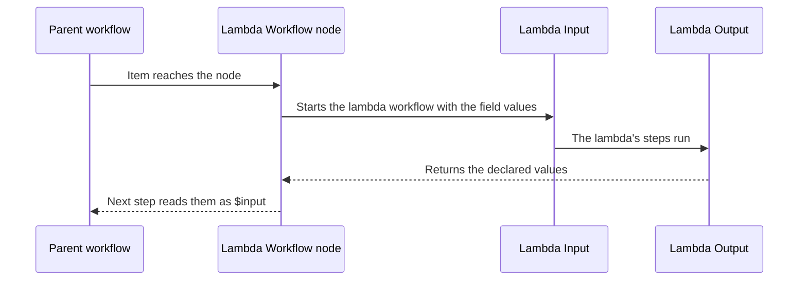

Sometimes you’ll want to reuse the same set of steps in multiple workflows.

Modular (lambda) workflows let one workflow **run another workflow**.

This helps you:

- Keep workflows smaller and easier to understand
- Reuse the same “module” in multiple places
- Update the module once instead of updating many workflows

---

## Why use modular (lambda) workflows

- Reuse logic across different workflows: for example, a “Normalize Data” or “Send Report” module.
- Keep individual workflows smaller, faster, and easier to maintain.
- Update a sub-workflow once and have multiple parent workflows benefit automatically.

---

## How it works

### Step 1: Create the reusable workflow

- Create a new workflow as a **Lambda** workflow.
- Start it with a [Lambda Input](/nodes/builtin/lambda/lambdainput/) node and declare the inputs it expects, with their defaults.
- Build the steps, and end with a [Lambda Output](/nodes/builtin/lambda/lambdaoutput/) node that declares what it returns.

### Step 2: Call it from a parent workflow

- In the parent workflow, open the node list, switch to the **Customs** tab and pick the workflow under **My Lambda Workflows**. It appears as a node named after the workflow.
- Fill its fields (one per declared input) with fixed values or expressions such as `{{ $input.email }}`.
- Read what it returned in the next step, for example `{{ $input.summary }}`.

Node reference: [Lambda Workflow](/nodes/builtin/lambda/lambdaworkflow/).

### How data passes between workflows

Like most nodes, the Lambda Workflow node runs once per item it receives, so each run of the lambda workflow works on a single item. Decide what inputs the lambda expects and what it returns, and keep both small.

---

## Best practices

- Name sub-workflows descriptively (e.g., **Normalize Data**, **Send Monthly Report**).
- Document inputs and outputs: use Sticky Notes (see [Sticky Notes](/app/workflows/components/sticky-notes/)) on your workflows.
- After import or copy of workflows, test parent workflows to confirm integration.
- Avoid circular calls (Workflow A calls B, and B calls A) unless intentionally designed.
- Keep sub-workflows focused on **one task** only: modular and reusable logic is easier to track and maintain.

---

## When not to use modular workflows

- The logic is very simple and used only once—modularizing may add unnecessary overhead.
- Interdependencies between actions are tightly coupled and harder to break out.
- Latency is a concern: if the parent must wait for a sub workflow that takes long, reconsider splitting.
  In such cases, you may prefer simpler patterns like [Splitting workflows](/concepts/flow/splitting/) or [Looping & Iteration](/concepts/flow/looping/).
