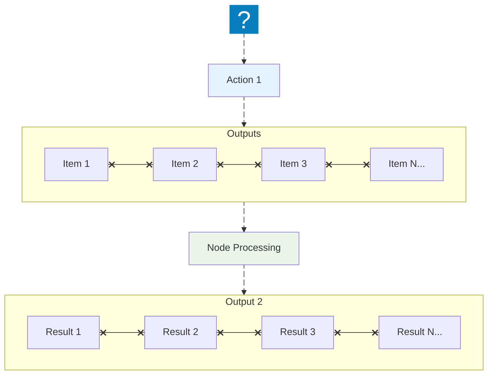
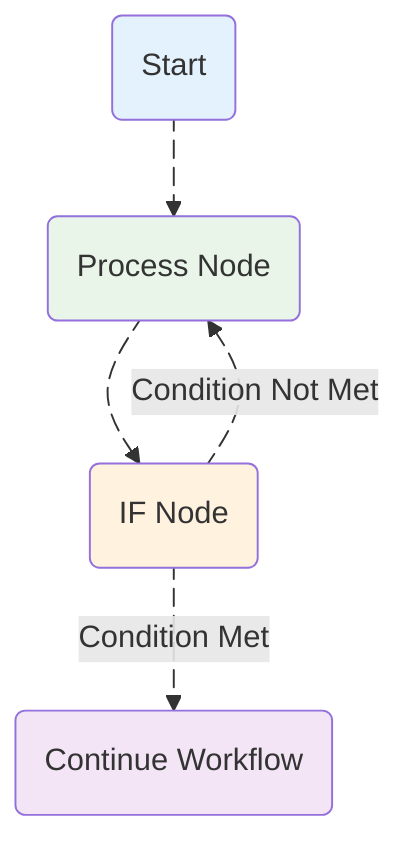

Looping is useful when you want to repeat an action.

Example: send a message to every contact in a list.

In many cases, you don’t need to build a manual loop: if a node receives multiple items, it usually runs once per item automatically.

## Using loops in AWFlow

Nodes can take any number of items as input, process them, and output results.

You can think of each item as one row in the output table.

Nodes usually run once for each item.

### Running a step once for the whole list

Sometimes you want one action for the whole list, not one per item. For example: send **one** summary message instead of one message per row.

Some nodes already work on the whole list at once instead of item by item:

- [Aggregate](/nodes/builtin/datatransformation/aggregate/) combines all items into one item (for example, all titles into one list).
- [Limit](/nodes/builtin/datatransformation/limit/) keeps only the first items.
- [Sort](/nodes/builtin/datatransformation/sort/) and [Remove Duplicates](/nodes/builtin/datatransformation/removeduplicates/) reorder or clean the list as a whole.
- [CSV](/nodes/builtin/datatransformation/csv/) and [Convert to File](/nodes/builtin/datatransformation/converttofile/) turn the whole list into one file.
- [Merge](/nodes/builtin/flow/merge/) waits for its branches and joins them.

To run any other step only once, put **Aggregate** (or **Limit** set to 1) in front of it. The step then receives a single item, so it runs once.

## Creating loops

AWFlow typically handles the iteration for all incoming items. When you need to repeat steps until a condition holds, or work through a long list a few items at a time, build the loop yourself with the [Loop](/nodes/builtin/flow/loop/) or [Split in Batches](/nodes/builtin/flow/splitinbatches/) node.

### Loop until a condition is met

To create a loop in an AWFlow workflow, connect the output of one node back into a previous node. Use an [If](/nodes/builtin/flow/if/) node to decide when to stop.

### Repeat with the Loop node

The [Loop](/nodes/builtin/flow/loop/) node repeats part of your workflow while its **Conditions** are true.

1. Connect the Loop node's **Loop** output to the first step you want to repeat (the loop body).
2. Connect the last step of the body back to the Loop node's **Loop Back** input.
3. Connect the **Done** output to what should happen after the loop.

Each pass, the Loop node checks its conditions. When they are no longer true, or when it reaches **Max Iterations** (100 by default, up to 1,000), it leaves through **Done**. The output includes `currentIndex`, the number of the current pass.

### Loop until all items are processed

Use [Split in Batches](/nodes/builtin/flow/splitinbatches/) to go through a list a few items at a time. It is useful when a service limits how many requests you can send at once, or when each step is slow.

1. In **Items**, map the list to go through, for example `{{ $input.rows }}`.
2. Set **Batch size**: how many items each pass receives (1 by default).
3. Wire it like the Loop node: **Loop** to the body, the end of the body back to **Loop Back**, and **Done** to what comes next.

Each pass hands the body the next `batch` of items. The output also has `batchIndex` (which batch this is) and `isLast` (true on the final batch). When every item has been handled, it leaves through **Done**. An empty list goes straight to **Done**.

:::tip
To pause between batches, add a [Wait](/nodes/builtin/flow/wait/) node at the end of the body.
:::