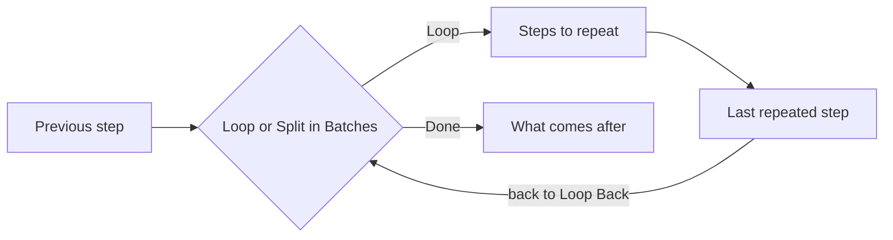

import { CardGrid, LinkCard } from "@astrojs/starlight/components";
import { CompareCards, ItemsPlayground } from "@components/awflow";

:::note[In 20 seconds]
You usually don't need a loop: a step that receives ten items runs ten times. Build a loop when the repeat depends on something else. **Loop** repeats while a condition holds, **Split in Batches** works through a list a few items at a time, and **Poll Until** calls a URL until the answer says it's ready.
:::

## See it happen

Split in Batches receives seven rows with **Batch size** 3. The steps in the loop run three times, with rows 1–3, 4–6 and 7. Each pass hands them one item holding the `batch` list.

<ItemsPlayground
  client:visible
  steps={[
    {
      name: "Read rows",
      kind: "data",
      items: { rows: ["r1", "r2", "r3", "r4", "r5", "r6", "r7"] },
    },
    {
      name: "Split in Batches",
      kind: "flow",
      runs: 4,
      note: "Items: {{ $input.rows }} · Batch size: 3",
      count: "3 passes, then Done",
      items: [
        { done: false, batch: ["r1", "r2", "r3"], batchIndex: 0, isLast: false },
        { done: false, batch: ["r4", "r5", "r6"], batchIndex: 1, isLast: false },
        { done: false, batch: ["r7"], batchIndex: 2, isLast: true },
      ],
    },
    {
      name: "Http Request",
      kind: "io",
      runs: 3,
      note: "body: {{ $input.batch }}",
      count: "one request per batch",
    },
  ]}
  selected={1}
  caption="Illustration of a run. The fourth pass finds no rows left and leaves through Done."
/>

## Steps already repeat once per item

When a step receives a list of items, it runs once for each, so a workflow that collects ten links can fetch ten pages without a loop. To do something **once** for the whole list instead, put [Aggregate](/nodes/builtin/datatransformation/aggregate/) in front of the step. See [Items](/concepts/data/data-structure/).

## Pick the right way to repeat

<CompareCards
  label="Ways to repeat work"
  cards={[
    {
      title: "Loop",
      icon: "loop",
      href: "/nodes/builtin/flow/loop/",
      when: "Repeat steps while a condition holds.",
      example: "Click Next and read the page until there's no Next button.",
      meta: "Loop · Done · up to 1,000 passes",
    },
    {
      title: "Split in Batches",
      icon: "batch",
      href: "/nodes/builtin/flow/splitinbatches/",
      when: "Work through a list a few items at a time.",
      example: "Send 500 rows, 20 per request, to respect a rate limit.",
      meta: "Loop · Done",
    },
    {
      title: "Poll Until",
      icon: "poll",
      href: "/nodes/builtin/flow/polluntil/",
      when: "Call a URL again and again until the response says it's ready.",
      example: "Check an export job every 5 minutes, give up after 1 hour.",
      meta: "Done · Timeout",
    },
  ]}
/>

Loop and Split in Batches are wired the same way:

## Repeat while a condition holds

1. Connect the [Loop](/nodes/builtin/flow/loop/) node's **Loop** output to the first step you want to repeat.
2. Connect the last repeated step back to the Loop node's **Loop Back** input (the bottom one).
3. Connect **Done** to what should happen after the loop.
4. In **Conditions**, describe when to keep going.

Each pass, Loop checks its conditions. When they no longer hold, or when it reaches **Max Iterations** (100 by default, up to 1,000), the data leaves through **Done**. The output includes `currentIndex`, the number of the current pass.

## Work through a list in batches

1. In [Split in Batches](/nodes/builtin/flow/splitinbatches/), set **Items** to the list, for example `{{ $input.rows }}`.
2. Set **Batch size**: how many items each pass gets (1 by default).
3. Wire it like Loop: **Loop** to the repeated steps, the last of them back to **Loop Back**, and **Done** to what comes next.

Each pass sends one item with `batch` (this pass's items), `batchIndex` (counting from 0) and `isLast`. Read the list with `{{ $input.batch }}`, or add [Split Out](/nodes/builtin/datatransformation/splitout/) on `batch` to run the next steps once per item. An empty list goes straight to **Done**.

To pause between batches, add a [Wait](/nodes/builtin/flow/wait/) node at the end of the repeated steps.

## You'll notice this when…

The loop stopped after 100 passes

It reached **Max Iterations**, a safety limit. Raise it (up to 1,000) if you really need more passes, or check that the condition can become false.

The repeated steps ran once, then the run went to Done

The last repeated step isn't connected back to **Loop Back**, or the conditions were false on the first check. Follow the wire from the end of the repeated part back to the bottom input.

A step inside the batch loop ran once per pass, not once per row

Each pass is a single item holding the `batch` list. Add [Split Out](/nodes/builtin/datatransformation/splitout/) on `batch` if each row needs its own run.

An approval or a long wait inside a loop pauses everything

[Wait](/nodes/builtin/flow/wait/) and [Wait For Approval](/nodes/builtin/flow/wait-for-approval/) pause once for everything they receive. To pause per item, place them inside a Loop or after Split in Batches with a batch size of 1.

## Next

<CardGrid>
  <LinkCard title="Next concept: Waiting" description="Pause for a set time or for a person." href="/concepts/flow/waiting/" />
  <LinkCard title="Practise it" description="Recipes that page through results or work in batches." href="/recipes/" />
</CardGrid>
