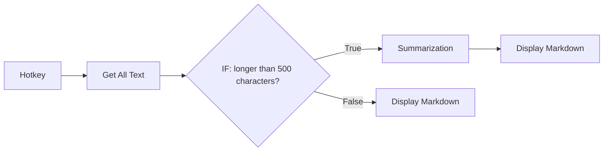

import { CardGrid, LinkCard } from "@astrojs/starlight/components";
import { CompareCards, ItemsPlayground } from "@components/awflow";

:::note[In 20 seconds]
A branching node checks each item and sends it out of one of its ports. **IF** has two ports (True and False), **Switch** has one port per rule plus a fallback, and **Filter** keeps the matching items and drops the rest. Steps on a port that receives no items don't run.
:::

## See it happen

IF checks `{{ $input.length }}` is greater than 500 for three pages. Two long pages leave through **True** and go to the summary step. One short page leaves through **False**.

<ItemsPlayground
  client:visible
  steps={[
    {
      name: "Pages",
      kind: "data",
      items: [
        { title: "Annual report", length: 5400 },
        { title: "Contact", length: 320 },
        { title: "Pricing FAQ", length: 1800 },
      ],
    },
    {
      name: "IF · True",
      kind: "flow",
      note: "length > 500",
      items: [
        { title: "Annual report", length: 5400 },
        { title: "Pricing FAQ", length: 1800 },
      ],
    },
    {
      name: "IF · False",
      kind: "flow",
      items: [{ title: "Contact", length: 320 }],
    },
  ]}
  selected={1}
  caption="Illustration of a run. The items are not changed, only routed."
/>

A branch can look like this on the canvas:

## Pick the branching node

<CompareCards
  label="Branching nodes"
  cards={[
    {
      title: "IF",
      icon: "branch",
      href: "/nodes/builtin/flow/if/",
      when: "Two paths: the conditions hold, or they don't.",
      example: "Save new contacts, update existing ones.",
      meta: "True · False",
    },
    {
      title: "Switch",
      icon: "switch",
      href: "/nodes/builtin/flow/switch/",
      when: "Three or more paths, each with a name, plus a fallback.",
      example: "Route a message to Billing, Bug or Anything else.",
      meta: "one port per rule",
    },
    {
      title: "Filter",
      icon: "filter",
      href: "/nodes/builtin/flow/filter/",
      when: "One path: keep what matches, drop the rest.",
      example: "Keep only products under 50 €.",
      meta: "Kept",
    },
  ]}
/>

## How the conditions work

Each condition compares a value, usually an expression such as `{{ $input.price }}`, with another value. Pick the type first (**String**, **Number**, **Date-Time**, **Boolean**, **Array** or **Object**): it decides which operators you get, such as **Contains**, **Is Equal To** or **Is Not Empty**. Link several conditions with **AND** (all must hold) or **OR** (one is enough).

IF and Switch outputs are **named ports**. Edges attach to a port by its name, so reordering Switch rules keeps every connection in place. See [named outputs on branching nodes](/app/workflows/components/connections/#named-outputs-on-branching-nodes).

## After the branch

- **Leave a port unconnected** to stop those items there. It's the simplest way to say "do nothing otherwise".
- **Join branches again** with [Merge](/nodes/builtin/flow/merge/) when you need data from both, or with [Funnel](/nodes/builtin/flow/funnel/) when either branch is enough to continue. See [Merging](/concepts/flow/merging/).
- **Branch on an AI result** with [Text Classifier](/nodes/builtin/ai/aiagents/textclassifiernode/) or Switch on its label. See [Branching on AI results](/concepts/ai/workflow-intelligence/).

## You'll notice this when…

Nothing ran after the IF

Every item went out of the other port. Open the IF node's output to see which port the items took, then check the condition's **type**: comparing `"10"` as a String with `9` gives a different answer than comparing numbers.

An item went to Switch's fallback branch

No rule matched it. In **Rules** mode, rules are tried from top to bottom and the first match wins, so put narrow rules above broad ones. A rule with no conditions never matches.

An item went down two Switch branches

**On Multiple Matches** is set to **Every match**. Set it back to the first match if each item should take one path.

A Merge after an IF outputs nothing

Only one branch ran, so the other [Merge](/nodes/builtin/flow/merge/) input is empty and an **Inner Join** finds no pairs. When the run should simply continue with whichever branch ran, join the branches with [Funnel](/nodes/builtin/flow/funnel/) instead.

## Next

<CardGrid>
  <LinkCard title="Next concept: Merging" description="Bring branches back together." href="/concepts/flow/merging/" />
  <LinkCard title="Practise it" description="Recipes that route items by a condition." href="/recipes/" />
</CardGrid>
