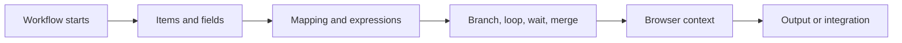

import { Card, CardGrid } from "@astrojs/starlight/components";

Concepts explain how workflows behave underneath the visual canvas. Use this section when a workflow runs but the result is confusing: data is missing, a branch takes the wrong path, a browser action reads the wrong page state, or an AI step receives the wrong context.

## Pick a hub

<CardGrid>
  <Card title="Data" icon="list-format">
    How nodes pass items, fields, arrays and objects between steps, and how you map them.

    [Explore data concepts](/concepts/data/)
  </Card>

  <Card title="Flow" icon="random">
    Execution order, branches, loops, waits, merges, errors and browser context.

    [Explore flow concepts](/concepts/flow/)
  </Card>

  <Card title="AI" icon="star">
    Models, prompts, knowledge, memory, agents, tools and testing.

    [Explore AI concepts](/concepts/ai/)
  </Card>

  <Card title="Glossary" icon="open-book">
    Short definitions of the terms used across these docs.

    [Open the glossary](/concepts/glossary/)
  </Card>
</CardGrid>

## How to use this section

Start with [Workflow Lifecycle](/concepts/flow/workflow-lifecycle/) if you want the full mental model. Move to [Data Structure](/concepts/data/data-structure/) when mappings are unclear, and use [Flow](/concepts/flow/) when branching, loops, waiting, or merging behave unexpectedly.

For exact settings and outputs, use the [Node Reference](/nodes/) after you understand the concept.
