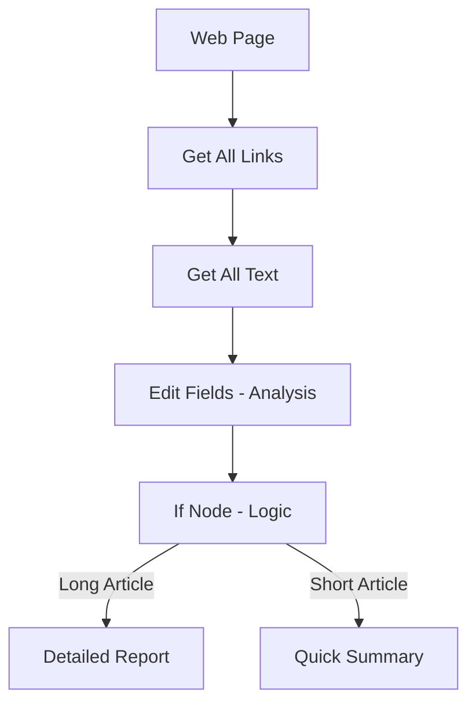
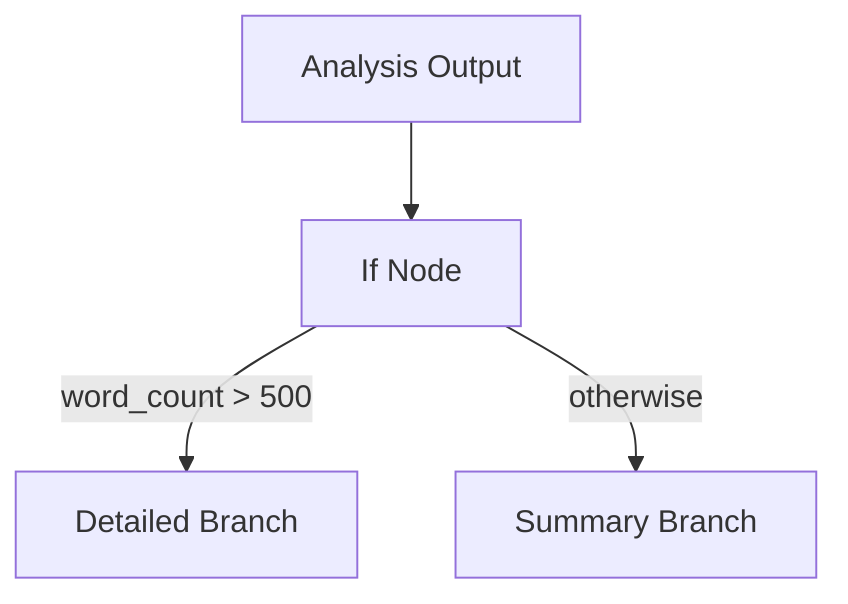

import { Card, CardGrid } from "@astrojs/starlight/components";

This walkthrough builds on [Your first workflow](/get-started/first-workflow/) and is part of [Level 2 · Working with data](/get-started/working-with-data/). It is a reference walkthrough, not yet a full lesson: it has no progress tracking or checks.

You’ll create an automation that:

- Extracts links and text from a web page
- Processes and analyzes the extracted content
- Uses a simple rule (an **If** step) to choose what to do next
- Produces different output depending on the page content

As before, everything runs entirely in your browser — no server required.

---

## Workflow Overview



- First, extract links from the page
- Then, extract full page text
- Analyze the text with custom expressions
- Use an If node to branch into “Long” or “Short” paths
- Format the final report accordingly

This shows the main idea behind workflows: they can react to what they find on the page.

---

## Step 1: Start a new workflow

1. Click the AWFlow extension icon. The app opens in the [side panel](/app/side-panel/).
2. Open **Workflows**, click **Add Workflow**, choose **Blank canvas** then **Triggered**, name it and click **Create & open**.
3. You should now have an empty canvas with an **Add Trigger** button.

---

## Step 2: Add a link extraction node

1. Click **Add Trigger** and pick **When Started**, then click the **+** on its right edge.
2. Search for **Get All Links** and insert it.
3. By default, it extracts all `<a>` link URLs and labels from the current page.
4. Click **Test step** to test it.

You’ll see the list of links in the node output.

This shows how to gather all hyperlinks on the page.

---

## Step 3: Add text extraction and processing

1. From **Get All Links**, click the **+** on its right edge.
2. Search for **Get All Text** and add it.
3. Click **Test step** to fetch the full page text.
4. From **Get All Text**, click the **+** on its right edge again.
5. Insert **Edit Fields** to analyze the text.
7. Configure these fields by copying the values below:
   - **word_count**: `{{ $json.text.split(' ').length }}`
   - **character_count**: `{{ $json.text.length }}`
   - **summary**: `{{ $json.text.substring(0, 200) }}...`

8. Click **Test step** to see the analysis results.

This gives you a quick “profile” of the page: how long it is, plus a short preview.

---

## Step 4: Add branching logic with If node



1. From the Edit Fields node, click the **+** on its right edge.
2. Search and insert **If**.
3. Configure it:
   - **Input**: `word_count` (select this from the previous node's output)
   - **Operator**: "Number > Larger"
   - **Value**: `500`

4. Test the If node. You’ll see two potential paths: "true" (longer than 500 words) and "false" (shorter).

Now your workflow can take different paths based on content length.

---

## Step 5: Create branch-specific outputs

For **Long (true)** branch:

1. Click the **true** connector from the If node.
2. Add an **Edit Fields** node.
3. Set fields:
   - `report_type`: “Detailed Analysis”
   - `message`:

     ```
     Long article: {{ $json.word_count }} words, {{ $json.character_count }} chars
     Preview: {{ $json.summary }}
     ```

For **Short (false)** branch:

1. Click the **false** connector.
2. Add **Edit Fields**.
3. Set fields:
   - `report_type`: “Quick Summary”
   - `message`:

     ```
     Short article: {{ $json.word_count }} words
     Preview: {{ $json.summary }}
     ```

Then execute the full workflow. The final output will differ based on whether the content was “long” or “short.”

---

## Step 6: Run and review full workflow

1. Navigate to a web page with substantial text (e.g. a news article).
2. In the builder, click **Test Workflow** (runs from the trigger onward).
3. Watch as the workflow runs step-by-step:
   - Links are extracted
   - Full text is fetched
   - Text is analyzed
   - Branching logic applies
   - Final report nodes emit output

4. Inspect the output of the final node to see the generated message.

You now have a branching, content‑aware automation built entirely in the browser.

---

## What to try next

- Add an **AI / LLM node** to summarize the page or detect sentiment
- Extract images or metadata (see [Browser Nodes](/nodes/extension/))
- Use **Wait / Click / Scroll** nodes to navigate and extract multiple pages
- Share your workflow in the **Marketplace** and study community templates

---

## What’s next?

<CardGrid>
  <Card
    title="AI‑Powered Workflows"
    icon="seti:pipeline"
  >
    Learn how to integrate model dependencies for deeper content analysis.

    [Go  →](/concepts/ai/)

  </Card>

<Card
title="Browser Nodes"
icon="puzzle"
href="/nodes/extension/"

>

Explore all supported browser manipulation nodes.

    [Go  →](/nodes/extension/)

  </Card>

<Card
title="Concepts"
icon="open-book"

>

Review the fundamentals of triggers, nodes, and data flow.

    [Go  →](/concepts/)

  </Card>

<Card
title="Troubleshooting & Best Practices"
icon="seti:yml"

>

Tips to debug, optimize, and make workflows more robust.

    [Go  →](/app/troubleshooting/)

  </Card>
</CardGrid>
